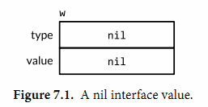
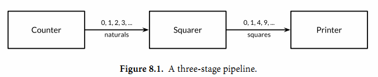
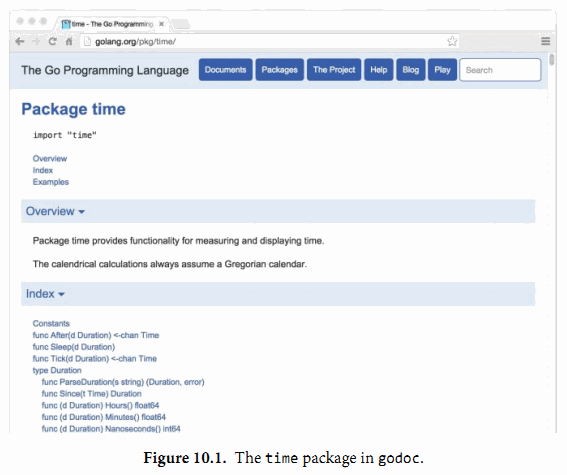

## 6. 方法

从90年代早期开始，面向对象编程（OOP）就成为了称霸工程界和教育界的编程范式，所以之后几乎所有大规模被应用的语言都包含了对OOP的支持，go语言也不例外。

尽管没有被大众所接受的明确的OOP的定义，从我们的理解来讲，一个对象其实也就是一个简单的值或者一个变量，在这个对象中会包含一些方法，而一个方法则是一个和特殊类型关联的函数。一个面向对象的程序会用方法来表达其属性和对应的操作，这样使用这个对象的用户就不需要直接去操作对象，而是借助方法来做这些事情。

在早些的章节中，我们已经使用了标准库提供的一些方法，比如time.Duration这个类型的Seconds方法：

```Go
const day = 24 * time.Hour
fmt.Println(day.Seconds()) // "86400"
```

并且在2.5节中，我们定义了一个自己的方法，Celsius类型的String方法:

```Go
func (c Celsius) String() string { return fmt.Sprintf("%g°C", c) }
```

在本章中，OOP编程的第一方面，我们会向你展示如何有效地定义和使用方法。我们会覆盖到OOP编程的两个关键点，封装和组合。

### 6.1. 方法声明

定义、使用方式如下

```go
package geometry

import "math"

type Point struct{X, Y float64}

// traditional function
func Distance(p, q Point) float64 {
  return math.Hypot(q.X-p.X, q.Y-p.Y)
}

// sone thing, but as a method of the Point type
// 函数前面的参数p会把这个函数Distance附加到Point这种类型上，相当于这种类型定义了他自己的方法
func (p Point) Distance(q Point) float64 {
  return math.Hypot(p.X-q.X, p.Y-q.Y)
}
```

代码中附加的参数p，叫做方法的接收器（receiver）。接收器名字不固定，一般使用对应类型的第一个字母小写化。

使用方式如下

```go
p := Point{1, 2}
q := Point{4, 6}
fmt.Println(Distance(p, q)) // "5", function call
fmt.Println(p.Distance(q)) // "5", method call
```

其中第一个Distance的调用使用的是包级别的函数：geometry.Distance，第二个则是使用Point类下声明的Point.Distance方法。

p.Distance（）这个表达式叫做选择器，他会选择合适的对应p这个对象的Distance方法来执行。选择器也可以用来选择struct类型的字段，比如p.X。

由于方法和字段都是在同一命名空间，所以如果我们在这里声明一个X方法的话，编译器会报错，因为在调用p.X时会有歧义。

> 也就是说不要让字段和方法重名 = 不要让成员和方法重名

不同的类型有自己的命名空间，不要担心不同的Distance混乱。比如这个例子：

``` go
// A Path is a journey connecting the points with straight lines.
type Path []Point
// Distance returns the distance traveled along the path.
func (path Path) Distance() float64 {
    sum := 0.0
    for i := range path {
        if i > 0 {
            sum += path[i-1].Distance(path[i])
        }
    }
    return sum
}
```

Go语言中可以为一些简单的数值、字符串、slice、map来定义一些附加行为（func）。我们可以给同一个包内的任意命名类型定义方法，只要这个命名类型的底层类型（译注：这个例子里，底层类型是指[]Point这个slice，Path就是命名类型）不是指针或者interface。

上面的这两个Distance没有任何关系，尽管Path的Distance方法会在内部调用Point.Distance方法来计算每个连接邻接点的线段的长度。

上面这个Distance可以用来计算三角形的周长

```go
perim := Path {
  {1, 1},
  {5, 1},
  {5, 4},
  {1, 1},
}
fmt.Println(perim.Distance()) // "12"
```

在上面两个对Distance名字的方法的调用中，编译器会根据方法的名字以及接收器来决定具体调用的是哪一个函数。第一个例子中path[i-1]数组中的类型是Point，因此Point.Distance这个方法被调用；在第二个例子中perim的类型是Path，因此Distance调用的是Path.Distance。

对于一个给定的类型，其内部的方法都必须有唯一的方法名，但是不同的类型却可以有同样的方法名，比如我们这里Point和Path就都有Distance这个名字的方法；所以我们没有必要非在方法名之前加类型名来消除歧义，比如PathDistance。这里我们已经看到了方法比之函数的一些好处：方法名可以简短。当我们在包外调用的时候这种好处就会被放大，因为我们可以使用这个短名字，而可以省略掉包的名字.

> 这段话的意思是在命名方面，方法要比函数更加优秀，使用更短的名字就可以说明作用。

下面是例子：

```
import "gopl.io/ch6/geometry"

perim := geometry.Path{{1, 1}, {5, 1}, {5, 4}, {1, 1}}
fmt.Println(geometry.PathDistance(perim)) // "12", standalone function
fmt.Println(perim.Distance())             // "12", method of geometry.Path
```

很明绑定到struct的方法比包内的函数更好（打字少hh）

###  6.2. 基于指针对象的方法

在CPP中指针和引用存在的很大的一个原因，就是在函数传值的时候可以避免不必要的默认拷贝。Go使用指针来避免拷贝，同样的我们使用指针接收器，当这个接受者本身比较大的时候，就可以使用指针而不是对象来声明方法。

```go
func (p *Point) ScaleBy(factor float64) {
    p.X *= factor
    p.Y *= factor
}
```

这个方法的名字全称为：`(*Point).ScaleBy` 。这里的括号是必须的，没有这个括号，表达式会被编译器理解为`*(Point).ScaleBy`。

> 这里主要是再说优先级这个事

一般情况下，大家会统一接收器为指针接收器，还是对象接收器。比如如果Point这个类有一个指针作为接收器的方法，那么Point的所有方法都必须有一个指针接收器，即使有些不需要指针作为接收器的函数。

只有类型（Point）和指向他们的指针（*Point）才可能是出现在接收器声明里面的两种接收器。为了避免歧义，在声明方法的时候，如果一个类型本身是一个指针的话，是不允许其出现在接收器中的，比如：

```go
type P *int
func (P) f() { /* ... */ } // compile error: invalid receiver type
```

想要调用指针类型方法`(*Point).ScaleBy`，只要提供一个Point类型的指针即可，像下面这样。

```go
r := &Point{1, 2}
r.ScaleBy(2)
fmt.Println(*r) // "{2, 4}"
```

或者这样：

```go
p := Point{1, 2}
pptr := &p
pptr.ScaleBy(2)
fmt.Println(p) // "{2, 4}"
```

或者这样:

```go
p := Point{1, 2}
(&p).ScaleBy(2)
fmt.Println(p) // "{2, 4}"
```

熟悉CPP的同学对于这种使用方式习以为常，不过Go会简化接收器的取地址或解引用操作。如果接收器p是一个Point类型的变量，并且其方法需要一个Point指针作为接收器，我们可以用下面这种简短的写法：

```go
p.ScaleBy(2)
```

这里p是一个变量，编译器会隐式地帮我们用&p去调用ScaleBy这个方法。这种简写方法只适用于“变量”，包括struct里的字段比如p.X，以及array和slice内的元素比如perim[0]。我们不能通过一个无法取到地址的接收器来调用指针方法，比如临时变量的内存地址就无法获取得到：

```go
Point{1, 2}.ScaleBy(2) // compile error: can't take address of Point literal
```

同样的我们可以用一个`*Point`这样的接收器来调用Point的方法，因为我们可以通过地址来找到这个变量，只要用解引用符号`*`来取到该变量即可。编译器在这里也会给我们隐式地插入`*`这个操作符，所以下面这两种写法等价的：

这里pptr是一个指针。

```Go
pptr.Distance(q)
(*pptr).Distance(q)
```

这里的几个例子可能让你有些困惑，所以我们总结复习一下：在每一个合法的方法调用表达式中，主要分为两种情况。

* 类型相同

要么接收器的实际参数（实际传入的参数）和其形式参数（声明的参数）是相同的类型，比如两者都是类型T或者都是类型`*T`：

```go
Point{1, 2}.Distance(q) //  Point
pptr.ScaleBy(2)         // *Point

```

* 类型不同

或者接收器实参是类型T，但接收器形参是类型`*T`，这种情况下编译器会隐式地为我们取变量的地址：

```go
p.ScaleBy(2) // implicit (&p)
```

或者接收器实参是类型`*T`，形参是类型T。编译器会隐式地为我们解引用，取到指针指向的实际变量：

```go
pptr.Distance(q) // implicit (*pptr)
```

如果是命名类型T（译注：用type xxx定义的类型）的所有方法都是用T类型自己来做接收器（而不是`*T`），那么拷贝这种类型的实例就是安全的；调用他的任何一个方法也就会产生一个值的拷贝。比如time.Duration的这个类型，在调用其方法时就会被全部拷贝一份，包括在作为参数传入函数的时候。

但是如果一个方法使用指针作为接收器，你需要避免对其进行拷贝，因为这样可能会破坏掉该类型内部的不变性。比如你对bytes.Buffer对象进行了拷贝，那么可能会引起原始对象和拷贝对象只是别名而已，实际上它们指向的对象是一样的。紧接着对拷贝后的变量进行修改可能会有让你有意外的结果。

> 命名类型T 如： type T int
>
> 如果一个方法是使用指针作为接收器，那么你就需要立刻警惕起来，因为不仅仅是对象过大使用指针进行传递，也有可能是因为浅拷贝，结合CPP可能更容易理解。

再再再总结：

1. 不管你的method的receiver是指针类型还是非指针类型，都是可以通过指针/非指针类型进行调用的，编译器会帮你做类型转换。
2. 在声明一个method的receiver该是指针还是非指针类型时，你需要考虑两方面的因素，第一方面是这个对象本身是不是特别大，如果声明为非指针变量时，调用会产生一次拷贝；第二方面是如果你用指针类型作为receiver，那么你一定要注意，这种指针类型指向的始终是一块内存地址，就算你对其进行了拷贝。熟悉C或者C++的人这里应该很快能明白。

#### 6.2.1. Nil也是一个合法的接收器类型

就像一些函数允许nil指针作为参数一样，方法理论上也可以用nil指针作为其接收器，尤其当nil对于对象来说是合法的零值时，比如map或者slice。在下面的简单int链表的例子里，nil代表的是空链表：

```go
// An IntList is a linked list of integers.
// A nil *IntList represents the empty list.
type IntList struct {
    Value int
    Tail  *IntList
}
// Sum returns the sum of the list elements.
func (list *IntList) Sum() int {
    if list == nil {
        return 0
    }
    return list.Value + list.Tail.Sum()
}
```

当你定义一个允许nil作为接收器值的方法的类型时，在类型前面的注释中指出nil变量代表的意义是很有必要的，就像我们上面例子里做的这样。

下面是net/url包里Values类型定义的一部分。

*net/url*

```go
package url

// Values maps a string key to a list of values.
type Values map[string][]string
// Get returns the first value associated with the given key,
// or "" if there are none.
func (v Values) Get(key string) string {
    if vs := v[key]; len(vs) > 0 {
        return vs[0]
    }
    return ""
}
// Add adds the value to key.
// It appends to any existing values associated with key.
func (v Values) Add(key, value string) {
    v[key] = append(v[key], value)
}
```

这个定义向外部暴露了一个map的命名类型，并且提供了一些能够简单操作这个map的方法。这个map的value字段是一个string的slice，所以这个Values是一个多维map。客户端使用这个变量的时候可以使用map固有的一些操作（make，切片，m[key]等等），也可以使用这里提供的操作方法，或者两者并用，都是可以的：

*gopl.io/ch6/urlvalues*

```go
m := url.Values{"lang": {"en"}} // direct construction
m.Add("item", "1")
m.Add("item", "2")

fmt.Println(m.Get("lang")) // "en"
fmt.Println(m.Get("q"))    // ""
fmt.Println(m.Get("item")) // "1"      (first value)
fmt.Println(m["item"])     // "[1 2]"  (direct map access)

m = nil
fmt.Println(m.Get("item")) // ""
m.Add("item", "3")         // panic: assignment to entry in nil map
```

对Get的最后一次调用中，nil接收器的行为即是一个空map的行为。我们可以等价地将这个操作写成Value(nil).Get("item")，但是如果你直接写nil.Get("item")的话是无法通过编译的，因为nil的字面量编译器无法判断其准确类型。所以相比之下，最后的那行m.Add的调用就会产生一个panic，因为他尝试更新一个空map。

由于url.Values是一个map类型，并且间接引用了其key/value对，因此url.Values.Add对这个map里的元素做任何的更新、删除操作对调用方都是可见的。实际上，就像在普通函数中一样，虽然可以通过引用来操作内部值，但在方法想要修改引用`本身`时是不会影响原始值的，比如把他置换为nil，或者让这个引用指向了其它的对象，调用方都不会受影响。（注：因为传入的是存储了内存地址的变量，m传递过来的时候是值拷贝，前文能做修改是因为涉及到了map的扩容，而现在m没有空间，就算创建了一个新的空map给m，因为m是值拷贝，你给他没用啊）

### 6.3. 通过嵌入结构体来扩展类型

给一段代码：

```go
import "image/color"

type Point struct{ X, Y float64 }

type ColoredPoint struct {
    Point
    Color color.RGBA
}
```

对于ColoredPoint的定义，我们完全可以将其定义为有三个字段的struct（X，Y，Color），但是现在却将Point这个类型嵌入到ColoredPoint来提供X和Y这两个字段。内嵌可以使我们在定义ColoredPoint时得到一种句法上的简写形式，并使其包含Point类型所具有的一切字段，然后再定义一些自己的。如果我们想要的话，我们可以直接认为通过嵌入的字段就是ColoredPoint自身的字段，而完全不需要在调用时指出Point，比如下面这样。

```go
var cp ColoredPoint
cp.X = 1
fmt.Println(cp.Point.X) // "1"
cp.Point.Y = 2
fmt.Println(cp.Y) // "2"
```

对于Point中的方法我们也有类似的用法，我们可以把ColoredPoint类型当作接收器来调用Point里的方法，即使ColoredPoint里没有声明这些方法：

```go
red := color.RGBA{255, 0, 0, 255}
blue := color.RGBA{0, 0, 255, 255}
var p = ColoredPoint{Point{1, 1}, red}
var q = ColoredPoint{Point{5, 4}, blue}
fmt.Println(p.Distance(q.Point)) // "5"
p.ScaleBy(2)
q.ScaleBy(2)
fmt.Println(p.Distance(q.Point)) // "10"
```

Point类的方法也被引入了ColoredPoint。用这种方式，内嵌可以使我们定义字段特别多的复杂类型，我们可以将字段先按小类型分组，然后定义小类型的方法，之后再把它们组合起来。

读者如果对基于类来实现面向对象的语言比较熟悉的话，可能会倾向于将Point看作一个基类，而ColoredPoint看作其子类或者继承类，或者将ColoredPoint看作"is a" Point类型。但这是错误的理解。请注意上面例子中对Distance方法的调用。Distance有一个参数是Point类型，但q并不是一个Point类，所以尽管q有着Point这个内嵌类型，我们也必须要显式地选择它。尝试直接传q的话你会看到下面这样的错误：

```go
p.Distance(q) // compile error: cannot use q (ColoredPoint) as Point
```

一个ColoredPoint并不是一个Point，但他"has a"Point，并且它有从Point类里引入的Distance和ScaleBy方法。如果你喜欢从实现的角度来考虑问题，内嵌字段会指导编译器去生成额外的包装方法来委托已经声明好的方法，和下面的形式是等价的：

```go
func (p ColoredPoint) Distance(q Point) float64 {
    return p.Point.Distance(q)
}

func (p *ColoredPoint) ScaleBy(factor float64) {
    p.Point.ScaleBy(factor)
}
```

当Point.Distance被第一个包装方法调用时（直接return p.Point.Distance(q)，简简单单包装一下），它的接收器值是p.Point，而不是p，当然了，在Point类的方法里，你是访问不到ColoredPoint的任何字段的。

在类型中内嵌的匿名字段也可能是一个命名类型的指针，这种情况下字段和方法会被间接地引入到当前的类型中（译注：访问需要通过该指针指向的对象去取）。添加这一层间接关系让我们可以共享通用的结构并动态地改变对象之间的关系。下面这个ColoredPoint的声明内嵌了一个*Point的指针。

```go
type ColoredPoint struct {
    *Point
    Color color.RGBA
}

p := ColoredPoint{&Point{1, 1}, red}
q := ColoredPoint{&Point{5, 4}, blue}
fmt.Println(p.Distance(*q.Point)) // "5"
q.Point = p.Point                 // p and q now share the same Point
p.ScaleBy(2)
fmt.Println(*p.Point, *q.Point) // "{2 2} {2 2}"
```

一个struct类型也可能会有多个匿名字段。我们将ColoredPoint定义为下面这样：

```go
type ColoredPoint struct {
    Point
    color.RGBA
}
```

然后这种类型的值便会拥有Point和RGBA类型的所有方法，以及直接定义在ColoredPoint中的方法。当编译器解析一个选择器到方法时，比如p.ScaleBy，它会首先去找直接定义在这个类型里的ScaleBy方法，然后找被ColoredPoint的内嵌字段们引入的方法，然后去找Point和RGBA的内嵌字段引入的方法，然后一直递归向下找。如果选择器有二义性的话编译器会报错，比如你在同一级里有两个同名的方法。

方法只能在命名类型（像Point）或者指向类型的指针上定义，但是多亏了内嵌，有些时候我们给匿名struct类型来定义方法也有了手段。

下面是一个小trick。这个例子展示了简单的cache，其使用两个包级别的变量来实现，一个mutex互斥锁（§9.2）和它所操作的cache：

```go
var (
    mu sync.Mutex // guards mapping
    mapping = make(map[string]string)
)

func Lookup(key string) string {
    mu.Lock()
    v := mapping[key]
    mu.Unlock()
    return v
}
```

下面这个版本在功能上是一致的，但将两个包级别的变量放在了cache这个struct一组内：

```go
var cache = struct {
    sync.Mutex
    mapping map[string]string
}{
    mapping: make(map[string]string),
}


func Lookup(key string) string {
    cache.Lock()
    v := cache.mapping[key]
    cache.Unlock()
    return v
}
```

我们给新的变量起了一个更具表达性的名字：cache。因为sync.Mutex字段也被嵌入到了这个struct里，其Lock和Unlock方法也就都被引入到了这个匿名结构中了，这让我们能够以一个简单明了的语法来对其进行加锁解锁操作。

### 6.4. 方法值和方法表达式

我们经常选择一个方法，并且在同一个表达式里执行，比如常见的p.Distance()形式，实际上将其分成两步来执行也是可能的。

1. p.Distance叫作“选择器”，选择器会返回一个方法“值”->一个将方法（Point.Distance）绑定到特定接收器变量的函数。
2. 这个函数可以不通过指定其接收器即可被调用；即调用时不需要指定接收器（译注：因为已经在前文中指定过了），只要传入函数的参数即可：

```go
p := Point{1, 2}
q := Point{4, 6}

distanceFromP := p.Distance        // method value
fmt.Println(distanceFromP(q))      // "5"
var origin Point                   // {0, 0}
fmt.Println(distanceFromP(origin)) // "2.23606797749979", sqrt(5)

scaleP := p.ScaleBy // method value
scaleP(2)           // p becomes (2, 4)
scaleP(3)           //      then (6, 12)
scaleP(10)          //      then (60, 120)
```

在一个包的API需要一个函数值、且调用方希望操作的是某一个绑定了对象的方法的话，方法“值”会非常实用（``=_=`真是绕）。举例来说，下面例子中的time.AfterFunc这个函数的功能是在指定的延迟时间之后来执行一个（译注：另外的）函数。且这个函数操作的是一个Rocket对象r

```go
type Rocket struct { /* ... */ }
func (r *Rocket) Launch() { /* ... */ }
r := new(Rocket)
time.AfterFunc(10 * time.Second, func() { r.Launch() })
```

直接用方法“值”传入AfterFunc的话可以更为简短：

```go
time.AfterFunc(10 * time.Second, r.Launch)
```

译注：省掉了上面那个例子里的匿名函数。

和方法“值”相关的还有方法表达式。当调用一个方法时，与调用一个普通的函数相比，我们必须要用选择器（p.Distance）语法来指定方法的接收器。

当T是一个类型时，方法表达式可能会写作`T.f`或者`(*T).f`，会返回一个函数“值”，这种函数会将其第一个参数用作接收器，所以可以用通常（译注：不写选择器）的方式来对其进行调用：

```go
p := Point{1, 2}
q := Point{4, 6}

distance := Point.Distance   // method expression
fmt.Println(distance(p, q))  // "5"
fmt.Printf("%T\n", distance) // "func(Point, Point) float64"

scale := (*Point).ScaleBy
scale(&p, 2)
fmt.Println(p)            // "{2 4}"
fmt.Printf("%T\n", scale) // "func(*Point, float64)"

// 译注：这个Distance实际上是指定了Point对象为接收器的一个方法func (p Point) Distance()，
// 但通过Point.Distance得到的函数需要比实际的Distance方法多一个参数，
// 即其需要用第一个额外参数指定接收器，后面排列Distance方法的参数。
// 看起来本书中函数和方法的区别是指有没有接收器。
```

当你根据一个变量来决定调用同一个类型的哪个函数时，方法表达式就显得很有用了。你可以根据选择来调用接收器各不相同的方法。下面的例子，变量op代表Point类型的addition或者subtraction方法，Path.TranslateBy方法会为其Path数组中的每一个Point来调用对应的方法：

```go
type Point struct{ X, Y float64 }

func (p Point) Add(q Point) Point { return Point{p.X + q.X, p.Y + q.Y} }
func (p Point) Sub(q Point) Point { return Point{p.X - q.X, p.Y - q.Y} }

type Path []Point

func (path Path) TranslateBy(offset Point, add bool) {
    var op func(p, q Point) Point
    if add {
        op = Point.Add
    } else {
        op = Point.Sub
    }
    for i := range path {
        // Call either path[i].Add(offset) or path[i].Sub(offset).
        path[i] = op(path[i], offset)
    }
}
```

### 6.5. 示例：Bit数组

Go语言里的集合一般会用map[T]bool这种形式来表示，T代表元素类型。集合用map类型来表示虽然非常灵活，但我们可以以一种更好的形式来表示它。例如在数据流分析领域，集合元素通常是一个非负整数，集合会包含很多元素，并且集合会经常进行并集、交集操作，这种情况下，bit数组会比map表现更加理想。（译注：这里再补充一个例子，比如我们执行一个http下载任务，把文件按照16kb一块划分为很多块，需要有一个全局变量来标识哪些块下载完成了，这种时候也需要用到bit数组。）

一个bit数组通常会用一个无符号数或者称之为“字”的slice来表示，每一个元素的每一位都表示集合里的一个值。当集合的第i位被设置时，我们才说这个集合包含元素i。下面的这个程序展示了一个简单的bit数组类型，并且实现了三个函数来对这个bit数组来进行操作：

*gopl.io/ch6/intset*

```go
// An IntSet is a set of small non-negative integers.
// Its zero value represents the empty set.
type IntSet struct {
    words []uint64
}

// Has reports whether the set contains the non-negative value x.
func (s *IntSet) Has(x int) bool {
    word, bit := x/64, uint(x%64)
    return word < len(s.words) && s.words[word]&(1<<bit) != 0
}

// Add adds the non-negative value x to the set.
func (s *IntSet) Add(x int) {
    word, bit := x/64, uint(x%64)
    for word >= len(s.words) {
        s.words = append(s.words, 0)
    }
    s.words[word] |= 1 << bit
}

// UnionWith sets s to the union of s and t.
func (s *IntSet) UnionWith(t *IntSet) {
    for i, tword := range t.words {
        if i < len(s.words) {
            s.words[i] |= tword
        } else {
            s.words = append(s.words, tword)
        }
    }
}
```

因为每一个字都有64个二进制位，所以为了定位x的bit位，我们用了x/64的商作为字的下标，并且用x%64得到的值作为这个字内的bit的所在位置。UnionWith这个方法里用到了bit位的“或”逻辑操作符号|来一次完成64个元素的或计算。（在练习6.5中我们还会有程序用到这个64位字的例子。）

当前这个实现还缺少了很多必要的特性，我们把其中一些作为练习题列在本小节之后。但是有一个方法如果缺失的话我们的bit数组可能会比较难混：将IntSet作为一个字符串来打印。这里我们来实现它，让我们来给上面的例子添加一个String方法，类似2.5节中做的那样：

```go
// String returns the set as a string of the form "{1 2 3}".
func (s *IntSet) String() string {
    var buf bytes.Buffer
    buf.WriteByte('{')
    for i, word := range s.words {
        if word == 0 {
            continue
        }
        for j := 0; j < 64; j++ {
            if word&(1<<uint(j)) != 0 {
                if buf.Len() > len("{") {
                    buf.WriteByte(' ')
                }
                fmt.Fprintf(&buf, "%d", 64*i+j)
            }
        }
    }
    buf.WriteByte('}')
    return buf.String()
}
```

这里留意一下String方法，是不是和3.5.4节中的intsToString方法很相似；bytes.Buffer在String方法里经常这么用。当你为一个复杂的类型定义了一个String方法时，fmt包就会特殊对待这种类型的值，这样可以让这些类型在打印的时候看起来更加友好，而不是直接打印其原始的值。fmt会直接调用用户定义的String方法。这种机制依赖于接口和类型断言，在第7章中我们会详细介绍。

现在我们就可以在实战中直接用上面定义好的IntSet了：

```go
var x, y IntSet
x.Add(1)
x.Add(144)
x.Add(9)
fmt.Println(x.String()) // "{1 9 144}"

y.Add(9)
y.Add(42)
fmt.Println(y.String()) // "{9 42}"

x.UnionWith(&y)
fmt.Println(x.String()) // "{1 9 42 144}"
fmt.Println(x.Has(9), x.Has(123)) // "true false"
```

这里要注意：我们声明的String和Has两个方法都是以指针类型`*IntSet`来作为接收器的，但实际上对于这两个类型来说，把接收器声明为指针类型也没什么必要。不过另外两个函数就不是这样了，因为另外两个函数操作的是s.words对象，如果你不把接收器声明为指针对象，那么实际操作的是拷贝对象，而不是原来的那个对象。因此，因为我们的String方法定义在IntSet指针上，所以当我们的变量是IntSet类型而不是IntSet指针时，可能会有下面这样让人意外的情况：

```go
fmt.Println(&x)         // "{1 9 42 144}"
fmt.Println(x.String()) // "{1 9 42 144}"
fmt.Println(x)          // "{[4398046511618 0 65536]}"
```

在第一个Println中，我们打印一个`*IntSet`的指针，这个类型的指针确实有自定义的String方法。第二Println，我们直接调用了x变量的String()方法；这种情况下编译器会隐式地在x前插入&操作符，这样相当于我们还是调用的IntSet指针的String方法。在第三个Println中，因为IntSet类型没有String方法，所以Println方法会直接以原始的方式理解并打印。所以在这种情况下&符号是不能忘的。在我们这种场景下，你把String方法绑定到IntSet对象上，而不是IntSet指针上可能会更合适一些，不过这也需要具体问题具体分析。

### 6.6. 封装

一个对象的变量或者方法如果对调用方是不可见的话，一般就被定义为“封装”。封装有时候也被叫做信息隐藏，同时也是面向对象编程最关键的一个方面。

Go语言只有一种控制可见性的手段：大写首字母的标识符会从定义它们的包中被导出，小写字母的则不会。这种限制包内成员的方式同样适用于struct或者一个类型的方法。因而如果我们想要封装一个对象，我们必须将其定义为一个struct。

这也就是前面的小节中IntSet被定义为struct类型的原因，尽管它只有一个字段：

```go
type IntSet struct {
    words []uint64
}
```

当然，我们也可以把IntSet定义为一个slice类型，但这样我们就需要把代码中所有方法里用到的s.words用`*s`替换掉了：

```go
type IntSet []uint64
```

尽管这个版本的IntSet在本质上是一样的，但它也允许其它包中可以直接读取并编辑这个slice。换句话说，相对于`*s`这个表达式会出现在所有的包中，s.words只能在定义IntSet的包中出现（译注：private和public的意思）。

这种基于名字的手段使得在语言中最小的封装单元是package（一个package可能有很多个.go文件），而不是像其它语言一样的类型。一个struct类型的字段对同一个包的所有代码都有可见性，无论你的代码是写在一个函数还是一个方法里。

封装提供了三方面的优点。首先，因为调用方不能直接修改对象的变量值，其只需要关注少量的语句并且只要弄懂少量变量的可能的值即可。

第二，隐藏实现的细节，可以防止调用方依赖那些可能变化的具体实现，这样使设计包的程序员在不破坏对外的api情况下能得到更大的自由。

把bytes.Buffer这个类型作为例子来考虑。这个类型在做短字符串叠加的时候很常用，所以在设计的时候可以做一些预先的优化，比如提前预留一部分空间，来避免反复的内存分配。又因为Buffer是一个struct类型，这些额外的空间可以用附加的字节数组来保存，且放在一个小写字母开头的字段中。这样在外部的调用方只能看到性能的提升，但并不会得到这个附加变量。Buffer和其增长算法我们列在这里，为了简洁性稍微做了一些精简：

```go
type Buffer struct {
    buf     []byte
    initial [64]byte
    /* ... */
}

// Grow expands the buffer's capacity, if necessary,
// to guarantee space for another n bytes. [...]
func (b *Buffer) Grow(n int) {
    if b.buf == nil {
        b.buf = b.initial[:0] // use preallocated space initially
    }
    if len(b.buf)+n > cap(b.buf) {
        buf := make([]byte, b.Len(), 2*cap(b.buf) + n)
        copy(buf, b.buf)
        b.buf = buf
    }
}
```

封装的第三个优点也是最重要的优点，是阻止了外部调用方对对象内部的值任意地进行修改。因为对象内部变量只可以被同一个包内的函数修改，所以包的作者可以让这些函数确保对象内部的一些值的不变性。比如下面的Counter类型允许调用方来增加counter变量的值，并且允许将这个值reset为0，但是不允许随便设置这个值（译注：小写，无法访问）：

```go
type Counter struct { n int }
func (c *Counter) N() int     { return c.n }
func (c *Counter) Increment() { c.n++ }
func (c *Counter) Reset()     { c.n = 0 }
```

只用来访问或修改内部变量的函数被称为setter或者getter，例子如下，比如log包里的Logger类型对应的一些函数。在命名一个getter方法时，我们通常会省略掉前面的Get前缀。这种简洁上的偏好也可以推广到各种类型的前缀比如Fetch，Find或者Lookup。

```go
package log
type Logger struct {
    flags  int
    prefix string
    // ...
}
func (l *Logger) Flags() int
func (l *Logger) SetFlags(flag int)
func (l *Logger) Prefix() string
func (l *Logger) SetPrefix(prefix string)
```

Go的编码风格不禁止直接导出字段。当然，一旦进行了导出，就没有办法在保证API兼容的情况下去除对其的导出，所以在一开始的选择一定要经过深思熟虑并且要考虑到包内部的一些不变量的保证，未来可能的变化，以及调用方的代码质量是否会因为包的一点修改而变差。

封装并不总是理想的。 虽然封装在有些情况是必要的，但有时候我们也需要暴露一些内部内容，比如：time.Duration将其表现暴露为一个int64数字的纳秒，使得我们可以用一般的数值操作来对时间进行对比，甚至可以定义这种类型的常量：

```go
const day = 24 * time.Hour
fmt.Println(day.Seconds()) // "86400"
```

另一个例子，将IntSet和本章开头的geometry.Path进行对比。Path被定义为一个slice类型，这允许其调用slice的字面方法来对其内部的points用range进行迭代遍历；在这一点上，IntSet是没有办法让你这么做的。

这两种类型决定性的不同：geometry.Path的本质是一个坐标点的序列，不多也不少，我们可以预见到之后也并不会给他增加额外的字段，所以在geometry包中将Path暴露为一个slice。相比之下，IntSet仅仅是在这里用了一个[]uint64的slice。这个类型还可以用[]uint类型来表示，或者我们甚至可以用其它完全不同的占用更小内存空间的东西来表示这个集合，所以我们可能还会需要额外的字段来在这个类型中记录元素的个数。也正是因为这些原因，我们让IntSet对调用方不透明。

> 啊，机翻如此难过，这段话的意思就是如果你想暴露某个字段，那么最好是弄一个更加短小的成员变量或是同类型的，然后赋值给这个新弄出来的成员，把这个新成员暴露出去，这样新旧隔离，新创建出来的字段专门给大家读的。大概这个么个意思。

在这章中，我们学到了如何将方法与命名类型进行组合，并且知道了如何调用这些方法。尽管方法对于OOP编程来说至关重要，但他们只是OOP编程里的半边天。为了完成OOP，我们还需要接口。Go里的接口会在下一章中介绍。

>  屁话

## 7. 接口

接口类型是对其它类型行为的抽象和概括；因为接口类型不会和特定的实现细节绑定在一起，通过这种抽象的方式我们可以让我们的函数更加灵活和更具有适应能力。

很多面向对象的语言都有相似的接口概念，但Go语言中接口类型的独特之处在于它是满足隐式实现的。也就是说，我们没有必要对于给定的具体类型定义所有满足的接口类型；简单地拥有一些必需的方法就足够了。这种设计可以让你创建一个新的接口类型满足已经存在的具体类型却不会去改变这些类型的定义；当我们使用的类型来自于不受我们控制的包时这种设计尤其有用。

在本章，我们会开始看到接口类型和值的一些基本技巧。顺着这种方式我们将学习几个来自标准库的重要接口。很多Go程序中都尽可能多的去使用标准库中的接口。最后，我们会在（§7.10）看到类型断言的知识，在（§7.13）看到类型开关的使用并且学到他们是怎样让不同的类型的概括成为可能。

### 7.1. 接口约定

目前为止，我们看到的类型都是具体的类型。一个具体的类型可以准确的描述它所代表的值，并且展示出对类型本身的一些操作方式：就像数字类型的算术操作，切片类型的取下标、添加元素和范围获取操作。具体的类型还可以通过它的内置方法提供额外的行为操作。总的来说，当你拿到一个具体的类型时你就知道它的本身是什么和你可以用它来做什么。

在Go语言中还存在着另外一种类型：接口类型。接口类型是一种抽象的类型。它不会暴露出它所代表的对象的内部值的结构和这个对象支持的基础操作的集合；它们只会表现出它们自己的方法。也就是说当你有看到一个接口类型的值时，你不知道它是什么，唯一知道的就是可以通过它的方法来做什么。

在本书中，我们一直使用两个相似的函数来进行字符串的格式化：fmt.Printf，它会把结果写到标准输出，和fmt.Sprintf，它会把结果以字符串的形式返回。得益于使用接口，我们不必可悲的因为返回结果在使用方式上的一些浅显不同就必需把格式化这个最困难的过程复制一份。实际上，这两个函数都使用了另一个函数fmt.Fprintf来进行封装。fmt.Fprintf这个函数对它的计算结果会被怎么使用是完全不知道的。

```go
package fmt

func Fprintf(w io.Writer, format string, args ...interface{}) (int, error)
func Printf(format string, args ...interface{}) (int, error) {
    return Fprintf(os.Stdout, format, args...)
}
func Sprintf(format string, args ...interface{}) string {
    var buf bytes.Buffer
    Fprintf(&buf, format, args...)
    return buf.String()
}
```

Fprintf的前缀F表示文件（File）也表明格式化输出结果应该被写入第一个参数提供的文件中。在Printf函数中的第一个参数os.Stdout是`*os.File`类型；在Sprintf函数中的第一个参数&buf是一个指向可以写入字节的内存缓冲区，然而它 并不是一个文件类型尽管它在某种意义上和文件类型相似。

即使Fprintf函数中的第一个参数也不是一个文件类型。它是io.Writer类型，这是一个接口类型定义如下：

```go
package io

// Writer is the interface that wraps the basic Write method.
type Writer interface {
    // Write writes len(p) bytes from p to the underlying data stream.
    // It returns the number of bytes written from p (0 <= n <= len(p))
    // and any error encountered that caused the write to stop early.
    // Write must return a non-nil error if it returns n < len(p).
    // Write must not modify the slice data, even temporarily.
    //
    // Implementations must not retain p.
    Write(p []byte) (n int, err error)
}
```

io.Writer类型定义了函数Fprintf和这个函数调用者之间的约定。一方面这个约定需要调用者提供具体类型的值就像`*os.File`和`*bytes.Buffer`，这些类型都有一个特定签名和行为的Write的函数。另一方面这个约定保证了Fprintf接受任何满足io.Writer接口的值都可以工作。Fprintf函数可能没有假定写入的是一个文件或是一段内存，而是写入一个可以调用Write函数的值。

因为fmt.Fprintf函数没有对具体操作的值做任何假设，而是仅仅通过io.Writer接口的约定来保证行为，所以第一个参数可以安全地传入一个只需要满足io.Writer接口的任意具体类型的值。一个类型可以自由地被另一个满足相同接口的类型替换，被称作可替换性（LSP里氏替换）。这是一个面向对象的特征。

让我们通过一个新的类型来进行校验，下面`*ByteCounter`类型里的Write方法，仅仅在丢弃写向它的字节前统计它们的长度。（在这个+=赋值语句中，让len(p)的类型和`*c`的类型匹配的转换是必须的。）

*gopl.io/ch7/bytecounter*

```go
type ByteCounter int

func (c *ByteCounter) Write(p []byte) (int, error) {
    *c += ByteCounter(len(p)) // convert int to ByteCounter
    return len(p), nil
}
```

因为*ByteCounter满足io.Writer的约定，我们可以把它传入Fprintf函数中；Fprintf函数执行字符串格式化的过程不会去关注ByteCounter正确的累加结果的长度。

```go
var c ByteCounter
c.Write([]byte("hello"))
fmt.Println(c) // "5", = len("hello")
c = 0          // reset the counter
var name = "Dolly"
fmt.Fprintf(&c, "hello, %s", name)
fmt.Println(c) // "12", = len("hello, Dolly")
```

除了io.Writer这个接口类型，还有另一个对fmt包很重要的接口类型。Fprintf和Fprintln函数向类型提供了一种控制它们值输出的途径。在2.5节中，我们为Celsius类型提供了一个String方法以便于可以打印成这样"100°C" ，在6.5节中我们给*IntSet添加一个String方法，这样集合可以用传统的符号来进行表示就像"{1 2 3}"。给一个类型定义String方法，可以让它满足最广泛使用之一的接口类型fmt.Stringer：

```go
package fmt

// The String method is used to print values passed
// as an operand to any format that accepts a string
// or to an unformatted printer such as Print.
type Stringer interface {
    String() string
}
```

我们会在7.10节解释fmt包怎么发现哪些值是满足这个接口类型的。

### 7.2. 接口类型

接口类型具体描述了一些方法的集合，是一个定义，一个实现了这些方法的具体类型是这个接口类型的实例。

io.Writer类型是用得最广泛的接口之一，因为它提供了所有类型的写入bytes的抽象，包括文件类型，内存缓冲区，网络链接，HTTP客户端，压缩工具，哈希等等。io包中定义了很多其它有用的接口类型。Reader可以代表任意可以读取bytes的类型，Closer可以是任意可以关闭的值，例如一个文件或是网络链接。（到现在你可能注意到了很多Go语言中单方法接口的命名习惯interface Reader -> Read）

```go
package io
type Reader interface {
    Read(p []byte) (n int, err error)
}
type Closer interface {
    Close() error
}
```

再往下看，我们发现有些新的接口类型通过组合已有的接口来定义。下面是两个例子：

```go
type ReadWriter interface {
    Reader
    Writer
}
type ReadWriteCloser interface {
    Reader
    Writer
    Closer
}
```

上面用到的语法和结构内嵌相似，我们可以用这种方式以一个简写命名一个接口，而不用声明它所有的方法。这种方式称为接口内嵌。我们也可以像下面这样，尽管略失简洁，，不使用内嵌来声明io.ReadWriter接口。

```go
type ReadWriter interface {
    Read(p []byte) (n int, err error)
    Write(p []byte) (n int, err error)
}
```

或者甚至使用一种混合的风格：

```go
type ReadWriter interface {
    Read(p []byte) (n int, err error)
    Writer
}
```

上面3种定义方式都是一样的效果。方法顺序的变化也没有影响，唯一重要的就是这个集合里面的方法。

### 7.3. 实现接口的条件

一个类型如果拥有一个接口需要的所有方法，那么这个类型就实现了这个接口。例如，`*os.File`类型实现了io.Reader，Writer，Closer，和ReadWriter接口。`*bytes.Buffer`实现了Reader，Writer，和ReadWriter这些接口，但是它没有实现Closer接口因为它不具有Close方法。Go的程序员经常会简要的把一个具体的类型描述成一个特定的接口类型。举个例子，`*bytes.Buffer`是io.Writer；`*os.Files`是io.ReadWriter。

接口指定的规则非常简单：表达一个类型属于某个接口只要这个类型实现这个接口。所以：

```go
var w io.Writer
w = os.Stdout           // OK: *os.File has Write method
w = new(bytes.Buffer)   // OK: *bytes.Buffer has Write method
w = time.Second         // compile error: time.Duration lacks Write method

var rwc io.ReadWriteCloser
rwc = os.Stdout         // OK: *os.File has Read, Write, Close methods
rwc = new(bytes.Buffer) // compile error: *bytes.Buffer lacks Close method
```

这个规则甚至适用于等式右边本身也是一个接口类型

```go
w = rwc                 // OK: io.ReadWriteCloser has Write method
rwc = w                 // compile error: io.Writer lacks Close method
```

因为ReadWriter和ReadWriteCloser包含有Writer的方法，所以任何实现了ReadWriter和ReadWriteCloser的类型必定也实现了Writer接口

在进一步学习前，必须先解释一个类型持有一个方法的表示当中的细节。回想在6.2章中，对于每一个命名过的具体类型T；它的一些方法的接收者是类型T本身然而另一些则是一个`*T`的指针。还记得在T类型的参数上调用一个`*T`的方法是合法的，只要这个参数是一个变量；编译器隐式的获取了它的地址。但这仅仅是一个语法糖：T类型的值不拥有所有`*T`指针的方法，这样它就可能只实现了更少的接口。

> 前文的具体命名类型的方法，到底接收器是T还是\*T，都可以直接调用方法，但是能调用不代表，这个类型有这个方法，接收器是T的类型，不会拥有接收器是\*T的方法（假设类型T同时拥有接收器为T和\*T的方法）。

举个例子可能会更清晰一点。在第6.5章中，IntSet类型的String方法的接收者是一个指针类型，所以我们不能在一个不能寻址的IntSet值上调用这个方法：

```go
type IntSet struct { /* ... */ }
func (*IntSet) String() string
var _ = IntSet{}.String() // compile error: String requires *IntSet receiver
```

> 注：下面这个方法才可以调用

```go
type IntSet struct { /* ... */
}

func (*IntSet) String() string {
	return "这是一个返回值"
}
func main() {
	var a = (&IntSet{}).String()
	fmt.Println(a)
}
```

但是我们可以在一个IntSet变量上调用这个方法：

```go
var s IntSet
var _ = s.String() // OK: s is a variable and &s has a String method
```

然而，由于只有`*IntSet`类型有String方法，所以也只有`*IntSet`类型实现了fmt.Stringer接口：

```go
var _ fmt.Stringer = &s // OK
var _ fmt.Stringer = s  // compile error: IntSet lacks String method
```

> 同样看看下面这个例子

```go
	var _ fmt.Stringer = &IntSet{2, 3} // OK
	var _ fmt.Stringer = IntSet{2, 3}  // not ok
```

12.8章包含了一个打印出任意值的所有方法的程序，然后可以使用godoc -analysis=type tool(§10.7.4)展示每个类型的方法和具体类型和接口之间的关系

就像信封封装和隐藏起信件来一样，接口类型封装和隐藏具体类型和它的值。即使具体类型有其它的方法，也只有接口类型暴露出来的方法会被调用到：

```go
os.Stdout.Write([]byte("hello")) // OK: *os.File has Write method
os.Stdout.Close()                // OK: *os.File has Close method

var w io.Writer
w = os.Stdout
w.Write([]byte("hello")) // OK: io.Writer has Write method
w.Close()                // compile error: io.Writer lacks Close method
```

一个有更多方法的接口类型，比如io.ReadWriter，和少一些方法的接口类型例如io.Reader，进行对比；更多方法的接口类型会告诉我们更多关于它的值持有的信息，并且对实现它的类型要求更加严格。那么关于interface{}类型，它没有任何方法，请讲出哪些具体的类型实现了它？

看上去interface{}空接口没有用，但实际上interface{}被称为空接口类型是不可或缺的。因为空接口类型对实现它的类型没有要求，所以我们可以将任意一个值赋给空接口类型。

```go
var any interface{}
any = true
any = 12.34
any = "hello"
any = map[string]int{"one": 1}
any = new(bytes.Buffer)
```

尽管不是很明显，从本书最早的例子中我们就已经在使用空接口类型。它允许像fmt.Println或者5.7章中的errorf函数接受任何类型的参数。

对于创建的一个interface{}值持有一个boolean，float，string，map，pointer，或者任意其它的类型；我们当然不能直接对它持有的值做操作，因为interface{}没有任何方法。我们会在7.10章中学到一种用类型断言来获取interface{}中值的方法。

> 7.3从这里后面的部分说的就是一种断言方式，如果接口写的有问题直接编译报错，觉得乱可以选择不看。

因为接口与实现只依赖于判断两个类型（这两个类型指接口类型和具体的实例类型）拥有的方法，所以没有必要定义一个具体类型和它实现的接口之间的关系。也就是说，有意地在文档里说明或者程序上断言这种关系偶尔是有用的，但程序上不强制这么做。下面的定义在编译期断言一个`*bytes.Buffer`的值实现了io.Writer接口类型:

```go
// *bytes.Buffer must satisfy io.Writer
var w io.Writer = new(bytes.Buffer)
```

因为任意`*bytes.Buffer`的值，甚至包括nil通过`(*bytes.Buffer)(nil)`进行显示的转换都实现了这个接口，所以我们不必分配一个新的变量。并且因为我们绝不会引用变量w，我们可以使用空标识符来进行代替。总的看，这些变化可以让我们得到一个更朴素的版本：

```go
// *bytes.Buffer must satisfy io.Writer
var _ io.Writer = (*bytes.Buffer)(nil)
```

非空的接口类型比如io.Writer经常被指针类型实现，尤其当一个或多个接口方法像Write方法那样隐式的给接收者带来变化的时候。一个结构体的指针是非常常见的承载方法的类型。

但是并不意味着只有指针类型满足接口类型，甚至连一些有设置方法的接口类型也可能会被Go语言中其它的引用类型实现。我们已经看过slice类型的方法（geometry.Path，§6.1）和map类型的方法（url.Values，§6.2.1），后面还会看到函数类型的方法的例子（http.HandlerFunc，§7.7）。甚至基本的类型也可能会实现一些接口；就如我们在7.4章中看到的time.Duration类型实现了fmt.Stringer接口。

一个具体的类型可能实现了很多不相关的接口。考虑在一个组织出售数字文化产品比如音乐，电影和书籍的程序中可能定义了下列的具体类型：

```
Album
Book
Movie
Magazine
Podcast
TVEpisode
Track
```

我们可以把每个抽象的特点用接口来表示。一些特性对于所有的这些文化产品都是共通的，例如标题，创作日期和作者列表。

```go
type Artifact interface {
    Title() string
    Creators() []string
    Created() time.Time
}
```

其它的一些特性只对特定类型的文化产品才有。和文字排版特性相关的只有books和magazines，还有只有movies和TV剧集和屏幕分辨率相关。

```go
type Text interface {
    Pages() int
    Words() int
    PageSize() int
}
type Audio interface {
    Stream() (io.ReadCloser, error)
    RunningTime() time.Duration
    Format() string // e.g., "MP3", "WAV"
}
type Video interface {
    Stream() (io.ReadCloser, error)
    RunningTime() time.Duration
    Format() string // e.g., "MP4", "WMV"
    Resolution() (x, y int)
}
```

这些接口不止是一种有用的方式来分组相关的具体类型和表示他们之间的共同特点。我们后面可能会发现其它的分组。举例，如果我们发现我们需要以同样的方式处理Audio和Video，我们可以定义一个Streamer接口来代表它们之间相同的部分而不必对已经存在的类型做改变。

```go
type Streamer interface {
    Stream() (io.ReadCloser, error)
    RunningTime() time.Duration
    Format() string
}
```

每一个具体类型的组基于它们相同的行为可以表示成一个接口类型。不像基于类的语言，他们一个类实现的接口集合需要进行显式的定义，在Go语言中我们可以在需要的时候定义一个新的抽象或者特定特点的组，而不需要修改具体类型的定义。当具体的类型来自不同的作者时这种方式会特别有用。当然也确实没有必要在具体的类型中指出这些共性。

### 7.4. flag.Value接口

在本章，我们会学到另一个标准的接口类型flag.Value是怎么帮助命令行标记定义新的符号的。思考下面这个会休眠特定时间的程序：

*gopl.io/ch7/sleep*

```go
var period = flag.Duration("period", 1*time.Second, "sleep period")

func main() {
    flag.Parse()
    fmt.Printf("Sleeping for %v...", *period)
    time.Sleep(*period)
    fmt.Println()
}
```

在它休眠前它会打印出休眠的时间周期。fmt包调用time.Duration的String方法打印这个时间周期是以用户友好的注解方式，而不是一个纳秒数字：

```
$ go build gopl.io/ch7/sleep
$ ./sleep
Sleeping for 1s...
```

默认情况下，休眠周期是一秒，但是可以通过 -period 这个命令行标记来控制。flag.Duration函数创建一个time.Duration类型的标记变量并且允许用户通过多种用户友好的方式来设置这个变量的大小，这种方式还包括和String方法相同的符号排版形式。这种对称设计使得用户交互良好。

```
$ ./sleep -period 50ms
Sleeping for 50ms...
$ ./sleep -period 2m30s
Sleeping for 2m30s...
$ ./sleep -period 1.5h
Sleeping for 1h30m0s...
$ ./sleep -period "1 day"
invalid value "1 day" for flag -period: time: invalid duration 1 day
```

因为时间周期标记值非常的有用，所以这个特性被构建到了flag包中；我们为我们自己的数据类型定义新的标记符号是简单容易的。我们只需要定义一个实现flag.Value接口的类型，如下：

```go
package flag

// Value is the interface to the value stored in a flag.
type Value interface {
    String() string
    Set(string) error
}
```

String方法格式化标记的值用在命令行帮助消息中；这样每一个flag.Value也是一个fmt.Stringer（因为fmt.Stringer也有String方法）。Set方法解析它的字符串参数并且更新标记变量的值。实际上，Set方法和String是两个相反的操作，所以最好的办法就是对他们使用相同的注解方式。

让我们定义一个允许通过摄氏度或者华氏温度变换的形式指定温度的celsiusFlag类型。注意celsiusFlag内嵌了一个Celsius类型（§2.5），因此不用实现本身就已经有String方法了。为了实现flag.Value接口，我们只需要定义Set方法：

*gopl.io/ch7/tempconv*

```go
// *celsiusFlag satisfies the flag.Value interface.
type celsiusFlag struct{ Celsius }

func (f *celsiusFlag) Set(s string) error {
    var unit string
    var value float64
    fmt.Sscanf(s, "%f%s", &value, &unit) // no error check needed
    switch unit {
    case "C", "°C":
        f.Celsius = Celsius(value)
        return nil
    case "F", "°F":
        f.Celsius = FToC(Fahrenheit(value))
        return nil
    }
    return fmt.Errorf("invalid temperature %q", s)
}
```

调用fmt.Sscanf函数从输入s中解析一个浮点数（value）和一个字符串（unit）。虽然通常必须检查Sscanf的错误返回，但是在这个例子中我们不需要。因为如果有错误发生，就没有switch case会匹配到。

下面的CelsiusFlag函数将所有逻辑都封装在一起。它返回一个内嵌在celsiusFlag变量f中的Celsius指针给调用者。Celsius字段是一个会通过Set方法在标记处理的过程中更新的变量。调用Var方法将标记加入应用的命令行标记集合中，有异常复杂命令行接口的全局变量flag.CommandLine.Programs可能有几个这个类型的变量。调用Var方法将一个`*celsiusFlag`参数赋值给一个flag.Value参数，导致编译器去检查`*celsiusFlag`是否有必须的方法。

```go
// CelsiusFlag defines a Celsius flag with the specified name,
// default value, and usage, and returns the address of the flag variable.
// The flag argument must have a quantity and a unit, e.g., "100C".
func CelsiusFlag(name string, value Celsius, usage string) *Celsius {
    f := celsiusFlag{value}
    flag.CommandLine.Var(&f, name, usage)
    return &f.Celsius
}
```

现在我们可以开始在我们的程序中使用新的标记：

*gopl.io/ch7/tempflag*

```go
var temp = tempconv.CelsiusFlag("temp", 20.0, "the temperature")

func main() {
    flag.Parse()
    fmt.Println(*temp)
}
```

下面是典型的场景：

```
$ go build gopl.io/ch7/tempflag
$ ./tempflag
20°C
$ ./tempflag -temp -18C
-18°C
$ ./tempflag -temp 212°F
100°C
$ ./tempflag -temp 273.15K
invalid value "273.15K" for flag -temp: invalid temperature "273.15K"
Usage of ./tempflag:
  -temp value
        the temperature (default 20°C)
$ ./tempflag -help
Usage of ./tempflag:
  -temp value
        the temperature (default 20°C)
```

```go
// 练习 7.6： 对tempFlag加入支持开尔文温度。
// 练习 7.7： 解释为什么帮助信息在它的默认值是20.0没有包含°C的情况下输出了°C。
type Celsius float64
type Fahrenheit float64
type Kelvin float64

func CToF(c Celsius) Fahrenheit { return Fahrenheit(c*9.0/5.0 + 32.0) }
func FToC(f Fahrenheit) Celsius { return Celsius((f - 32.0) * 5.0 / 9.0) }
func KToC(k Kelvin) Celsius     { return Celsius(k - 273.15) }

// 练习7.7 为啥默认值是带有°C的字符串
// 因为Celsius类型实现了String()方法，
// 在flag.CommandLine.Var(&f, name, usage)时，
// 会调用f.String()方法，给Flag结构体的DefValue属性就是带有°C这个符号的
// 而default的这句话是在flag.Parse()调用其他函数中执行输出的
// 见Flag.FlagSet.defaultUsage() 和 PrintDefaults()方法

func (c Celsius) String() string { return fmt.Sprintf("%gC", c) }

// *celsiusFlag satisfies the flag.Value interface.
type celsiusFlag struct{ Celsius }

func (f *celsiusFlag) Set(s string) error {
	var unit string
	var value float64
	fmt.Sscanf(s, "%f%s", &value, &unit) // no error check needed
	switch unit {
	case "C", "°C":
		f.Celsius = Celsius(value)
		return nil
	case "F", "°F":
		f.Celsius = FToC(Fahrenheit(value))
		return nil
	case "K", "°K":
		f.Celsius = KToC(Kelvin(value))
		return nil
	}
	return fmt.Errorf("invalid temperature %q", s)
}

// CelsiusFlag defines a Celsius flag with the specified name,
// default value, and usage, and returns the address of the flag variable.
// The flag argument must have a quantity and a unit, e.g., "100C".
func CelsiusFlag(name string, value Celsius, usage string) *Celsius {
	f := celsiusFlag{value}
	flag.CommandLine.Var(&f, name, usage)
	return &f.Celsius
}

var temp = CelsiusFlag("temp", 20.0, "the temperature")

func main() {
	flag.Parse()
	fmt.Println(*temp)
}
```

### 7.5. 接口值

概念上讲一个接口的值，接口值，由两个部分组成，一个具体的类型和那个类型的值。它们被称为接口的动态类型和动态值。对于像Go语言这种静态类型的语言，类型是编译期的概念；因此一个类型不是一个值。在我们的概念模型中，一些提供每个类型信息的值被称为类型描述符，比如类型的名称和方法。在一个接口值中，类型部分代表与之相关类型的描述符。

下面4个语句中，变量w得到了3个不同的值。（开始和最后的值是相同的）

```go
var w io.Writer
w = os.Stdout
w = new(bytes.Buffer)
w = nil
```

让我们进一步观察在每一个语句后的w变量的值和动态行为。第一个语句定义了变量w:

```go
var w io.Writer
```

在Go语言中，变量总是被一个定义明确的值初始化，即使接口类型也不例外。对于一个接口的零值就是它的类型和值的部分都是nil（图7.1）。



一个接口值基于它的动态类型被描述为空或非空，所以这是一个空的接口值。你可以通过使用w==nil或者w!=nil来判断接口值是否为空。调用一个空接口值上的任意方法都会产生panic:

```go
w.Write([]byte("hello")) // panic: nil pointer dereference
```

第二个语句将一个`*os.File`类型的值赋给变量w:

```go
w = os.Stdout
```

这个赋值过程调用了一个具体类型到接口类型的隐式转换，这和显式的使用io.Writer(os.Stdout)是等价的。这类转换不管是显式的还是隐式的，都会刻画出操作到的类型和值。这个接口值的动态类型被设为`*os.File`指针的类型描述符，它的动态值持有os.Stdout的拷贝；这是一个代表处理标准输出的os.File类型变量的指针（图7.2）。


调用一个包含`*os.File`类型指针的接口值的Write方法，使得`(*os.File).Write`方法被调用。这个调用输出“hello”。

```go
w.Write([]byte("hello")) // "hello"
```

通常在编译期，我们不知道接口值的动态类型是什么，所以一个接口上的调用必须使用动态分配。因为不是直接进行调用，所以编译器必须把代码生成在类型描述符的方法Write上，然后间接调用那个地址。这个调用的接收者是一个接口动态值的拷贝，os.Stdout。效果和下面这个直接调用一样：

```go
os.Stdout.Write([]byte("hello")) // "hello"
```

第三个语句给接口值赋了一个*bytes.Buffer类型的值

```go
w = new(bytes.Buffer)
```

现在动态类型是*bytes.Buffer并且动态值是一个指向新分配的缓冲区的指针（图7.3）。


Write方法的调用也使用了和之前一样的机制：

```go
w.Write([]byte("hello")) // writes "hello" to the bytes.Buffers
```

这次类型描述符是*bytes.Buffer，所以调用了(*bytes.Buffer).Write方法，并且接收者是该缓冲区的地址。这个调用把字符串“hello”添加到缓冲区中。

最后，第四个语句将nil赋给了接口值：

```go
w = nil
```

这个重置将它所有的部分都设为nil值，把变量w恢复到和它之前定义时相同的状态，在图7.1中可以看到。

一个接口值可以持有任意大的动态值。例如，表示时间实例的time.Time类型，这个类型有几个对外不公开的字段。我们从它上面创建一个接口值：

```go
var x interface{} = time.Now()
```

结果可能和图7.4相似。从概念上讲，不论接口值多大，动态值总是可以容下它。（这只是一个概念上的模型；具体的实现可能会非常不同）


接口值可以使用==和!＝来进行比较。两个接口值相等仅当它们都是nil值，或者它们的动态类型相同并且动态值也根据这个动态类型的==操作相等。因为接口值是可比较的，所以它们可以用在map的键或者作为switch语句的操作数。

然而，如果两个接口值的动态类型相同，但是这个动态类型是不可比较的（比如切片），将它们进行比较就会失败并且panic:

```go
var x interface{} = []int{1, 2, 3}
fmt.Println(x == x) // panic: comparing uncomparable type []int
```

考虑到这点，接口类型是非常与众不同的。其它类型要么是安全的可比较类型（如基本类型和指针）要么是完全不可比较的类型（如切片，映射类型，和函数），但是在比较接口值或者包含了接口值的聚合类型时，我们必须要意识到潜在的panic。同样的风险也存在于使用接口作为map的键或者switch的操作数。只能比较你非常确定它们的动态值是可比较类型的接口值。

当我们处理错误或者调试的过程中，得知接口值的动态类型是非常有帮助的。所以我们使用fmt包的%T动作:

```go
var w io.Writer
fmt.Printf("%T\n", w) // "<nil>"
w = os.Stdout
fmt.Printf("%T\n", w) // "*os.File"
w = new(bytes.Buffer)
fmt.Printf("%T\n", w) // "*bytes.Buffer"
```

在fmt包内部，使用反射来获取接口动态类型的名称。我们会在第12章中学到反射相关的知识。

#### [7.5.1. 警告：一个包含nil指针的接口不是nil接口](https://gopl-zh.github.io/ch7/ch7-05.html#751--警告一个包含nil指针的接口不是nil接口)

一个不包含任何值的nil接口值和一个刚好包含nil指针的接口值是不同的。这个细微区别产生了一个容易绊倒每个Go程序员的陷阱。

思考下面的程序。当debug变量设置为true时，main函数会将f函数的输出收集到一个bytes.Buffer类型中。

```go
const debug = true

func main() {
    var buf *bytes.Buffer
    if debug {
        buf = new(bytes.Buffer) // enable collection of output
    }
    f(buf) // NOTE: subtly incorrect!
    if debug {
        // ...use buf...
    }
}

// If out is non-nil, output will be written to it.
func f(out io.Writer) {
    // ...do something...
    if out != nil {
        out.Write([]byte("done!\n"))
    }
}
```

我们可能会预计当把变量debug设置为false时可以禁止对输出的收集，但是实际上在out.Write方法调用时程序发生了panic：

```go
if out != nil {
    out.Write([]byte("done!\n")) // panic: nil pointer dereference
}
```

当main函数调用函数f时，它给f函数的out参数赋了一个\*bytes.Buffer的空指针，所以out的动态值是nil。然而，它的动态类型是*bytes.Buffer，意思就是out变量是一个包含空指针值的非空接口（如图7.5），所以防御性检查out!=nil的结果依然是true。


动态分配机制依然决定(\*bytes.Buffer).Write的方法会被调用，但是这次的接收者的值是nil。对于一些如\*os.File的类型，nil是一个有效的接收者（§6.2.1），但是*bytes.Buffer类型不在这些种类中。这个方法会被调用，但是当它尝试去获取缓冲区时会发生panic。

> 注：\*bytes.Buffer这个类型的Write的接收器必须是非空，如果是\*os.File的Write方法的接收器是可以为nil的

问题在于尽管一个nil的\*bytes.Buffer指针有实现这个接口的方法，它也不满足**这个接口**具体的行为上的要求。特别是这个调用违反了(*bytes.Buffer).Write方法的接收者非空的隐含先觉条件，所以将nil指针赋给这个接口是错误的。解决方案就是将main函数中的变量buf的类型改为io.Writer，因此可以避免一开始就将一个不完整的值赋值给这个接口：

```go
var buf io.Writer
if debug {
    buf = new(bytes.Buffer) // enable collection of output
}
f(buf) // OK
```

现在我们已经把接口值的技巧都讲完了，让我们来看更多的一些在Go标准库中的重要接口类型。在下面的三章中，我们会看到接口类型是怎样用在排序，web服务，错误处理中的。

### 7.6. sort.Interface接口

> 虽然但是这篇写的不好

排序操作和字符串格式化一样是很多程序经常使用的操作。尽管一个最短的快排程序只要15行就可以搞定，但是一个健壮的实现需要更多的代码，并且我们不希望每次我们需要的时候都重写或者拷贝这些代码。

幸运的是，sort包内置的提供了根据一些排序函数来对任何序列排序的功能。它的设计非常独到。在很多语言中，排序算法都是和序列数据类型关联，同时排序函数和具体类型元素关联。相比之下，Go语言的sort.Sort函数不会对具体的序列和它的元素做任何假设。相反，它使用了一个接口类型sort.Interface来指定通用的排序算法和可能被排序到的序列类型之间的约定。这个接口的实现由序列的具体表示和它希望排序的元素决定，序列的表示经常是一个切片。

一个内置的排序算法需要知道三个东西：序列的长度，表示两个元素比较的结果，一种交换两个元素的方式；这就是sort.Interface的三个方法：

```go
package sort

type Interface interface {
    Len() int
    Less(i, j int) bool // i, j are indices of sequence elements
    Swap(i, j int)
}
```

为了对序列进行排序，我们需要定义一个实现了这三个方法的类型，然后对这个类型的一个实例应用sort.Sort函数。思考对一个字符串切片进行排序，这可能是最简单的例子了。下面是这个新的类型StringSlice和它的Len，Less和Swap方法

```go
type StringSlice []string
func (p StringSlice) Len() int           { return len(p) }
func (p StringSlice) Less(i, j int) bool { return p[i] < p[j] }
func (p StringSlice) Swap(i, j int)      { p[i], p[j] = p[j], p[i] }
```

现在我们可以通过像下面这样将一个切片转换为一个StringSlice类型来进行排序：

```go
sort.Sort(StringSlice(names))
```

这个转换得到一个相同长度，容量，和基于names数组的切片值；并且这个切片值的类型有三个排序需要的方法。

对字符串切片的排序是很常用的需要，所以sort包提供了StringSlice类型，也提供了Strings函数能让上面这些调用简化成sort.Strings(names)。

这里用到的技术很容易适用到其它排序序列中，例如我们可以忽略大小写或者含有的特殊字符。对于更复杂的排序，我们使用相同的方法，但是会用更复杂的数据结构和更复杂地实现sort.Interface的方法。

我们会运行上面的例子来对一个表格中的音乐播放列表进行排序。每个track都是单独的一行，每一列都是这个track的属性像艺术家，标题，和运行时间。想象一个图形用户界面来呈现这个表格，并且点击一个属性的顶部会使这个列表按照这个属性进行排序；再一次点击相同属性的顶部会进行逆向排序。让我们看下每个点击会发生什么响应。

下面的变量tracks包含了一个播放列表。（One of the authors apologizes for the other author’s musical tastes.）每个元素都不是Track本身而是指向它的指针。尽管我们在下面的代码中直接存储Tracks也可以工作，sort函数会交换很多对元素，所以如果每个元素都是指针而不是Track类型会更快，指针是一个机器字码长度而Track类型可能是八个或更多。

*gopl.io/ch7/sorting*

```go
type Track struct {
    Title  string
    Artist string
    Album  string
    Year   int
    Length time.Duration
}

var tracks = []*Track{
    {"Go", "Delilah", "From the Roots Up", 2012, length("3m38s")},
    {"Go", "Moby", "Moby", 1992, length("3m37s")},
    {"Go Ahead", "Alicia Keys", "As I Am", 2007, length("4m36s")},
    {"Ready 2 Go", "Martin Solveig", "Smash", 2011, length("4m24s")},
}

func length(s string) time.Duration {
    d, err := time.ParseDuration(s)
    if err != nil {
        panic(s)
    }
    return d
}
```

printTracks函数将播放列表打印成一个表格。一个图形化的展示可能会更好点，但是这个小程序使用text/tabwriter包来生成一个列整齐对齐和隔开的表格，像下面展示的这样。注意到`*tabwriter.Writer`是满足io.Writer接口的。它会收集每一片写向它的数据；它的Flush方法会格式化整个表格并且将它写向os.Stdout（标准输出）。

```go
func printTracks(tracks []*Track) {
    const format = "%v\t%v\t%v\t%v\t%v\t\n"
    tw := new(tabwriter.Writer).Init(os.Stdout, 0, 8, 2, ' ', 0)
    fmt.Fprintf(tw, format, "Title", "Artist", "Album", "Year", "Length")
    fmt.Fprintf(tw, format, "-----", "------", "-----", "----", "------")
    for _, t := range tracks {
        fmt.Fprintf(tw, format, t.Title, t.Artist, t.Album, t.Year, t.Length)
    }
    tw.Flush() // calculate column widths and print table
}
```

为了能按照Artist字段对播放列表进行排序，我们会像对StringSlice那样定义一个新的带有必须的Len，Less和Swap方法的切片类型。

```go
type byArtist []*Track
func (x byArtist) Len() int           { return len(x) }
func (x byArtist) Less(i, j int) bool { return x[i].Artist < x[j].Artist }
func (x byArtist) Swap(i, j int)      { x[i], x[j] = x[j], x[i] }
```

为了调用通用的排序程序，我们必须先将tracks转换为新的byArtist类型，它定义了具体的排序：

```go
sort.Sort(byArtist(tracks))
```

在按照artist对这个切片进行排序后，printTrack的输出如下

```
Title       Artist          Album               Year Length
-----       ------          -----               ---- ------
Go Ahead    Alicia Keys     As I Am             2007 4m36s
Go          Delilah         From the Roots Up   2012 3m38s
Ready 2 Go  Martin Solveig  Smash               2011 4m24s
Go          Moby            Moby                1992 3m37s
```

如果用户第二次请求“按照artist排序”，我们会对tracks进行逆向排序。然而我们不需要定义一个有颠倒Less方法的新类型byReverseArtist，因为sort包中提供了Reverse函数将排序顺序转换成逆序。

```go
sort.Sort(sort.Reverse(byArtist(tracks)))
```

在按照artist对这个切片进行逆向排序后，printTrack的输出如下

```
Title       Artist          Album               Year Length
-----       ------          -----               ---- ------
Go          Moby            Moby                1992 3m37s
Ready 2 Go  Martin Solveig  Smash               2011 4m24s
Go          Delilah         From the Roots Up   2012 3m38s
Go Ahead    Alicia Keys     As I Am             2007 4m36s
```

sort.Reverse函数值得进行更近一步的学习，因为它使用了（§6.3）章中的组合，这是一个重要的思路。sort包定义了一个不公开的struct类型reverse，它嵌入了一个sort.Interface。reverse的Less方法调用了内嵌的sort.Interface值的Less方法，但是通过交换索引的方式使排序结果变成逆序。 

```go
package sort

type reverse struct{ Interface } // that is, sort.Interface

func (r reverse) Less(i, j int) bool { return r.Interface.Less(j, i) }

func Reverse(data Interface) Interface { return reverse{data} }
```

reverse的另外两个方法Len和Swap隐式地由原有内嵌的sort.Interface提供。因为reverse是一个不公开的类型，所以导出函数Reverse返回一个包含原有sort.Interface值的reverse类型实例。

为了可以按照不同的列进行排序，我们必须定义一个新的类型例如byYear：

```go
type byYear []*Track
func (x byYear) Len() int           { return len(x) }
func (x byYear) Less(i, j int) bool { return x[i].Year < x[j].Year }
func (x byYear) Swap(i, j int)      { x[i], x[j] = x[j], x[i] }
```

在使用sort.Sort(byYear(tracks))按照年对tracks进行排序后，printTrack展示了一个按时间先后顺序的列表：

```
Title       Artist          Album               Year Length
-----       ------          -----               ---- ------
Go          Moby            Moby                1992 3m37s
Go Ahead    Alicia Keys     As I Am             2007 4m36s
Ready 2 Go  Martin Solveig  Smash               2011 4m24s
Go          Delilah         From the Roots Up   2012 3m38s
```

对于我们需要的每个切片元素类型和每个排序函数，我们需要定义一个新的sort.Interface实现。如你所见，Len和Swap方法对于所有的切片类型都有相同的定义。下个例子，具体的类型customSort会将一个切片和函数结合，使我们只需要写比较函数就可以定义一个新的排序。顺便说下，实现了sort.Interface的具体类型不一定是切片类型；customSort是一个结构体类型。

```go
type customSort struct {
    t    []*Track
    less func(x, y *Track) bool
}

func (x customSort) Len() int           { return len(x.t) }
func (x customSort) Less(i, j int) bool { return x.less(x.t[i], x.t[j]) }
func (x customSort) Swap(i, j int)	{ x.t[i], x.t[j] = x.t[j], x.t[i] }
```

让我们定义一个多层的排序函数，它主要的排序键是标题，第二个键是年，第三个键是运行时间Length。下面是该排序的调用，其中这个排序使用了匿名排序函数：

```go
sort.Sort(customSort{tracks, func(x, y *Track) bool {
    if x.Title != y.Title {
        return x.Title < y.Title
    }
    if x.Year != y.Year {
        return x.Year < y.Year
    }
    if x.Length != y.Length {
        return x.Length < y.Length
    }
    return false
}})
```

这下面是排序的结果。注意到两个标题是“Go”的track按照标题排序是相同的顺序，但是在按照year排序上更久的那个track优先。

```
Title       Artist          Album               Year Length
-----       ------          -----               ---- ------
Go          Moby            Moby                1992 3m37s
Go          Delilah         From the Roots Up   2012 3m38s
Go Ahead    Alicia Keys     As I Am             2007 4m36s
Ready 2 Go  Martin Solveig  Smash               2011 4m24s
```

尽管对长度为n的序列排序需要 O(n log n)次比较操作，检查一个序列是否已经有序至少需要n-1次比较。sort包中的IsSorted函数帮我们做这样的检查。像sort.Sort一样，它也使用sort.Interface对这个序列和它的排序函数进行抽象，但是它从不会调用Swap方法：这段代码示范了IntsAreSorted和Ints函数在IntSlice类型上的使用：

```go
values := []int{3, 1, 4, 1}
fmt.Println(sort.IntsAreSorted(values)) // "false"
sort.Ints(values)
fmt.Println(values)                     // "[1 1 3 4]"
fmt.Println(sort.IntsAreSorted(values)) // "true"
sort.Sort(sort.Reverse(sort.IntSlice(values)))
fmt.Println(values)                     // "[4 3 1 1]"
fmt.Println(sort.IntsAreSorted(values)) // "false"
```

为了使用方便，sort包为[]int、[]string和[]float64的正常排序提供了特定版本的函数和类型。对于其他类型，例如[]int64或者[]uint，尽管路径也很简单，还是依赖我们自己实现。

### 7.7. http.Handler接口

在第一章中，我们粗略的了解了怎么用net/http包去实现网络客户端（§1.5）和服务器（§1.7）。在这个小节中，我们会对那些基于http.Handler接口的服务器API做更进一步的学习：

*net/http*

```go
package http

type Handler interface {
    ServeHTTP(w ResponseWriter, r *Request)
}

func ListenAndServe(address string, h Handler) error
```

ListenAndServe函数需要一个例如“localhost:8000”的服务器地址，和一个所有请求都可以分派的Handler接口实例。它会一直运行，直到这个服务因为一个错误而失败（或者启动失败），它的返回值一定是一个非空的错误。

想象一个电子商务网站，为了销售，将数据库中物品的价格映射成美元。下面这个程序可能是能想到的最简单的实现了。它将库存清单模型化为一个命名为database的map类型，我们给这个类型一个ServeHttp方法，这样它可以满足http.Handler接口。这个handler会遍历整个map并输出物品信息。

*gopl.io/ch7/http1*

```go
func main() {
    db := database{"shoes": 50, "socks": 5}
    log.Fatal(http.ListenAndServe("localhost:8000", db))
}

type dollars float32

func (d dollars) String() string { return fmt.Sprintf("$%.2f", d) }

type database map[string]dollars

func (db database) ServeHTTP(w http.ResponseWriter, req *http.Request) {
    for item, price := range db {
        fmt.Fprintf(w, "%s: %s\n", item, price)
    }
}
```

如果我们启动这个服务，

```
$ go build gopl.io/ch7/http1
$ ./http1 &
```

然后用1.5节中的获取程序（如果你更喜欢可以使用web浏览器）来连接服务器，我们得到下面的输出：

```
$ go build gopl.io/ch1/fetch
$ ./fetch http://localhost:8000
shoes: $50.00
socks: $5.00
```

目前为止，这个服务器不考虑URL，只能为每个请求列出它全部的库存清单。更真实的服务器会定义多个不同的URL，每一个都会触发一个不同的行为。让我们使用/list来调用已经存在的这个行为并且增加另一个/price调用表明单个货品的价格，像这样/price?item=socks来指定一个请求参数。

*gopl.io/ch7/http2*

```go
func (db database) ServeHTTP(w http.ResponseWriter, req *http.Request) {
    switch req.URL.Path {
    case "/list":
        for item, price := range db {
            fmt.Fprintf(w, "%s: %s\n", item, price)
        }
    case "/price":
        item := req.URL.Query().Get("item")
        price, ok := db[item]
        if !ok {
            w.WriteHeader(http.StatusNotFound) // 404
            fmt.Fprintf(w, "no such item: %q\n", item)
            return
        }
        fmt.Fprintf(w, "%s\n", price)
    default:
        w.WriteHeader(http.StatusNotFound) // 404
        fmt.Fprintf(w, "no such page: %s\n", req.URL)
    }
}
```

现在handler基于URL的路径部分（req.URL.Path）来决定执行什么逻辑。如果这个handler不能识别这个路径，它会通过调用w.WriteHeader(http.StatusNotFound)返回客户端一个HTTP错误；这个检查应该在向w写入任何值前完成。（顺便提一下，http.ResponseWriter是另一个接口。它在io.Writer上增加了发送HTTP相应头的方法。）等效地，我们可以使用实用的http.Error函数：

```go
msg := fmt.Sprintf("no such page: %s\n", req.URL)
http.Error(w, msg, http.StatusNotFound) // 404
```

/price的case会调用URL的Query方法来将HTTP请求参数解析为一个map，或者更准确地说一个net/url包中url.Values(§6.2.1)类型的多重映射。然后找到第一个item参数并查找它的价格。如果这个货品没有找到会返回一个错误。

这里是一个和新服务器会话的例子：

```
$ go build gopl.io/ch7/http2
$ go build gopl.io/ch1/fetch
$ ./http2 &
$ ./fetch http://localhost:8000/list
shoes: $50.00
socks: $5.00
$ ./fetch http://localhost:8000/price?item=socks
$5.00
$ ./fetch http://localhost:8000/price?item=shoes
$50.00
$ ./fetch http://localhost:8000/price?item=hat
no such item: "hat"
$ ./fetch http://localhost:8000/help
no such page: /help
```

显然我们可以继续向ServeHTTP方法中添加case，但在一个实际的应用中，将每个case中的逻辑定义到一个分开的方法或函数中会很实用。此外，相近的URL可能需要相似的逻辑；例如几个图片文件可能有形如/images/*.png的URL。因为这些原因，net/http包提供了一个请求多路器ServeMux来简化URL和handlers的联系。一个ServeMux将一批http.Handler聚集到一个单一的http.Handler中。再一次，我们可以看到满足同一接口的不同类型是可替换的：web服务器将请求指派给任意的http.Handler 而不需要考虑它后面的具体类型。

对于更复杂的应用，一些ServeMux可以通过组合来处理更加错综复杂的路由需求。Go语言目前没有一个权威的web框架，就像Ruby语言有Rails和python有Django。这并不是说这样的框架不存在，而是Go语言标准库中的构建模块就已经非常灵活以至于这些框架都是不必要的。此外，尽管在一个项目早期使用框架是非常方便的，但是它们带来额外的复杂度会使长期的维护更加困难。

在下面的程序中，我们创建一个ServeMux并且使用它将URL和相应处理/list和/price操作的handler联系起来，这些操作逻辑都已经被分到不同的方法中。然后我们在调用ListenAndServe函数中使用ServeMux为主要的handler。

*gopl.io/ch7/http3*

```go
func main() {
    db := database{"shoes": 50, "socks": 5}
    mux := http.NewServeMux()
    mux.Handle("/list", http.HandlerFunc(db.list))
    mux.Handle("/price", http.HandlerFunc(db.price))
    log.Fatal(http.ListenAndServe("localhost:8000", mux))
}

type database map[string]dollars

func (db database) list(w http.ResponseWriter, req *http.Request) {
    for item, price := range db {
        fmt.Fprintf(w, "%s: %s\n", item, price)
    }
}

func (db database) price(w http.ResponseWriter, req *http.Request) {
    item := req.URL.Query().Get("item")
    price, ok := db[item]
    if !ok {
        w.WriteHeader(http.StatusNotFound) // 404
        fmt.Fprintf(w, "no such item: %q\n", item)
        return
    }
    fmt.Fprintf(w, "%s\n", price)
}
```

让我们关注这两个注册到handlers上的调用。第一个db.list是一个方法值（§6.4），它是下面这个类型的值。

```go
func(w http.ResponseWriter, req *http.Request)
```

也就是说db.list的调用会援引一个接收者是db的database.list方法。所以db.list是一个实现了handler类似行为的函数，但是因为它没有方法（理解：该方法没有它自己的方法），所以它不满足http.Handler接口并且不能直接传给mux.Handle。

语句http.HandlerFunc(db.list)是一个转换而非一个函数调用，因为http.HandlerFunc是一个类型。它有如下的定义：

*net/http*

```go
package http

type HandlerFunc func(w ResponseWriter, r *Request)

func (f HandlerFunc) ServeHTTP(w ResponseWriter, r *Request) {
    f(w, r)
}
```

HandlerFunc显示了在Go语言接口机制中一些不同寻常的特点。这是一个实现了接口http.Handler的方法的函数类型。ServeHTTP方法的行为是调用了它的函数本身。因此HandlerFunc是一个让函数值满足一个接口的适配器，这里函数和这个接口仅有的方法有相同的函数签名。实际上，这个技巧让一个单一的类型例如database以多种方式满足http.Handler接口：一种通过它的list方法，一种通过它的price方法等等。

> 函数签名（Function Sginature）
>
> 函数签名包含了一个函数的信息，包括函数名、参数类型、所在类、名称空间及其他信息。
> 比如：
> 函数`int func(int x)`的函数签名为：`int func(int)`
> 每个函数签名对应一个修饰后的名字。

因为handler通过这种方式注册非常普遍，ServeMux有一个方便的HandleFunc方法，它帮我们简化handler注册代码成这样：

*gopl.io/ch7/http3a*

```go
mux.HandleFunc("/list", db.list)
mux.HandleFunc("/price", db.price)
```

从上面的代码很容易看出应该怎么构建一个程序：由两个不同的web服务器监听不同的端口，并且定义不同的URL将它们指派到不同的handler。我们只要构建另外一个ServeMux并且再调用一次ListenAndServe（可能并行的）。但是在大多数程序中，一个web服务器就足够了。此外，在一个应用程序的多个文件中定义HTTP handler也是非常典型的，如果它们必须全部都显式地注册到这个应用的ServeMux实例上会比较麻烦。

所以为了方便，net/http包提供了一个全局的ServeMux实例DefaultServerMux和包级别的http.Handle和http.HandleFunc函数。现在，为了使用DefaultServeMux作为服务器的主handler，我们不需要将它传给ListenAndServe函数；nil值就可以工作。

然后服务器的主函数可以简化成：

*gopl.io/ch7/http4*

```go
func main() {
    db := database{"shoes": 50, "socks": 5}
    http.HandleFunc("/list", db.list)
    http.HandleFunc("/price", db.price)
    log.Fatal(http.ListenAndServe("localhost:8000", nil))
}
```

最后，一个重要的提示：就像我们在1.7节中提到的，web服务器在一个新的协程中调用每一个handler，所以当handler获取其它协程或者这个handler本身的其它请求也可以访问到变量时，一定要使用预防措施，比如锁机制。我们后面的两章中将讲到并发相关的知识。

### 7.8. error接口

从本书的开始，我们就已经创建和使用过神秘的预定义error类型，而且没有解释它究竟是什么。实际上它就是interface类型，这个类型有一个返回错误信息的单一方法：

```go
type error interface {
    Error() string
}
```

创建一个error最简单的方法就是调用errors.New函数，它会根据传入的错误信息返回一个新的error。整个errors包仅只有4行：

```go
package errors

func New(text string) error { return &errorString{text} }

type errorString struct { text string }

func (e *errorString) Error() string { return e.text }
```

承载errorString的类型是一个结构体而非一个字符串，这是为了保护它表示的错误避免粗心（或有意）的更新。并且因为是指针类型`*errorString`满足Error接口而非errorString类型，所以每个New函数的调用都分配了一个独特的和其他错误不相同的实例。我们也不想要重要的error例如io.EOF和一个刚好有相同错误消息的error比较后相等。

```go
fmt.Println(errors.New("EOF") == errors.New("EOF")) // "false"
```

调用errors.New函数是非常稀少的，因为有一个方便的封装函数fmt.Errorf，它还会处理字符串格式化。我们曾多次在第5章中用到它。

```go
package fmt

import "errors"

func Errorf(format string, args ...interface{}) error {
    return errors.New(Sprintf(format, args...))
}
```

虽然`*errorString`可能是最简单的错误类型，但远非只有它一个。例如，syscall包提供了Go语言底层系统调用API。在多个平台上，它定义一个实现error接口的数字类型Errno，并且在Unix平台上，Errno的Error方法会从一个字符串表中查找错误消息，如下面展示的这样：

```go
package syscall

type Errno uintptr // operating system error code

var errors = [...]string{
    1:   "operation not permitted",   // EPERM
    2:   "no such file or directory", // ENOENT
    3:   "no such process",           // ESRCH
    // ...
}

func (e Errno) Error() string {
    if 0 <= int(e) && int(e) < len(errors) {
        return errors[e]
    }
    return fmt.Sprintf("errno %d", e)
}
```

下面的语句创建了一个持有Errno值为2的接口值，表示POSIX ENOENT状况：

```go
var err error = syscall.Errno(2)
fmt.Println(err.Error()) // "no such file or directory"
fmt.Println(err)         // "no such file or directory"
```

err的值图形化的呈现在图7.6中。


Errno是一个系统调用错误的高效表示方式，它通过一个有限的集合进行描述，并且它满足标准的错误接口。我们会在第7.11节了解到其它满足这个接口的类型。

### 7.9. 表达式求值

> 快速入门这章不用看，比较墨迹。

在本节中，我们会构建一个简单算术表达式的求值器。我们将使用一个接口Expr来表示Go语言中任意的表达式。现在这个接口不需要有方法，但是我们后面会为它增加一些。

```go
// An Expr is an arithmetic expression.
type Expr interface{}
```

我们的表达式语言包括浮点数符号（小数点）；二元操作符+，-，*， 和/；一元操作符-x和+x；调用pow(x,y)，sin(x)，和sqrt(x)的函数；例如x和pi的变量；当然也有括号和标准的优先级运算符。所有的值都是float64类型。这下面是一些表达式的例子：

```go
sqrt(A / pi)
pow(x, 3) + pow(y, 3)
(F - 32) * 5 / 9
```

下面的五个具体类型表示了具体的表达式类型。Var类型表示对一个变量的引用。（我们很快会知道为什么它可以被输出。）literal类型表示一个浮点型常量。unary和binary类型表示有一到两个运算对象的运算符表达式，这些操作数可以是任意的Expr类型。call类型表示对一个函数的调用；我们限制它的fn字段只能是pow，sin或者sqrt。

*gopl.io/ch7/eval*

```go
// A Var identifies a variable, e.g., x.
type Var string

// A literal is a numeric constant, e.g., 3.141.
type literal float64

// A unary represents a unary operator expression, e.g., -x.
type unary struct {
    op rune // one of '+', '-'
    x  Expr
}

// A binary represents a binary operator expression, e.g., x+y.
type binary struct {
    op   rune // one of '+', '-', '*', '/'
    x, y Expr
}

// A call represents a function call expression, e.g., sin(x).
type call struct {
    fn   string // one of "pow", "sin", "sqrt"
    args []Expr
}
```

为了计算一个包含变量的表达式，我们需要一个environment变量将变量的名字映射成对应的值：

```go
type Env map[Var]float64
```

我们也需要每个表达式去定义一个Eval方法，这个方法会根据给定的environment变量返回表达式的值。因为每个表达式都必须提供这个方法，我们将它加入到Expr接口中。这个包只会对外公开Expr，Env，和Var类型。调用方不需要获取其它的表达式类型就可以使用这个求值器。

```go
type Expr interface {
    // Eval returns the value of this Expr in the environment env.
    Eval(env Env) float64
}
```

下面给大家展示一个具体的Eval方法。Var类型的这个方法对一个environment变量进行查找，如果这个变量没有在environment中定义过这个方法会返回一个零值，literal类型的这个方法简单的返回它真实的值。

```go
func (v Var) Eval(env Env) float64 {
    return env[v]
}

func (l literal) Eval(_ Env) float64 {
    return float64(l)
}
```

unary和binary的Eval方法会递归的计算它的运算对象，然后将运算符op作用到它们上。我们不将被零或无穷数除作为一个错误，因为它们都会产生一个固定的结果——无限。最后，call的这个方法会计算对于pow，sin，或者sqrt函数的参数值，然后调用对应在math包中的函数。

```go
func (u unary) Eval(env Env) float64 {
    switch u.op {
    case '+':
        return +u.x.Eval(env)
    case '-':
        return -u.x.Eval(env)
    }
    panic(fmt.Sprintf("unsupported unary operator: %q", u.op))
}

func (b binary) Eval(env Env) float64 {
    switch b.op {
    case '+':
        return b.x.Eval(env) + b.y.Eval(env)
    case '-':
        return b.x.Eval(env) - b.y.Eval(env)
    case '*':
        return b.x.Eval(env) * b.y.Eval(env)
    case '/':
        return b.x.Eval(env) / b.y.Eval(env)
    }
    panic(fmt.Sprintf("unsupported binary operator: %q", b.op))
}

func (c call) Eval(env Env) float64 {
    switch c.fn {
    case "pow":
        return math.Pow(c.args[0].Eval(env), c.args[1].Eval(env))
    case "sin":
        return math.Sin(c.args[0].Eval(env))
    case "sqrt":
        return math.Sqrt(c.args[0].Eval(env))
    }
    panic(fmt.Sprintf("unsupported function call: %s", c.fn))
}
```

一些方法会失败。例如，一个call表达式可能有未知的函数或者错误的参数个数。用一个无效的运算符如!或者<去构建一个unary或者binary表达式也是可能会发生的（尽管下面提到的Parse函数不会这样做）。这些错误会让Eval方法panic。其它的错误，像计算一个没有在environment变量中出现过的Var，只会让Eval方法返回一个错误的结果。所有的这些错误都可以通过在计算前检查Expr来发现。这是我们接下来要讲的Check方法的工作，但是让我们先测试Eval方法。

下面的TestEval函数是对evaluator的一个测试。它使用了我们会在第11章讲解的testing包，但是现在知道调用t.Errof会报告一个错误就足够了。这个函数循环遍历一个表格中的输入，这个表格中定义了三个表达式和针对每个表达式不同的环境变量。第一个表达式根据给定圆的面积A计算它的半径，第二个表达式通过两个变量x和y计算两个立方体的体积之和，第三个表达式将华氏温度F转换成摄氏度。

```go
func TestEval(t *testing.T) {
    tests := []struct {
        expr string
        env  Env
        want string
    }{
        {"sqrt(A / pi)", Env{"A": 87616, "pi": math.Pi}, "167"},
        {"pow(x, 3) + pow(y, 3)", Env{"x": 12, "y": 1}, "1729"},
        {"pow(x, 3) + pow(y, 3)", Env{"x": 9, "y": 10}, "1729"},
        {"5 / 9 * (F - 32)", Env{"F": -40}, "-40"},
        {"5 / 9 * (F - 32)", Env{"F": 32}, "0"},
        {"5 / 9 * (F - 32)", Env{"F": 212}, "100"},
    }
    var prevExpr string
    for _, test := range tests {
        // Print expr only when it changes.
        if test.expr != prevExpr {
            fmt.Printf("\n%s\n", test.expr)
            prevExpr = test.expr
        }
        expr, err := Parse(test.expr)
        if err != nil {
            t.Error(err) // parse error
            continue
        }
        got := fmt.Sprintf("%.6g", expr.Eval(test.env))
        fmt.Printf("\t%v => %s\n", test.env, got)
        if got != test.want {
            t.Errorf("%s.Eval() in %v = %q, want %q\n",
            test.expr, test.env, got, test.want)
        }
    }
}
```

对于表格中的每一条记录，这个测试会解析它的表达式然后在环境变量中计算它，输出结果。这里我们没有空间来展示Parse函数，但是如果你使用go get下载这个包你就可以看到这个函数。

go test(§11.1) 命令会运行一个包的测试用例：

```
$ go test -v gopl.io/ch7/eval
```

这个-v标识可以让我们看到测试用例打印的输出；正常情况下像这样一个成功的测试用例会阻止打印结果的输出。这里是测试用例里fmt.Printf语句的输出：

```
sqrt(A / pi)
    map[A:87616 pi:3.141592653589793] => 167

pow(x, 3) + pow(y, 3)
    map[x:12 y:1] => 1729
    map[x:9 y:10] => 1729

5 / 9 * (F - 32)
    map[F:-40] => -40
    map[F:32] => 0
    map[F:212] => 100
```

幸运的是目前为止所有的输入都是适合的格式，但是我们的运气不可能一直都有。甚至在解释型语言中，为了静态错误检查语法是非常常见的；静态错误就是不用运行程序就可以检测出来的错误。通过将静态检查和动态的部分分开，我们可以快速的检查错误并且对于多次检查只执行一次而不是每次表达式计算的时候都进行检查。

让我们往Expr接口中增加另一个方法。Check方法对一个表达式语义树检查出静态错误。我们马上会说明它的vars参数。

```go
type Expr interface {
    Eval(env Env) float64
    // Check reports errors in this Expr and adds its Vars to the set.
    Check(vars map[Var]bool) error
}
```

具体的Check方法展示在下面。literal和Var类型的计算不可能失败，所以这些类型的Check方法会返回一个nil值。对于unary和binary的Check方法会首先检查操作符是否有效，然后递归的检查运算单元。相似地对于call的这个方法首先检查调用的函数是否已知并且有没有正确个数的参数，然后递归的检查每一个参数。

```go
func (v Var) Check(vars map[Var]bool) error {
    vars[v] = true
    return nil
}

func (literal) Check(vars map[Var]bool) error {
    return nil
}

func (u unary) Check(vars map[Var]bool) error {
    if !strings.ContainsRune("+-", u.op) {
        return fmt.Errorf("unexpected unary op %q", u.op)
    }
    return u.x.Check(vars)
}

func (b binary) Check(vars map[Var]bool) error {
    if !strings.ContainsRune("+-*/", b.op) {
        return fmt.Errorf("unexpected binary op %q", b.op)
    }
    if err := b.x.Check(vars); err != nil {
        return err
    }
    return b.y.Check(vars)
}

func (c call) Check(vars map[Var]bool) error {
    arity, ok := numParams[c.fn]
    if !ok {
        return fmt.Errorf("unknown function %q", c.fn)
    }
    if len(c.args) != arity {
        return fmt.Errorf("call to %s has %d args, want %d",
            c.fn, len(c.args), arity)
    }
    for _, arg := range c.args {
        if err := arg.Check(vars); err != nil {
            return err
        }
    }
    return nil
}

var numParams = map[string]int{"pow": 2, "sin": 1, "sqrt": 1}
```

我们在两个组中有选择地列出有问题的输入和它们得出的错误。Parse函数（这里没有出现）会报出一个语法错误和Check函数会报出语义错误。

```
x % 2               unexpected '%'
math.Pi             unexpected '.'
!true               unexpected '!'
"hello"             unexpected '"'

log(10)             unknown function "log"
sqrt(1, 2)          call to sqrt has 2 args, want 1
```

Check方法的参数是一个Var类型的集合，这个集合聚集从表达式中找到的变量名。为了保证成功的计算，这些变量中的每一个都必须出现在环境变量中。从逻辑上讲，这个集合就是调用Check方法返回的结果，但是因为这个方法是递归调用的，所以对于Check方法，填充结果到一个作为参数传入的集合中会更加的方便。调用方在初始调用时必须提供一个空的集合。

在第3.2节中，我们绘制了一个在编译期才确定的函数f(x,y)。现在我们可以解析，检查和计算在字符串中的表达式，我们可以构建一个在运行时从客户端接收表达式的web应用并且它会绘制这个函数的表示的曲面。我们可以使用集合vars来检查表达式是否是一个只有两个变量x和y的函数——实际上是3个，因为我们为了方便会提供半径大小r。并且我们会在计算前使用Check方法拒绝有格式问题的表达式，这样我们就不会在下面函数的40000个计算过程（100x100个栅格，每一个有4个角）重复这些检查。

这个ParseAndCheck函数混合了解析和检查步骤的过程：

*gopl.io/ch7/surface*

```go
import "gopl.io/ch7/eval"

func parseAndCheck(s string) (eval.Expr, error) {
    if s == "" {
        return nil, fmt.Errorf("empty expression")
    }
    expr, err := eval.Parse(s)
    if err != nil {
        return nil, err
    }
    vars := make(map[eval.Var]bool)
    if err := expr.Check(vars); err != nil {
        return nil, err
    }
    for v := range vars {
        if v != "x" && v != "y" && v != "r" {
            return nil, fmt.Errorf("undefined variable: %s", v)
        }
    }
    return expr, nil
}
```

为了编写这个web应用，所有我们需要做的就是下面这个plot函数，这个函数有和http.HandlerFunc相似的签名：

```go
func plot(w http.ResponseWriter, r *http.Request) {
    r.ParseForm()
    expr, err := parseAndCheck(r.Form.Get("expr"))
    if err != nil {
        http.Error(w, "bad expr: "+err.Error(), http.StatusBadRequest)
        return
    }
    w.Header().Set("Content-Type", "image/svg+xml")
    surface(w, func(x, y float64) float64 {
        r := math.Hypot(x, y) // distance from (0,0)
        return expr.Eval(eval.Env{"x": x, "y": y, "r": r})
    })
}
```


这个plot函数解析和检查在HTTP请求中指定的表达式并且用它来创建一个两个变量的匿名函数。这个匿名函数和来自原来surface-plotting程序中的固定函数f有相同的签名，但是它计算一个用户提供的表达式。环境变量中定义了x，y和半径r。最后plot调用surface函数，它就是gopl.io/ch3/surface中的主要函数，修改后它可以接受plot中的函数和输出io.Writer作为参数，而不是使用固定的函数f和os.Stdout。图7.7中显示了通过程序产生的3个曲面。

### 7.10. 类型断言

类型断言是一个使用在接口值上的操作。语法上它看起来像x.(T)被称为断言类型，这里x表示一个接口的类型和T表示一个类型。一个类型断言检查它操作对象的动态类型是否和断言的类型匹配。

这里有两种可能。第一种，如果断言的类型T是一个具体类型，然后类型断言检查x的动态类型是否和T相同。如果这个检查成功了，类型断言**获得**的结果是x的动态值，当然它的类型是T。换句话说，具体类型的类型断言从它的操作对象中获得具体的值。如果检查失败，接下来这个操作会抛出panic。例如：

```go
var w io.Writer
w = os.Stdout
f := w.(*os.File)      // success: f == os.Stdout
c := w.(*bytes.Buffer) // panic: interface holds *os.File, not *bytes.Buffer
```

第二种，如果相反地断言的类型T是一个接口类型，然后类型断言检查是否x的动态类型满足T。如果这个检查成功了，**不会获得**其动态值；而是，这个结果仍然是一个有相同动态类型和值部分的接口值，但是结果为类型T。换句话说，对一个接口类型的类型断言改变了类型的表述方式，改变了可以获取的方法集合（通常更大），但是它保留了接口值内部的动态类型和值的部分。

> 接口类型的变量，var T AnyInterface，假设T是一个AnyInterface接口类型的变量，那么**T的类型是AnyInterface**而T因为是接口，所以它有动态类型和动态值，不要把动态类型和T本身的类型搞混。

> 可以看看这个[博客](https://www.cnblogs.com/susufufu/archive/2017/08/13/7353290.html#:~:text=%E7%AC%AC%E4%BA%8C%E7%A7%8D%20%EF%BC%8C%20%E5%A6%82%E6%9E%9C%E6%96%AD%E8%A8%80%E7%9A%84%E7%B1%BB%E5%9E%8BT%E6%98%AF%E4%B8%80%E4%B8%AA%E6%8E%A5%E5%8F%A3%E7%B1%BB%E5%9E%8B%EF%BC%8C%E7%B1%BB%E5%9E%8B%E6%96%AD%E8%A8%80x.,%28T%29%E6%A3%80%E6%9F%A5x%E7%9A%84%E5%8A%A8%E6%80%81%E7%B1%BB%E5%9E%8B%E6%98%AF%E5%90%A6%E6%BB%A1%E8%B6%B3T%E6%8E%A5%E5%8F%A3%E3%80%82%20%E5%A6%82%E6%9E%9C%E8%BF%99%E4%B8%AA%E6%A3%80%E6%9F%A5%E6%88%90%E5%8A%9F%EF%BC%8C%E5%88%99%E6%A3%80%E6%9F%A5%E7%BB%93%E6%9E%9C%E7%9A%84%E6%8E%A5%E5%8F%A3%E5%80%BC%E7%9A%84%E5%8A%A8%E6%80%81%E7%B1%BB%E5%9E%8B%E5%92%8C%E5%8A%A8%E6%80%81%E5%80%BC%E4%B8%8D%E5%8F%98%EF%BC%8C%E4%BD%86%E6%98%AF%E8%AF%A5%E6%8E%A5%E5%8F%A3%E5%80%BC%E7%9A%84%E7%B1%BB%E5%9E%8B%E8%A2%AB%E8%BD%AC%E6%8D%A2%E4%B8%BA%E6%8E%A5%E5%8F%A3%E7%B1%BB%E5%9E%8BT%E3%80%82%20%E6%8D%A2%E5%8F%A5%E8%AF%9D%E8%AF%B4%EF%BC%8C%E5%AF%B9%E4%B8%80%E4%B8%AA%E6%8E%A5%E5%8F%A3%E7%B1%BB%E5%9E%8B%E7%9A%84%E7%B1%BB%E5%9E%8B%E6%96%AD%E8%A8%80%E6%94%B9%E5%8F%98%E4%BA%86%E7%B1%BB%E5%9E%8B%E7%9A%84%E8%A1%A8%E8%BF%B0%E6%96%B9%E5%BC%8F%EF%BC%8C%E6%94%B9%E5%8F%98%E4%BA%86%E5%8F%AF%E4%BB%A5%E8%8E%B7%E5%8F%96%E7%9A%84%E6%96%B9%E6%B3%95%E9%9B%86%E5%90%88%EF%BC%88%E9%80%9A%E5%B8%B8%E6%9B%B4%E5%A4%A7%EF%BC%89%EF%BC%8C%E4%BD%86%E6%98%AF%E5%AE%83%E4%BF%9D%E6%8A%A4%E4%BA%86%E6%8E%A5%E5%8F%A3%E5%80%BC%E5%86%85%E9%83%A8%E7%9A%84%E5%8A%A8%E6%80%81%E7%B1%BB%E5%9E%8B%E5%92%8C%E5%80%BC%E7%9A%84%E9%83%A8%E5%88%86%E3%80%82)

在下面的第一个类型断言后，w和rw都持有os.Stdout，因此它们都有一个动态类型`*os.File`，但是变量w是一个io.Writer类型，只对外公开了文件的Write方法，而rw变量还公开了它的Read方法。

```go
var w io.Writer
w = os.Stdout
rw := w.(io.ReadWriter) // success: *os.File has both Read and Write
w = new(ByteCounter)
rw = w.(io.ReadWriter) // panic: *ByteCounter has no Read method
```

如果断言操作的对象是一个nil接口值，那么不论被断言的类型是什么这个类型断言都会失败。我们几乎不需要对一个更少限制性的接口类型（更少的方法集合）做断言，因为它表现的就像是赋值操作一样，除了对于nil接口值的情况。

```go
w = rw             // io.ReadWriter is assignable to io.Writer
w = rw.(io.Writer) // fails only if rw == nil
```

经常地，对一个接口值的动态类型我们是不确定的，并且我们更愿意去检验它是否是一些特定的类型。如果类型断言出现在一个预期有两个结果的赋值操作中，例如如下的定义，这个操作不会在失败的时候发生panic，但是替代地返回一个额外的第二个结果，这个结果是一个标识成功与否的布尔值：

```go
var w io.Writer = os.Stdout
f, ok := w.(*os.File)      // success:  ok, f == os.Stdout
b, ok := w.(*bytes.Buffer) // failure: !ok, b == nil
```

第二个结果通常赋值给一个命名为ok的变量。如果这个操作失败了，那么ok就是false值，第一个结果等于被断言类型的零值，在这个例子中就是一个nil的`*bytes.Buffer`类型。

这个ok结果经常立即用于决定程序下面做什么。if语句的扩展格式让这个变的很简洁：

```go
if f, ok := w.(*os.File); ok {
    // ...use f...
}
```

当类型断言的操作对象是一个变量，你有时会看见原来的变量名重用而不是声明一个新的本地变量名，这个重用的变量原来的值会被覆盖（理解：其实是声明了一个同名的新的本地变量，外层原来的w不会被改变），如下面这样：

```go
if w, ok := w.(*os.File); ok {
    // ...use w...
}
```

### 7.11. 基于类型断言区别错误类型

思考在os包中文件操作返回的错误集合。I/O可以因为任何的原因失败，但是有三种经常的错误必须进行不同的处理：文件已经存在（对于创建操作），找不到文件（对于读取操作），和权限拒绝。os包中提供了三个帮助函数来对给定的错误值表示的失败进行分类：

```go
package os

func IsExist(err error) bool
func IsNotExist(err error) bool
func IsPermission(err error) bool
```

对这些判断的一个缺乏经验的实现可能会去检查错误消息是否包含了特定的子字符串，

```go
func IsNotExist(err error) bool {
    // NOTE: not robust!
    return strings.Contains(err.Error(), "file does not exist")
}
```

但是处理I/O错误的逻辑可能一个和另一个平台非常的不同，所以这种方案并不健壮，并且对相同的失败可能会报出各种不同的错误消息。在测试的过程中，通过检查错误消息的子字符串来保证特定的函数以期望的方式失败是非常有用的，但对于线上的代码是不够的。

一个更可靠的方式是使用一个专门的类型来描述结构化的错误。os包中定义了一个PathError类型来描述在文件路径操作中涉及到的失败，像Open或者Delete操作；并且定义了一个叫LinkError的变体来描述涉及到两个文件路径的操作，像Symlink和Rename。这下面是os.PathError：

```go
package os

// PathError records an error and the operation and file path that caused it.
type PathError struct {
    Op   string
    Path string
    Err  error
}

func (e *PathError) Error() string {
    return e.Op + " " + e.Path + ": " + e.Err.Error()
}
```

大多数调用方都不知道PathError并且通过调用错误本身的Error方法来统一处理所有的错误。尽管PathError的Error方法简单地把这些字段连接起来生成错误消息，PathError的结构保护了内部的错误组件。调用方需要使用类型断言来检测错误的具体类型以便将一种失败和另一种区分开；具体的类型可以比字符串提供更多的细节。

```go
_, err := os.Open("/no/such/file")
fmt.Println(err) // "open /no/such/file: No such file or directory"
fmt.Printf("%#v\n", err)
// Output:
// &os.PathError{Op:"open", Path:"/no/such/file", Err:0x2}
```

这就是三个帮助函数是怎么工作的。例如下面展示的IsNotExist，它会报出是否一个错误和syscall.ENOENT（§7.8）或者和有名的错误os.ErrNotExist相等（可以在§5.4.2中找到io.EOF）；或者是一个`*PathError`，它内部的错误是syscall.ENOENT和os.ErrNotExist其中之一。

```go
import (
    "errors"
    "syscall"
)

var ErrNotExist = errors.New("file does not exist")

// IsNotExist returns a boolean indicating whether the error is known to
// report that a file or directory does not exist. It is satisfied by
// ErrNotExist as well as some syscall errors.
func IsNotExist(err error) bool {
    if pe, ok := err.(*PathError); ok {
        err = pe.Err
    }
    return err == syscall.ENOENT || err == ErrNotExist
}
```

下面这里是它的实际使用：

```go
_, err := os.Open("/no/such/file")
fmt.Println(os.IsNotExist(err)) // "true"
```

如果错误消息结合成一个更大的字符串，当然PathError的结构就不再为人所知，例如通过一个对fmt.Errorf函数的调用。区别错误通常必须在失败操作后，错误传回调用者前进行。

### 7.12. 通过类型断言查询接口

下面这段逻辑和net/http包中web服务器负责写入HTTP头字段（例如："Content-type:text/html"）的部分相似。io.Writer接口类型的变量w代表HTTP响应；写入它的字节最终被发送到某个人的web浏览器上。

```go
func writeHeader(w io.Writer, contentType string) error {
    if _, err := w.Write([]byte("Content-Type: ")); err != nil {
        return err
    }
    if _, err := w.Write([]byte(contentType)); err != nil {
        return err
    }
    // ...
}
```

因为Write方法需要传入一个byte切片而我们希望写入的值是一个字符串，所以我们需要使用[]byte(...)进行转换。这个转换分配内存并且做一个拷贝，但是这个拷贝在转换后几乎立马就被丢弃掉。让我们假装这是一个web服务器的核心部分并且我们的性能分析表示这个内存分配使服务器的速度变慢。这里我们可以避免掉内存分配么？

这个io.Writer接口告诉我们关于w持有的具体类型的唯一东西：就是可以向它写入字节切片。如果我们回顾net/http包中的内幕，我们知道在这个程序中的w变量持有的动态类型也有一个允许字符串高效写入的WriteString方法；这个方法会避免去分配一个临时的拷贝。（这可能像在黑夜中射击一样，但是许多满足io.Writer接口的重要类型同时也有WriteString方法，包括`*bytes.Buffer`，`*os.File`和`*bufio.Writer`。）

我们不能对任意io.Writer类型的变量w，假设它也拥有WriteString方法。但是我们可以定义一个只有这个方法的新接口并且使用类型断言来检测是否w的动态类型满足这个新接口。

```go
// writeString writes s to w.
// If w has a WriteString method, it is invoked instead of w.Write.
func writeString(w io.Writer, s string) (n int, err error) {
    type stringWriter interface {
        WriteString(string) (n int, err error)
    }
    if sw, ok := w.(stringWriter); ok {
        return sw.WriteString(s) // avoid a copy
    }
    return w.Write([]byte(s)) // allocate temporary copy
}

func writeHeader(w io.Writer, contentType string) error {
    if _, err := writeString(w, "Content-Type: "); err != nil {
        return err
    }
    if _, err := writeString(w, contentType); err != nil {
        return err
    }
    // ...
}
```

为了避免重复定义，我们将这个检查移入到一个实用工具函数writeString中，但是它太有用了以致于标准库将它作为io.WriteString函数提供。这是向一个io.Writer接口写入字符串的推荐方法。

这个例子的神奇之处在于，没有定义了WriteString方法的标准接口，也没有指定它是一个所需行为的标准接口。一个具体类型只会通过它的方法决定它是否满足stringWriter接口，而不是任何它和这个接口类型所表达的关系。它的意思就是上面的技术依赖于一个假设，这个假设就是：如果一个类型满足下面的这个接口，然后WriteString(s)方法就必须和Write([]byte(s))有相同的效果。

```go
interface {
    io.Writer
    WriteString(s string) (n int, err error)
}
```

尽管io.WriteString实施了这个假设，但是调用它的函数极少可能会去实施类似的假设。定义一个特定类型的方法隐式地获取了对特定行为的协约。对于Go语言的新手，特别是那些来自有强类型语言使用背景的新手，可能会发现它缺乏显式的意图令人感到混乱，但是在实战的过程中这几乎不是一个问题。除了空接口interface{}，接口类型很少意外巧合地被实现。

上面的writeString函数使用一个类型断言来获知一个普遍接口类型的值是否满足一个更加具体的接口类型；并且如果满足，它会使用这个更具体接口的行为。这个技术可以被很好的使用，不论这个被询问的接口是一个标准如io.ReadWriter，或者用户定义的如stringWriter接口。

这也是fmt.Fprintf函数怎么从其它所有值中区分满足error或者fmt.Stringer接口的值。在fmt.Fprintf内部，有一个将单个操作对象转换成一个字符串的步骤，像下面这样：

```go
package fmt

func formatOneValue(x interface{}) string {
    if err, ok := x.(error); ok {
        return err.Error()
    }
    if str, ok := x.(Stringer); ok {
        return str.String()
    }
    // ...all other types...
}
```

如果x满足这两个接口类型中的一个，具体满足的接口决定对值的格式化方式。如果都不满足，默认的case或多或少会统一地使用反射来处理所有的其它类型；我们可以在第12章知道具体是怎么实现的。

再一次的，它假设任何有String方法的类型都满足fmt.Stringer中约定的行为，这个行为会返回一个适合打印的字符串。

### 7.13. 类型分支---x.(type)

接口被以两种不同的方式使用。在第一个方式中，以io.Reader，io.Writer，fmt.Stringer，sort.Interface，http.Handler和error为典型，一个接口的方法表达了实现这个接口的具体类型间的相似性，但是隐藏了代码的细节和这些具体类型本身的操作。重点在于方法上，而不是具体的类型上。

第二个方式是利用一个接口值可以持有各种具体类型值的能力，将这个接口认为是这些类型的联合。类型断言用来动态地区别这些类型，使得对每一种情况都不一样。在这个方式中，重点在于具体的类型满足这个接口，而不在于接口的方法（如果它确实有一些的话），并且没有任何的信息隐藏。我们将以这种方式使用的接口描述为discriminated unions（可辨识联合）。

如果你熟悉面向对象编程，你可能会将这两种方式当作是subtype polymorphism（子类型多态）和 ad hoc polymorphism（非参数多态），但是你不需要去记住这些术语。对于本章剩下的部分，我们将会呈现一些第二种方式的例子。

和其它那些语言一样，Go语言查询一个SQL数据库的API会干净地将查询中固定的部分和变化的部分分开。一个调用的例子可能看起来像这样：

```go
import "database/sql"

func listTracks(db sql.DB, artist string, minYear, maxYear int) {
    result, err := db.Exec(
        "SELECT * FROM tracks WHERE artist = ? AND ? <= year AND year <= ?",
        artist, minYear, maxYear)
    // ...
}
```

Exec方法使用SQL字面量替换在查询字符串中的每个'?'；SQL字面量表示相应参数的值，它有可能是一个布尔值，一个数字，一个字符串，或者nil空值。用这种方式构造查询可以帮助避免SQL注入攻击；这种攻击就是对手可以通过利用输入内容中不正确的引号来控制查询语句。在Exec函数内部，我们可能会找到像下面这样的一个函数，它会将每一个参数值转换成它的SQL字面量符号。

```go
func sqlQuote(x interface{}) string {
    if x == nil {
        return "NULL"
    } else if _, ok := x.(int); ok {
        return fmt.Sprintf("%d", x)
    } else if _, ok := x.(uint); ok {
        return fmt.Sprintf("%d", x)
    } else if b, ok := x.(bool); ok {
        if b {
            return "TRUE"
        }
        return "FALSE"
    } else if s, ok := x.(string); ok {
        return sqlQuoteString(s) // (not shown)
    } else {
        panic(fmt.Sprintf("unexpected type %T: %v", x, x))
    }
}
```

switch语句可以简化if-else链，如果这个if-else链对一连串值做相等测试。一个相似的type switch（类型分支）可以简化类型断言的if-else链。

在最简单的形式中，一个类型分支像普通的switch语句一样，它的运算对象是x.(type)——它使用了关键词字面量type——并且每个case有一到多个类型。一个类型分支基于这个接口值的动态类型使一个多路分支有效。这个nil的case和if x == nil匹配，并且这个default的case和如果其它case都不匹配的情况匹配。一个对sqlQuote的类型分支可能会有这些case：

```go
switch x.(type) {
case nil:       // ...
case int, uint: // ...
case bool:      // ...
case string:    // ...
default:        // ...
}
```

和（§1.8）中的普通switch语句一样，每一个case会被顺序的进行考虑，并且当一个匹配找到时，这个case中的内容会被执行。当一个或多个case类型是接口时，case的顺序就会变得很重要，因为可能会有两个case同时匹配的情况。default case相对其它case的位置是无所谓的。它不会允许落空发生。

注意到在原来的函数中，对于bool和string情况的逻辑需要通过类型断言访问提取的值。因为这个做法很典型，类型分支语句有一个扩展的形式，它可以将提取的值绑定到一个在每个case范围内都有效的新变量。

```go
switch x := x.(type) { /* ... */ }
```

这里我们已经将新的变量也命名为x；和类型断言一样，重用变量名是很常见的。和一个switch语句相似地，一个类型分支隐式的创建了一个词法块，因此新变量x的定义不会和外面块中的x变量冲突。每一个case也会隐式的创建一个单独的词法块。

使用类型分支的扩展形式来重写sqlQuote函数会让这个函数更加的清晰：

```go
func sqlQuote(x interface{}) string {
    switch x := x.(type) {
    case nil:
        return "NULL"
    case int, uint:
        return fmt.Sprintf("%d", x) // x has type interface{} here.
    case bool:
        if x {
            return "TRUE"
        }
        return "FALSE"
    case string:
        return sqlQuoteString(x) // (not shown)
    default:
        panic(fmt.Sprintf("unexpected type %T: %v", x, x))
    }
}
```

在这个版本的函数中，在每个单一类型的case内部，变量x和这个case的类型相同。例如，变量x在bool的case中是bool类型和string的case中是string类型。在所有其它的情况中（default），变量x是switch运算对象的类型（接口）；在这个例子中运算对象是一个interface{}。当多个case需要相同的操作时，比如int和uint的情况，类型分支可以很容易的合并这些情况。

尽管sqlQuote接受一个任意类型的参数，但是这个函数只会在它的参数匹配类型分支中的一个case时运行到结束；其它情况的它会panic出“unexpected type”消息。虽然x的类型是interface{}，但是我们把它认为是一个int，uint，bool，string，和nil值的discriminated union（可识别联合）

### 7.14. 示例：基于标记的XML解码

第4.5章节展示了如何使用encoding/json包中的Marshal和Unmarshal函数来将JSON文档转换成Go语言的数据结构。encoding/xml包提供了一个相似的API。当我们想构造一个文档树的表示时使用encoding/xml包会很方便，但是对于很多程序并不是必须的。encoding/xml包也提供了一个更低层的基于标记的API用于XML解码。在基于标记的样式中，解析器消费输入并产生一个标记流；四个主要的标记类型－StartElement，EndElement，CharData，和Comment－每一个都是encoding/xml包中的具体类型。每一个对(*xml.Decoder).Token的调用都返回一个标记。

这里显示的是和这个API相关的部分：

*encoding/xml*

```go
package xml

type Name struct {
    Local string // e.g., "Title" or "id"
}

type Attr struct { // e.g., name="value"
    Name  Name
    Value string
}

// A Token includes StartElement, EndElement, CharData,
// and Comment, plus a few esoteric types (not shown).
type Token interface{}
type StartElement struct { // e.g., <name>
    Name Name
    Attr []Attr
}
type EndElement struct { Name Name } // e.g., </name>
type CharData []byte                 // e.g., <p>CharData</p>
type Comment []byte                  // e.g., <!-- Comment -->

type Decoder struct{ /* ... */ }
func NewDecoder(io.Reader) *Decoder
func (*Decoder) Token() (Token, error) // returns next Token in sequence
```

这个没有方法的Token接口也是一个可识别联合的例子。传统的接口如io.Reader的目的是隐藏满足它的具体类型的细节，这样就可以创造出新的实现：在这个实现中每个具体类型都被统一地对待。相反，满足可识别联合的具体类型的集合被设计为确定和暴露，而不是隐藏。可识别联合的类型几乎没有方法，操作它们的函数使用一个类型分支的case集合来进行表述，这个case集合中每一个case都有不同的逻辑。

下面的xmlselect程序获取和打印在一个XML文档树中确定的元素下找到的文本。使用上面的API，它可以在输入上一次完成它的工作而从来不要实例化这个文档树。

*gopl.io/ch7/xmlselect*

```go
// Xmlselect prints the text of selected elements of an XML document.
package main

import (
    "encoding/xml"
    "fmt"
    "io"
    "os"
    "strings"
)

func main() {
    dec := xml.NewDecoder(os.Stdin)
    var stack []string // stack of element names
    for {
        tok, err := dec.Token()
        if err == io.EOF {
            break
        } else if err != nil {
            fmt.Fprintf(os.Stderr, "xmlselect: %v\n", err)
            os.Exit(1)
        }
        switch tok := tok.(type) {
        case xml.StartElement:
            stack = append(stack, tok.Name.Local) // push
        case xml.EndElement:
            stack = stack[:len(stack)-1] // pop
        case xml.CharData:
            if containsAll(stack, os.Args[1:]) {
                fmt.Printf("%s: %s\n", strings.Join(stack, " "), tok)
            }
        }
    }
}

// containsAll reports whether x contains the elements of y, in order.
func containsAll(x, y []string) bool {
    for len(y) <= len(x) {
        if len(y) == 0 {
            return true
        }
        if x[0] == y[0] {
            y = y[1:]
        }
        x = x[1:]
    }
    return false
}
```

main函数中的循环每遇到一个StartElement时，它把这个元素的名称压到一个栈里，并且每次遇到EndElement时，它将名称从这个栈中推出。这个API保证了StartElement和EndElement的序列可以被完全的匹配，甚至在一个糟糕的文档格式中。注释会被忽略。当xmlselect遇到一个CharData时，只有当栈中有序地包含所有通过命令行参数传入的元素名称时，它才会输出相应的文本。

下面的命令打印出任意出现在两层div元素下的h2元素的文本。它的输入是XML的说明文档，并且它自己就是XML文档格式的。

```
$ go build gopl.io/ch1/fetch
$ ./fetch http://www.w3.org/TR/2006/REC-xml11-20060816 |
    ./xmlselect div div h2
html body div div h2: 1 Introduction
html body div div h2: 2 Documents
html body div div h2: 3 Logical Structures
html body div div h2: 4 Physical Structures
html body div div h2: 5 Conformance
html body div div h2: 6 Notation
html body div div h2: A References
html body div div h2: B Definitions for Character Normalization
...
```

**练习 7.17：** 扩展xmlselect程序以便让元素不仅可以通过名称选择，也可以通过它们CSS风格的属性进行选择。例如一个像这样

```html
<div id="page" class="wide">
```

的元素可以通过匹配id或者class，同时还有它的名称来进行选择。

**练习 7.18：** 使用基于标记的解码API，编写一个可以读取任意XML文档并构造这个文档所代表的通用节点树的程序。节点有两种类型：CharData节点表示文本字符串，和 Element节点表示被命名的元素和它们的属性。每一个元素节点有一个子节点的切片。

你可能发现下面的定义会对你有帮助。

```go
import "encoding/xml"

type Node interface{} // CharData or *Element

type CharData string

type Element struct {
    Type     xml.Name
    Attr     []xml.Attr
    Children []Node
}
```

### 7.15. 补充几点

> 也不算啥补充，感觉说的不好

当设计一个新的包时，新手Go程序员总是先创建一套接口，然后再定义一些满足它们的具体类型。这种方式的结果就是有很多的接口，它们中的每一个仅只有一个实现。不要再这么做了。这种接口是不必要的抽象；它们也有一个运行时损耗。你可以使用导出机制（§6.6）来限制一个类型的方法或一个结构体的字段是否在包外可见。接口只有当有两个或两个以上的具体类型必须以相同的方式进行处理时才需要。

当一个接口只被一个单一的具体类型实现时有一个例外，就是由于它的依赖，这个具体类型不能和这个接口存在在一个相同的包中。这种情况下，一个接口是解耦这两个包的一个好方式。

因为在Go语言中只有当两个或更多的类型实现一个接口时才使用接口，它们必定会从任意特定的实现细节中抽象出来。结果就是有更少和更简单方法的更小的接口（经常和io.Writer或 fmt.Stringer一样只有一个）。当新的类型出现时，小的接口更容易满足。对于接口设计的一个好的标准就是 ask only for what you need（只考虑你需要的东西）

我们完成了对方法和接口的学习过程。Go语言对面向对象风格的编程支持良好，但这并不意味着你只能使用这一风格。不是任何事物都需要被当做一个对象；独立的函数有它们自己的用处，未封装的数据类型也是这样。观察一下，在本书前五章的例子中像input.Scan这样的方法被调用不超过二十次，与之相反的是普遍调用的函数如fmt.Printf。

## 8. Goroutines和Channels

并发程序指同时进行多个任务的程序，随着硬件的发展，并发程序变得越来越重要。Web服务器会一次处理成千上万的请求。平板电脑和手机app在渲染用户画面同时还会后台执行各种计算任务和网络请求。即使是传统的批处理问题——读取数据、计算、写输出，现在也会用并发来隐藏掉I/O的操作延迟以充分利用现代计算机设备的多个核心。计算机的性能每年都在以非线性的速度增长。

Go语言中的并发程序可以用两种手段来实现。本章讲解goroutine和channel，其支持“顺序通信进程”（communicating sequential processes）或被简称为CSP。CSP是一种现代的并发编程模型，在这种编程模型中值会在不同的运行实例（goroutine）中传递，尽管大多数情况下仍然是被限制在单一实例中。第9章覆盖更为传统的并发模型：多线程共享内存，如果你在其它的主流语言中写过并发程序的话可能会更熟悉一些。第9章也会深入介绍一些并发程序带来的风险和陷阱。

尽管Go对并发的支持是众多强力特性之一，但跟踪调试并发程序还是很困难，在线性程序中形成的直觉往往还会使我们误入歧途。如果这是读者第一次接触并发，推荐稍微多花一些时间来思考这两个章节中的样例。

### 8.1. Goroutines

在Go语言中，每一个并发的执行单元叫作一个goroutine。设想这里的一个程序有两个函数，一个函数做计算，另一个输出结果，假设两个函数没有相互之间的调用关系。一个线性的程序会先调用其中的一个函数，然后再调用另一个。如果程序中包含多个goroutine，对两个函数的调用则可能发生在同一时刻。马上就会看到这样的一个程序。

如果你使用过操作系统或者其它语言提供的线程，那么你可以简单地把goroutine类比作一个线程，这样你就可以写出一些正确的程序了。goroutine和线程的本质区别会在9.8节中讲。

当一个程序启动时，其主函数即在一个单独的goroutine中运行，我们叫它main goroutine。新的goroutine会用go语句来创建。在语法上，go语句是一个普通的函数或方法调用前加上关键字go。go语句会使其语句中的函数在一个新创建的goroutine中运行。而go语句本身会迅速地完成。

```go
f()    // call f(); wait for it to return
go f() // create a new goroutine that calls f(); don't wait
```

下面的例子，main goroutine将计算菲波那契数列的第45个元素值。由于计算函数使用低效的递归，所以会运行相当长时间，在此期间我们想让用户看到一个可见的标识来表明程序依然在正常运行，所以来做一个动画的小图标：

*gopl.io/ch8/spinner*

```go
func main() {
    go spinner(100 * time.Millisecond)
    const n = 45
    fibN := fib(n) // slow
    fmt.Printf("\rFibonacci(%d) = %d\n", n, fibN)
}

func spinner(delay time.Duration) {
    for {
        for _, r := range `-\|/` {
            fmt.Printf("\r%c", r)
            time.Sleep(delay)
        }
    }
}

func fib(x int) int {
    if x < 2 {
        return x
    }
    return fib(x-1) + fib(x-2)
}
```

动画显示了几秒之后，fib(45)的调用成功地返回，并且打印结果：

```
Fibonacci(45) = 1134903170
```

**然后主函数返回。主函数返回时，所有的goroutine都会被直接打断，程序退出。**除了从主函数退出或者直接终止程序之外，没有其它的编程方法能够让一个goroutine来打断另一个的执行，但是之后可以看到一种方式来实现这个目的，通过goroutine之间的通信来让一个goroutine请求其它的goroutine，并让被请求的goroutine自行结束执行。

留意一下这里的两个独立的单元是如何进行组合的，spinning和菲波那契的计算。分别在独立的函数中，但两个函数会同时执行。

### 8.2. 示例：并发的Clock服务

网络编程是并发大显身手的一个领域，由于服务器是最典型的需要同时处理很多连接的程序，这些连接一般来自于彼此独立的客户端。在本小节中，我们会讲解go语言的net包，这个包提供编写一个网络客户端或者服务器程序的基本组件，无论两者间通信是使用TCP、UDP或者Unix domain sockets。在第一章中我们使用过的net/http包里的方法，也算是net包的一部分。

我们的第一个例子是一个顺序执行的时钟服务器，它会每隔一秒钟将当前时间写到客户端：

*gopl.io/ch8/clock1*

```go
// Clock1 is a TCP server that periodically writes the time.
package main

import (
    "io"
    "log"
    "net"
    "time"
)

func main() {
    listener, err := net.Listen("tcp", "localhost:8000")
    if err != nil {
        log.Fatal(err)
    }

    for {
        conn, err := listener.Accept()
        if err != nil {
            log.Print(err) // e.g., connection aborted
            continue
        }
        handleConn(conn) // handle one connection at a time
    }
}

func handleConn(c net.Conn) {
    defer c.Close()
    for {
        _, err := io.WriteString(c, time.Now().Format("15:04:05\n"))
        if err != nil {
            return // e.g., client disconnected
        }
        time.Sleep(1 * time.Second)
    }
}
```

Listen函数创建了一个net.Listener的对象，这个对象会监听一个网络端口上到来的连接，在这个例子里我们用的是TCP的localhost:8000端口。listener对象的Accept方法会直接阻塞，直到一个新的连接被创建，然后会返回一个net.Conn对象来表示这个连接。

handleConn函数会处理一个完整的客户端连接。在一个for死循环中，用time.Now()获取当前时刻，然后写到客户端。由于net.Conn实现了io.Writer接口，我们可以直接向其写入内容。这个死循环会一直执行，直到写入失败。最可能的原因是客户端主动断开连接。这种情况下handleConn函数会用defer调用关闭服务器侧的连接，然后返回到主函数，继续等待下一个连接请求。

time.Time.Format方法提供了一种格式化日期和时间信息的方式。它的参数是一个格式化模板，标识如何来格式化时间，而这个格式化模板限定为Mon Jan 2 03:04:05PM 2006 UTC-0700。有8个部分（周几、月份、一个月的第几天……）。可以以任意的形式来组合前面这个模板；出现在模板中的部分会作为参考来对时间格式进行输出。在上面的例子中我们只用到了小时、分钟和秒。time包里定义了很多标准时间格式，比如time.RFC1123。在进行格式化的逆向操作time.Parse时，也会用到同样的策略。（译注：这是go语言和其它语言相比比较奇葩的一个地方。你需要记住格式化字符串是1月2日下午3点4分5秒零六年UTC-0700，而不像其它语言那样Y-m-d H:i:s一样，当然了这里可以用1234567的方式来记忆，倒是也不麻烦。）

为了连接例子里的服务器，我们需要一个客户端程序，比如netcat这个工具（nc命令），这个工具可以用来执行网络连接操作。

```
$ go build gopl.io/ch8/clock1
$ ./clock1 &
$ nc localhost 8000
13:58:54
13:58:55
13:58:56
13:58:57
^C
```

客户端将服务器发来的时间显示了出来，我们用Control+C来中断客户端的执行，在Unix系统上，你会看到^C这样的响应。如果你的系统没有装nc这个工具，你可以用telnet来实现同样的效果，或者也可以用我们下面的这个用go写的简单的telnet程序，用net.Dial就可以简单地创建一个TCP连接：

*gopl.io/ch8/netcat1*

```go
// Netcat1 is a read-only TCP client.
package main

import (
    "io"
    "log"
    "net"
    "os"
)

func main() {
    conn, err := net.Dial("tcp", "localhost:8000")
    if err != nil {
        log.Fatal(err)
    }
    defer conn.Close()
    mustCopy(os.Stdout, conn)
}

func mustCopy(dst io.Writer, src io.Reader) {
    if _, err := io.Copy(dst, src); err != nil {
        log.Fatal(err)
    }
}
```

这个程序会从连接中读取数据，并将读到的内容写到标准输出中，直到遇到end of file的条件或者发生错误。mustCopy这个函数我们在本节的几个例子中都会用到。让我们同时运行两个客户端来进行一个测试，这里可以开两个终端窗口，下面左边的是其中的一个的输出，右边的是另一个的输出：

```
$ go build gopl.io/ch8/netcat1
$ ./netcat1
13:58:54                               $ ./netcat1
13:58:55
13:58:56
^C
                                       13:58:57
                                       13:58:58
                                       13:58:59
                                       ^C
$ killall clock1
```

killall命令是一个Unix命令行工具，可以用给定的进程名来杀掉所有名字匹配的进程。

第二个客户端必须等待第一个客户端完成工作，这样服务端才能继续向后执行；因为我们这里的服务器程序同一时间只能处理一个客户端连接。我们这里对服务端程序做一点小改动，使其支持并发：在handleConn函数调用的地方增加go关键字，让每一次handleConn的调用都进入一个独立的goroutine。

*gopl.io/ch8/clock2*

```go
for {
    conn, err := listener.Accept()
    if err != nil {
        log.Print(err) // e.g., connection aborted
        continue
    }
    go handleConn(conn) // handle connections concurrently
}
```

现在多个客户端可以同时接收到时间了：

```
$ go build gopl.io/ch8/clock2
$ ./clock2 &
$ go build gopl.io/ch8/netcat1
$ ./netcat1
14:02:54                               $ ./netcat1
14:02:55                               14:02:55
14:02:56                               14:02:56
14:02:57                               ^C
14:02:58
14:02:59                               $ ./netcat1
14:03:00                               14:03:00
14:03:01                               14:03:01
^C                                     14:03:02
                                       ^C
$ killall clock2
```

### 8.3. 示例：并发的Echo服务

clock服务器每一个连接都会起一个goroutine。在本节中我们会创建一个echo服务器，这个服务在每个连接中会有多个goroutine。大多数echo服务仅仅会返回他们读取到的内容，就像下面这个简单的handleConn函数所做的一样：

```go
func handleConn(c net.Conn) {
    io.Copy(c, c) // NOTE: ignoring errors
    c.Close()
}
```

一个更有意思的echo服务应该模拟一个实际的echo的“回响”，并且一开始要用大写HELLO来表示“声音很大”，之后经过一小段延迟返回一个有所缓和的Hello，然后一个全小写字母的hello表示声音渐渐变小直至消失，像下面这个版本的handleConn(译注：笑看作者脑洞大开)：

*gopl.io/ch8/reverb1*

```go
func echo(c net.Conn, shout string, delay time.Duration) {
    fmt.Fprintln(c, "\t", strings.ToUpper(shout))
    time.Sleep(delay)
    fmt.Fprintln(c, "\t", shout)
    time.Sleep(delay)
    fmt.Fprintln(c, "\t", strings.ToLower(shout))
}

func handleConn(c net.Conn) {
    input := bufio.NewScanner(c)
    for input.Scan() {
        echo(c, input.Text(), 1*time.Second)
    }
    // NOTE: ignoring potential errors from input.Err()
    c.Close()
}
```

我们需要升级我们的客户端程序，这样它就可以发送终端的输入到服务器，并把服务端的返回输出到终端上，这使我们有了使用并发的另一个好机会：

*gopl.io/ch8/netcat2*

```go
func main() {
    conn, err := net.Dial("tcp", "localhost:8000")
    if err != nil {
        log.Fatal(err)
    }
    defer conn.Close()
    go mustCopy(os.Stdout, conn)
    mustCopy(conn, os.Stdin)
}
```

当main goroutine从标准输入流中读取内容并将其发送给服务器时，另一个goroutine会读取并打印服务端的响应。当main goroutine碰到输入终止时，例如，用户在终端中按了Control-D(^D)，在windows上是Control-Z，这时程序就会被终止，尽管其它goroutine中还有进行中的任务。（在8.4.1中引入了channels后我们会明白如何让程序等待两边都结束。）

下面这个会话中，客户端的输入是左对齐的，服务端的响应会用缩进来区别显示。 客户端会向服务器“喊三次话”：

```
$ go build gopl.io/ch8/reverb1
$ ./reverb1 &
$ go build gopl.io/ch8/netcat2
$ ./netcat2
Hello?
    HELLO?
    Hello?
    hello?
Is there anybody there?
    IS THERE ANYBODY THERE?
Yooo-hooo!
    Is there anybody there?
    is there anybody there?
    YOOO-HOOO!
    Yooo-hooo!
    yooo-hooo!
^D
$ killall reverb1
```

注意客户端的第三次shout在前一个shout处理完成之前一直没有被处理，这貌似看起来不是特别“现实”。真实世界里的回响应该是会由三次shout的回声组合而成的。为了模拟真实世界的回响，我们需要更多的goroutine来做这件事情。这样我们就再一次地需要go这个关键词了，这次我们用它来调用echo：

*gopl.io/ch8/reverb2*

```go
func handleConn(c net.Conn) {
    input := bufio.NewScanner(c)
    for input.Scan() {
        go echo(c, input.Text(), 1*time.Second)
    }
    // NOTE: ignoring potential errors from input.Err()
    c.Close()
}
```

go后跟的函数的参数会在go语句自身执行时被求值；因此input.Text()会在main goroutine中被求值。 现在回响是并发并且会按时间来覆盖掉其它响应了：

```
$ go build gopl.io/ch8/reverb2
$ ./reverb2 &
$ ./netcat2
Is there anybody there?
    IS THERE ANYBODY THERE?
Yooo-hooo!
    Is there anybody there?
    YOOO-HOOO!
    is there anybody there?
    Yooo-hooo!
    yooo-hooo!
^D
$ killall reverb2
```

让服务使用并发不只是处理多个客户端的请求，甚至在处理单个连接时也可能会用到，就像我们上面的两个go关键词的用法。然而在我们使用go关键词的同时，需要慎重地考虑net.Conn中的方法在并发地调用时是否安全，事实上对于大多数类型来说也确实不安全。我们会在下一章中详细地探讨并发安全性。

### 8.4. Channels

如果说goroutine是Go语言程序的并发体的话，那么channels则是它们之间的通信机制。channel是一个通信机制，它可以让一个goroutine通过它给另一个goroutine发送值信息。每个channel都有一个特殊的类型，也就是channels可发送数据的类型。一个可以发送int类型数据的channel一般写为chan int。

使用内置的make函数，我们可以创建一个channel：

```Go
ch := make(chan int) // ch has type 'chan int'
```

和map类似，channel也对应一个make创建的底层数据结构的引用。当我们复制一个channel或用于函数参数传递时，我们只是拷贝了一个channel引用，因此调用者和被调用者将引用同一个channel对象。和其它的引用类型一样，channel的零值也是nil。

两个相同类型的channel可以使用==运算符比较。如果两个channel引用的是相同的对象，那么比较的结果为真。一个channel也可以和nil进行比较。

一个channel有发送和接受两个主要操作，都是通信行为。一个发送语句将一个值从一个goroutine通过channel发送到另一个执行接收操作的goroutine。发送和接收两个操作都使用`<-`运算符。在发送语句中，`<-`运算符分割channel和要发送的值。在接收语句中，`<-`运算符写在channel对象之前。一个不使用接收结果的接收操作也是合法的。

```Go
ch <- x  // a send statement
x = <-ch // a receive expression in an assignment statement
<-ch     // a receive statement; result is discarded
```

**Channel还支持close操作，用于关闭channel，随后对基于该channel的任何发送操作都将导致panic异常。对一个已经被close过的channel进行接收操作依然可以接受到之前已经成功发送的数据；如果channel中已经没有数据的话将产生一个零值的数据。**

使用内置的close函数就可以关闭一个channel：

```Go
close(ch)
```

以最简单方式调用make函数创建的是一个无缓存的channel，但是我们也可以指定第二个整型参数，对应channel的容量。如果channel的容量大于零，那么该channel就是带缓存的channel。

```Go
ch = make(chan int)    // unbuffered channel
ch = make(chan int, 0) // unbuffered channel
ch = make(chan int, 3) // buffered channel with capacity 3
```

我们将先讨论无缓存的channel，然后在8.4.4节讨论带缓存的channel。

#### [8.4.1. 不带缓存的Channels](https://gopl-zh.github.io/ch8/ch8-04.html#841-不带缓存的channels)

一个基于无缓存Channels的发送操作将导致发送者goroutine阻塞，直到另一个goroutine在相同的Channels上执行接收操作，当发送的值通过Channels成功传输之后，两个goroutine可以继续执行后面的语句。反之，如果接收操作先发生，那么接收者goroutine也将阻塞，直到有另一个goroutine在相同的Channels上执行发送操作。

基于无缓存Channels的发送和接收操作将导致两个goroutine做一次同步操作。因为这个原因，无缓存Channels有时候也被称为同步Channels。当通过一个无缓存Channels发送数据时，接收者收到数据发生在再次唤醒发送者goroutine之前（译注：*happens before*，这是Go语言并发内存模型的一个关键术语！）。

在讨论并发编程时，当我们说x事件在y事件之前发生（*happens before*），我们并不是说x事件在时间上比y时间更早；我们要表达的意思是要保证在此之前的事件都已经完成了，例如在此之前的更新某些变量的操作已经完成，你可以放心依赖这些已完成的事件了。

当我们说x事件既不是在y事件之前发生也不是在y事件之后发生，我们就说x事件和y事件是并发的。这并不是意味着x事件和y事件就一定是同时发生的，我们只是不能确定这两个事件发生的先后顺序。在下一章中我们将看到，当两个goroutine并发访问了相同的变量时，我们有必要保证某些事件的执行顺序，以避免出现某些并发问题。

在8.3节的客户端程序，它在主goroutine中（译注：就是执行main函数的goroutine）将标准输入复制到server，因此当客户端程序关闭标准输入时，后台goroutine可能依然在工作。我们需要让主goroutine等待后台goroutine完成工作后再退出，我们使用了一个channel来同步两个goroutine：

*gopl.io/ch8/netcat3*

```Go
func main() {
    conn, err := net.Dial("tcp", "localhost:8000")
    if err != nil {
        log.Fatal(err)
    }
    done := make(chan struct{})
    go func() {
        io.Copy(os.Stdout, conn) // NOTE: ignoring errors
        log.Println("done")
        done <- struct{}{} // signal the main goroutine
    }()
    mustCopy(conn, os.Stdin)
    conn.Close()
    <-done // wait for background goroutine to finish
}
```

当用户关闭了标准输入，主goroutine中的mustCopy函数调用将返回，然后调用conn.Close()关闭读和写方向的网络连接。关闭网络连接中的写方向的连接将导致server程序收到一个文件（end-of-file）结束的信号。关闭网络连接中读方向的连接将导致后台goroutine的io.Copy函数调用返回一个“read from closed connection”（“从关闭的连接读”）类似的错误，因此我们临时移除了错误日志语句；在练习8.3将会提供一个更好的解决方案。（需要注意的是go语句调用了一个函数字面量，这是Go语言中启动goroutine常用的形式。）

在后台goroutine返回之前，它先打印一个日志信息，然后向done对应的channel发送一个值。主goroutine在退出前先等待从done对应的channel接收一个值。因此，总是可以在程序退出前正确输出“done”消息。

基于channels发送消息有两个重要方面。首先每个消息都有一个值，但是有时候通讯的事实和发生的时刻也同样重要。当我们更希望强调通讯发生的时刻时，我们将它称为**消息事件**。有些消息事件并不携带额外的信息，它仅仅是用作两个goroutine之间的同步，这时候我们可以用`struct{}`空结构体作为channels元素的类型，虽然也可以使用bool或int类型实现同样的功能，`done <- 1`语句也比`done <- struct{}{}`更短。

**练习 8.3：** 在netcat3例子中，conn虽然是一个interface类型的值，但是其底层真实类型是`*net.TCPConn`，代表一个TCP连接。一个TCP连接有读和写两个部分，可以使用CloseRead和CloseWrite方法分别关闭它们。修改netcat3的主goroutine代码，只关闭网络连接中写的部分，这样的话后台goroutine可以在标准输入被关闭后继续打印从reverb1服务器传回的数据。（要在reverb2服务器也完成同样的功能是比较困难的；参考**练习 8.4**。）

#### [8.4.2. 串联的Channels（Pipeline）](https://gopl-zh.github.io/ch8/ch8-04.html#842-串联的channelspipeline)

Channels也可以用于将多个goroutine连接在一起，一个Channel的输出作为下一个Channel的输入。这种串联的Channels就是所谓的管道（pipeline）。下面的程序用两个channels将三个goroutine串联起来，如图8.1所示。



第一个goroutine是一个计数器，用于生成0、1、2、……形式的整数序列，然后通过channel将该整数序列发送给第二个goroutine；第二个goroutine是一个求平方的程序，对收到的每个整数求平方，然后将平方后的结果通过第二个channel发送给第三个goroutine；第三个goroutine是一个打印程序，打印收到的每个整数。为了保持例子清晰，我们有意选择了非常简单的函数，当然三个goroutine的计算很简单，在现实中确实没有必要为如此简单的运算构建三个goroutine。

*gopl.io/ch8/pipeline1*

```Go
func main() {
    naturals := make(chan int)
    squares := make(chan int)

    // Counter
    go func() {
        for x := 0; ; x++ {
            naturals <- x
        }
    }()

    // Squarer
    go func() {
        for {
            x := <-naturals
            squares <- x * x
        }
    }()

    // Printer (in main goroutine)
    for {
        fmt.Println(<-squares)
    }
}
```

如您所料，上面的程序将生成0、1、4、9、……形式的无穷数列。像这样的串联Channels的管道（Pipelines）可以用在需要长时间运行的服务中，每个长时间运行的goroutine可能会包含一个死循环，在不同goroutine的死循环内部使用串联的Channels来通信。但是，如果我们希望通过Channels只发送有限的数列该如何处理呢？

如果发送者知道，没有更多的值需要发送到channel的话，那么让接收者也能及时知道没有多余的值可接收将是有用的，因为接收者可以停止不必要的接收等待。这可以通过内置的close函数来关闭channel实现：

```Go
close(naturals)
```

当一个channel被关闭后，再向该channel发送数据将导致panic异常。当一个被关闭的channel中已经发送的数据都被成功接收后，后续的接收操作将不再阻塞，它们会立即返回一个零值。关闭上面例子中的naturals变量对应的channel并不能终止循环，它依然会收到一个永无休止的零值序列，然后将它们发送给打印者goroutine。

没有办法直接测试一个channel是否被关闭，但是接收操作有一个变体形式：它多接收一个结果，多接收的第二个结果是一个布尔值ok，ture表示成功从channels接收到值，false表示channels已经被关闭并且里面没有值可接收。使用这个特性，我们可以修改squarer函数中的循环代码，当naturals对应的channel被关闭并没有值可接收时跳出循环，并且也关闭squares对应的channel.

```Go
// Squarer
go func() {
    for {
        x, ok := <-naturals
        if !ok {
            break // channel was closed and drained
        }
        squares <- x * x
    }
    close(squares)
}()
```

因为上面的语法是笨拙的，而且这种处理模式很常见，因此Go语言的range循环可直接在channels上面迭代。**使用range循环是上面处理模式的简洁语法，它依次从channel接收数据，当channel被关闭并且没有值可接收时跳出循环。**

在下面的改进中，我们的计数器goroutine只生成100个含数字的序列，然后关闭naturals对应的channel，这将导致计算平方数的squarer对应的goroutine可以正常终止循环并关闭squares对应的channel。（在一个更复杂的程序中，可以通过defer语句关闭对应的channel。）最后，主goroutine也可以正常终止循环并退出程序。

*gopl.io/ch8/pipeline2*

```Go
func main() {
    naturals := make(chan int)
    squares := make(chan int)

    // Counter
    go func() {
        for x := 0; x < 100; x++ {
            naturals <- x
        }
        close(naturals)
    }()

    // Squarer
    go func() {
        for x := range naturals {
            squares <- x * x
        }
        close(squares)
    }()

    // Printer (in main goroutine)
    for x := range squares {
        fmt.Println(x)
    }
}
```

其实你并不需要关闭每一个channel。**只有当需要告诉接收者goroutine，所有的数据已经全部发送时才需要关闭channel**。不管一个channel是否被关闭，当它没有被引用时将会被Go语言的垃圾自动回收器回收。（不要将关闭一个打开文件的操作和关闭一个channel操作混淆。对于每个打开的文件，都需要在不使用的时候调用对应的Close方法来关闭文件。）

> channel通常在写端关闭，如果在读端关闭，会造成很多panic，所以channel变量的回收需要通过垃圾回收机制回收，close关不掉，而读取文件操作是通过一个句柄来控制的，关闭了，谁都读不了了。

> channel不需要通过close释放资源，只要没有goroutine持有channel，相关资源会自动释放。
>
> close可以用来通知channel接收者不会再收到数据。所以即使channel中有数据也可以close而不会导致接收者收不到残留的数据。
> 有些场景需要关闭通道，例如range遍历通道，如不关闭range遍历会出现死锁。

试图重复关闭一个channel将导致panic异常，试图关闭一个nil值的channel也将导致panic异常。关闭一个channels还会触发一个广播机制，我们将在8.9节讨论。

#### [8.4.3. 单方向的Channel](https://gopl-zh.github.io/ch8/ch8-04.html#843-单方向的channel)

随着程序的增长，人们习惯于将大的函数拆分为小的函数。我们前面的例子中使用了三个goroutine，然后用两个channels来连接它们，它们都是main函数的局部变量。将三个goroutine拆分为以下三个函数是自然的想法：

```Go
func counter(out chan int)
func squarer(out, in chan int)
func printer(in chan int)
```

其中计算平方的squarer函数在两个串联Channels的中间，因此拥有两个channel类型的参数，一个用于输入一个用于输出。两个channel都拥有相同的类型，但是它们的使用方式相反：一个只用于接收，另一个只用于发送。参数的名字in和out已经明确表示了这个意图，但是并无法保证squarer函数向一个in参数对应的channel发送数据或者从一个out参数对应的channel接收数据。

这种场景是典型的。当一个channel作为一个函数参数时，它一般总是被专门用于只发送或者只接收。

为了表明这种意图并防止被滥用，Go语言的类型系统提供了单方向的channel类型，分别用于只发送或只接收的channel。类型`chan<- int`表示一个只发送int的channel，只能发送不能接收。相反，类型`<-chan int`表示一个只接收int的channel，只能接收不能发送。（箭头`<-`和关键字chan的相对位置表明了channel的方向。）这种限制将在编译期检测。

**因为关闭操作只用于断言不再向channel发送新的数据，所以只有在发送者所在的goroutine才会调用close函数，因此对一个只接收的channel调用close将是一个编译错误。**

这是改进的版本，这一次参数使用了单方向channel类型：

*gopl.io/ch8/pipeline3*

```Go
func counter(out chan<- int) {
    for x := 0; x < 100; x++ {
        out <- x
    }
    close(out)
}

func squarer(out chan<- int, in <-chan int) {
    for v := range in {
        out <- v * v
    }
    close(out)
}

func printer(in <-chan int) {
    for v := range in {
        fmt.Println(v)
    }
}

func main() {
    naturals := make(chan int)
    squares := make(chan int)
    go counter(naturals)
    go squarer(squares, naturals)
    printer(squares)
}
```

调用counter（naturals）时，naturals的类型将隐式地从chan int转换成chan<- int。调用printer(squares)也会导致相似的隐式转换，这一次是转换为`<-chan int`类型只接收型的channel。任何双向channel向单向channel变量的赋值操作都将导致该隐式转换。这里并没有反向转换的语法：也就是不能将一个类似`chan<- int`类型的单向型的channel转换为`chan int`类型的双向型的channel。

#### [8.4.4. 带缓存的Channels](https://gopl-zh.github.io/ch8/ch8-04.html#844-带缓存的channels)

带缓存的Channel内部持有一个元素队列。队列的最大容量是在调用make函数创建channel时通过第二个参数指定的。下面的语句创建了一个可以持有三个字符串元素的带缓存Channel。图8.2是ch变量对应的channel的图形表示形式。

```Go
ch = make(chan string, 3)
```


向缓存Channel的发送操作就是向内部缓存队列的尾部插入元素，接收操作则是从队列的头部删除元素。如果内部缓存队列是满的，那么发送操作将阻塞直到因另一个goroutine执行接收操作而释放了新的队列空间。相反，如果channel是空的，接收操作将阻塞直到有另一个goroutine执行发送操作而向队列插入元素。

我们可以在无阻塞的情况下连续向新创建的channel发送三个值：

```Go
ch <- "A"
ch <- "B"
ch <- "C"
```

此刻，channel的内部缓存队列将是满的（图8.3），如果有第四个发送操作将发生阻塞。


如果我们接收一个值，

```Go
fmt.Println(<-ch) // "A"
```

那么channel的缓存队列将不是满的也不是空的（图8.4），因此对该channel执行的发送或接收操作都不会发生阻塞。通过这种方式，channel的缓存队列解耦了接收和发送的goroutine。


在某些特殊情况下，程序可能需要知道channel内部缓存的容量，可以用内置的**cap函数**获取：

```Go
fmt.Println(cap(ch)) // "3"
```

同样，对于内置的**len函数**，如果传入的是channel，那么将返回channel内部缓存队列中有效元素的个数。因为在并发程序中该信息会随着接收操作而失效，但是它对某些故障诊断和性能优化会有帮助。

```Go
fmt.Println(len(ch)) // "2"
```

在继续执行两次接收操作后channel内部的缓存队列将又成为空的，如果有第四个接收操作将发生阻塞：

```Go
fmt.Println(<-ch) // "B"
fmt.Println(<-ch) // "C"
```

在这个例子中，发送和接收操作都发生在同一个goroutine中，但是在真实的程序中它们一般由不同的goroutine执行。Go语言新手有时候会将一个带缓存的channel当作同一个goroutine中的队列使用，虽然语法看似简单，但实际上这是一个错误。Channel和goroutine的调度器机制是紧密相连的，如果没有其他goroutine从channel接收，发送者——或许是整个程序——将会面临永远阻塞的风险。如果你只是需要一个简单的队列，使用slice就可以了。

下面的例子展示了一个使用了带缓存channel的应用。它并发地向三个镜像站点发出请求，三个镜像站点分散在不同的地理位置。它们分别将收到的响应发送到带缓存channel，最后接收者只接收第一个收到的响应，也就是最快的那个响应。因此mirroredQuery函数可能在另外两个响应慢的镜像站点响应之前就返回了结果。（顺便说一下，多个goroutines并发地向同一个channel发送数据，或从同一个channel接收数据都是常见的用法。）

```Go
func mirroredQuery() string {
    responses := make(chan string, 3)
    go func() { responses <- request("asia.gopl.io") }()
    go func() { responses <- request("europe.gopl.io") }()
    go func() { responses <- request("americas.gopl.io") }()
    return <-responses // return the quickest response
}

func request(hostname string) (response string) { /* ... */ }
```

如果我们使用了无缓存的channel，那么两个慢的goroutines将会因为没有人接收而被永远卡住。这种情况，称为goroutines泄漏，这将是一个BUG。**和垃圾变量不同，泄漏的goroutines并不会被自动回收，因此确保每个不再需要的goroutine能正常退出是重要的。**

> 如果有缓存，那么慢的goroutines执行完就结束了，chan没有被其他goroutines引用了，就被垃圾回收了。

关于无缓存或带缓存channels之间的选择，或者是带缓存channels的容量大小的选择，都可能影响程序的正确性。无缓存channel更强地保证了每个发送操作与相应的同步接收操作；但是对于带缓存channel，这些操作是解耦的。同样，即使我们知道将要发送到一个channel的信息的数量上限（假设很大），创建一个**对应容量大小**的带缓存channel也是不现实的，因为这要求在执行任何接收操作之前缓存所有已经发送的值。如果未能分配足够的缓存将导致程序死锁。

Channel的缓存也可能影响程序的性能。想象一家蛋糕店有三个厨师，一个烘焙，一个上糖衣，还有一个将每个蛋糕传递到它下一个厨师的生产线。在狭小的厨房空间环境，每个厨师在完成蛋糕后必须等待下一个厨师已经准备好接受它；这类似于在一个无缓存的channel上进行沟通。

如果在每个厨师之间有一个放置一个蛋糕的额外空间，那么每个厨师就可以将一个完成的蛋糕临时放在那里而马上进入下一个蛋糕的制作中；这类似于将channel的缓存队列的容量设置为1。只要每个厨师的平均工作效率相近，那么其中大部分的传输工作将是迅速的，个体之间细小的效率差异将在交接过程中弥补。如果厨师之间有更大的额外空间——也是就更大容量的缓存队列——将可以在不停止生产线的前提下消除更大的效率波动，例如一个厨师可以短暂地休息，然后再加快赶上进度而不影响其他人。

另一方面，如果生产线的前期阶段一直快于后续阶段，那么它们之间的缓存在大部分时间都将是满的。相反，如果后续阶段比前期阶段更快，那么它们之间的缓存在大部分时间都将是空的。对于这类场景，额外的缓存并没有带来任何好处。

生产线的隐喻对于理解channels和goroutines的工作机制是很有帮助的。例如，如果第二阶段是需要精心制作的复杂操作，一个厨师可能无法跟上第一个厨师的进度，或者是无法满足第三阶段厨师的需求。要解决这个问题，我们可以再雇佣另一个厨师来帮助完成第二阶段的工作，他执行相同的任务但是独立工作。这类似于基于相同的channels创建另一个独立的goroutine。

我们没有太多的空间展示全部细节，但是gopl.io/ch8/cake包模拟了这个蛋糕店，可以通过不同的参数调整。它还对上面提到的几种场景提供对应的基准测试（§11.4） 。

### 8.5. 并发的循环

本节中，我们会探索一些用来在并行时循环迭代的常见并发模型。我们会探究从全尺寸图片生成一些缩略图的问题。gopl.io/ch8/thumbnail包提供了ImageFile函数来帮我们拉伸图片。我们不会说明这个函数的实现，只需要从gopl.io下载它。

*gopl.io/ch8/thumbnail*

```go
package thumbnail

// ImageFile reads an image from infile and writes
// a thumbnail-size version of it in the same directory.
// It returns the generated file name, e.g., "foo.thumb.jpg".
func ImageFile(infile string) (string, error)
```

下面的程序会循环迭代一些图片文件名，并为每一张图片生成一个缩略图：

*gopl.io/ch8/thumbnail*

```go
// makeThumbnails makes thumbnails of the specified files.
func makeThumbnails(filenames []string) {
    for _, f := range filenames {
        if _, err := thumbnail.ImageFile(f); err != nil {
            log.Println(err)
        }
    }
}
```

显然我们处理文件的顺序无关紧要，因为每一个图片的拉伸操作和其它图片的处理操作都是彼此独立的。像这种子问题都是完全彼此独立的问题被叫做易并行问题（译注：embarrassingly parallel，直译的话更像是尴尬并行）。易并行问题是最容易被实现成并行的一类问题（废话），并且最能够享受到并发带来的好处，能够随着并行的规模线性地扩展。

下面让我们并行地执行这些操作，从而将文件IO的延迟隐藏掉，并用上多核cpu的计算能力来拉伸图像。我们的第一个并发程序只是使用了一个go关键字。这里我们先忽略掉错误，之后再进行处理。

```go
// NOTE: incorrect!
func makeThumbnails2(filenames []string) {
    for _, f := range filenames {
        go thumbnail.ImageFile(f) // NOTE: ignoring errors
    }
}
```

这个版本运行的实在有点太快，实际上，由于它比最早的版本使用的时间要短得多，即使当文件名的slice中只包含有一个元素。这就有点奇怪了，如果程序没有并发执行的话，那为什么一个并发的版本还是要快呢？答案其实是makeThumbnails在它还没有完成工作之前就已经返回了。它启动了所有的goroutine，每一个文件名对应一个，但没有等待它们一直到执行完毕。

没有什么直接的办法能够等待goroutine完成，但是我们可以改变goroutine里的代码让其能够将完成情况报告给外部的goroutine知晓，使用的方式是向一个共享的channel中发送事件。因为我们已经确切地知道有len(filenames)个内部goroutine，所以外部的goroutine只需要在返回之前对这些事件计数。

```go
// makeThumbnails3 makes thumbnails of the specified files in parallel.
func makeThumbnails3(filenames []string) {
    ch := make(chan struct{})
    for _, f := range filenames {
        go func(f string) {
            thumbnail.ImageFile(f) // NOTE: ignoring errors
            ch <- struct{}{}
        }(f)
    }
    // Wait for goroutines to complete.
    for range filenames {
        <-ch
    }
}
```

注意我们将f的值作为一个显式的变量传给了函数，而不是在循环的闭包中声明：

```go
for _, f := range filenames {
    go func() {
        thumbnail.ImageFile(f) // NOTE: incorrect!
        // ...
    }()
}
```

回忆一下之前在5.6.1节中，匿名函数中的循环变量快照问题。上面这个单独的变量f是被所有的匿名函数值所共享，且会被连续的循环迭代所更新的。当新的goroutine开始执行字面函数时，for循环可能已经更新了f并且开始了另一轮的迭代或者（更有可能的）已经结束了整个循环，所以当这些goroutine开始读取f的值时，它们所看到的值已经是slice的最后一个元素了。显式地添加这个参数，我们能够确保使用的f是当go语句执行时的“当前”那个f。

如果我们想要从每一个worker goroutine往主goroutine中返回值时该怎么办呢？当我们调用thumbnail.ImageFile创建文件失败的时候，它会返回一个错误。下一个版本的makeThumbnails会返回其在做拉伸操作时接收到的第一个错误：

```go
// makeThumbnails4 makes thumbnails for the specified files in parallel.
// It returns an error if any step failed.
func makeThumbnails4(filenames []string) error {
    errors := make(chan error)

    for _, f := range filenames {
        go func(f string) {
            _, err := thumbnail.ImageFile(f)
            errors <- err
        }(f)
    }

    for range filenames {
        if err := <-errors; err != nil {
            return err // NOTE: incorrect: goroutine leak!
        }
    }

    return nil
}
```

这个程序有一个微妙的bug。当它遇到第一个非nil的error时会直接将error返回到调用方，使得没有一个goroutine去排空errors channel。这样剩下的worker goroutine在向这个channel中发送值时，都会永远地阻塞下去，并且永远都不会退出。这种情况叫做goroutine泄露（§8.4.4），可能会导致整个程序卡住或者跑出out of memory的错误。

最简单的解决办法就是用一个具有合适大小的buffered channel，这样这些worker goroutine向channel中发送错误时就不会被阻塞。（一个可选的解决办法是创建一个另外的goroutine，当main goroutine返回第一个错误的同时去排空channel。）

下一个版本的makeThumbnails使用了一个buffered channel来返回生成的图片文件的名字，附带生成时的错误。

```go
// makeThumbnails5 makes thumbnails for the specified files in parallel.
// It returns the generated file names in an arbitrary order,
// or an error if any step failed.
func makeThumbnails5(filenames []string) (thumbfiles []string, err error) {
    type item struct {
        thumbfile string
        err       error
    }

    ch := make(chan item, len(filenames))
    for _, f := range filenames {
        go func(f string) {
            var it item
            it.thumbfile, it.err = thumbnail.ImageFile(f)
            ch <- it
        }(f)
    }

    for range filenames {
        it := <-ch
        if it.err != nil {
            return nil, it.err
        }
        thumbfiles = append(thumbfiles, it.thumbfile)
    }

    return thumbfiles, nil
}
```

我们最后一个版本的makeThumbnails返回了新文件们的大小总计数（bytes）。和前面的版本都不一样的一点是我们在这个版本里没有把文件名放在slice里，而是通过一个string的channel传过来，所以我们无法对循环的次数进行预测。

为了知道最后一个goroutine什么时候结束（最后一个结束并不一定是最后一个开始），我们需要一个递增的计数器，在每一个goroutine启动时加一，在goroutine退出时减一。这需要一种特殊的计数器，这个计数器需要在多个goroutine操作时做到安全并且提供在其减为零之前一直等待的一种方法。这种计数类型被称为sync.WaitGroup，下面的代码就用到了这种方法：

```go
// makeThumbnails6 makes thumbnails for each file received from the channel.
// It returns the number of bytes occupied by the files it creates.
func makeThumbnails6(filenames <-chan string) int64 {
    sizes := make(chan int64)
    var wg sync.WaitGroup // number of working goroutines
    for f := range filenames {
        wg.Add(1)
        // worker
        go func(f string) {
            defer wg.Done()
            thumb, err := thumbnail.ImageFile(f)
            if err != nil {
                log.Println(err)
                return
            }
            info, _ := os.Stat(thumb) // OK to ignore error
            sizes <- info.Size()
        }(f)
    }

    // closer
    go func() {
        wg.Wait()
        close(sizes)
    }()

    var total int64
    for size := range sizes {
        total += size
    }
    return total
}
```

注意Add和Done方法的不对称。Add是为计数器加一，必须在worker goroutine开始之前调用，而不是在goroutine中；否则的话我们没办法确定Add是在"closer" goroutine调用Wait之前被调用。并且Add有一个参数，但Done却没有任何参数；其实它和Add(-1)是等价的。我们使用defer来确保计数器即使是在出错的情况下依然能够正确地被减掉。上面的程序代码结构是当我们使用并发循环，但又不知道迭代次数时很通常而且很地道的写法。

sizes channel携带了每一个文件的大小到main goroutine，在main goroutine中使用了range loop来计算总和。观察一下我们是怎样创建一个closer goroutine，并让其在所有worker goroutine们结束之后再关闭sizes channel的。两步操作：wait和close，必须是基于sizes的循环的并发。考虑一下另一种方案：如果等待操作被放在了main goroutine中，在循环之前，这样的话就永远都不会结束了（sizes是没有缓冲的chan，所以一直会堵塞，永远不会结束），如果在循环之后，那么又变成了不可达的部分，因为没有任何东西去关闭这个channel，这个循环就永远都不会终止。

> 使用range循环是上面处理模式的简洁语法，它依次从channel接收数据，当channel被关闭并且没有值可接收时跳出循环。

> 最后一个close高明的地方在于主函数的for range会在channel里没有元素也没有关闭的时候阻塞，因此函数不会提前退出。而当`closer`完成了对`sender`的同步后，会关闭channel，for range在处理完所有元素后便会退出，一个mutex没有，但完成了两个同步。

图8.5 表明了makethumbnails6函数中事件的序列。纵列表示goroutine。窄线段代表sleep，粗线段代表活动。斜线箭头代表用来同步两个goroutine的事件。时间向下流动。注意main goroutine是如何大部分的时间被唤醒执行其range循环，等待worker发送值或者closer来关闭channel的。


### 8.6. 示例：并发的Web爬虫

在5.6节中，我们做了一个简单的web爬虫，用bfs(广度优先)算法来抓取整个网站。在本节中，我们会让这个爬虫并行化，这样每一个彼此独立的抓取命令可以并行进行IO，最大化利用网络资源。crawl函数如下。

```go
func crawl(url string) []string {
    fmt.Println(url)
    list, err := links.Extract(url)
    if err != nil {
        log.Print(err)
    }
    return list
}
```

主函数和5.6节中的breadthFirst(广度优先)类似。像之前一样，一个worklist是一个记录了需要处理的元素的队列，每一个元素都是一个需要抓取的URL列表，不过这一次我们用channel代替slice来做这个队列。每一个对crawl的调用都会在他们自己的goroutine中进行并且会把他们抓到的链接发送回worklist。

```go
func main() {
    worklist := make(chan []string)

    // Start with the command-line arguments.
    go func() { worklist <- os.Args[1:] }()

    // Crawl the web concurrently.
    seen := make(map[string]bool)
    for list := range worklist {
        for _, link := range list {
            if !seen[link] {
                seen[link] = true
                go func(link string) {
                    worklist <- crawl(link)
                }(link)
            }
        }
    }
}
```

注意这里的crawl所在的goroutine会将link作为一个显式的参数传入，来避免“循环变量快照”的问题（在5.6.1中有讲解）。另外注意这里将命令行参数传入worklist也是在一个另外的goroutine中进行的，这是为了避免channel两端的main goroutine与crawler goroutine都尝试向对方发送内容，却没有一端接收内容时发生死锁。当然，这里我们也可以用buffered channel来解决问题，这里不再赘述。

现在爬虫可以高并发地运行起来，并且可以产生一大坨的URL了，不过还是会有俩问题。一个问题是在运行一段时间后可能会出现在log的错误信息里的：

```
$ go build gopl.io/ch8/crawl1
$ ./crawl1 http://gopl.io/
http://gopl.io/
https://golang.org/help/
https://golang.org/doc/
https://golang.org/blog/
...
2015/07/15 18:22:12 Get ...: dial tcp: lookup blog.golang.org: no such host
2015/07/15 18:22:12 Get ...: dial tcp 23.21.222.120:443: socket: too many open files
...
```

最初的错误信息是一个让人莫名的DNS查找失败，即使这个域名是完全可靠的。而随后的错误信息揭示了原因：这个程序一次性创建了太多网络连接，超过了每一个进程的打开文件数限制，既而导致了在调用net.Dial像DNS查找失败这样的问题。

这个程序实在是太他妈并行了。无穷无尽地并行化并不是什么好事情，因为不管怎么说，你的系统总是会有一些个限制因素，比如CPU核心数会限制你的计算负载，比如你的硬盘转轴和磁头数限制了你的本地磁盘IO操作频率，比如你的网络带宽限制了你的下载速度上限，或者是你的一个web服务的服务容量上限等等。为了解决这个问题，我们可以限制并发程序所使用的资源来使之适应自己的运行环境。对于我们的例子来说，最简单的方法就是限制对links.Extract在同一时间最多不会有超过n次调用，这里的n一般小于文件描述符的上限值，比如20。这和一个夜店里限制客人数目是一个道理，只有当有客人离开时，才会允许新的客人进入店内。

我们可以用一个有容量限制的buffered channel来控制并发，这类似于操作系统里的计数信号量概念。从概念上讲，channel里的n个空槽代表n个可以处理内容的token（通行证），从channel里接收一个值会释放其中的一个token，并且生成一个新的空槽位。这样保证了在没有接收介入时最多有n个发送操作。（这里可能我们拿channel里填充的槽来做token更直观一些，不过还是这样吧。）由于channel里的元素类型并不重要，我们用一个零值的struct{}来作为其元素。

让我们重写crawl函数，将对links.Extract的调用操作用获取、释放token的操作包裹起来，来确保同一时间对其只有20个调用。信号量数量和其能操作的IO资源数量应保持接近。

*gopl.io/ch8/crawl2*

```go
// tokens is a counting semaphore used to
// enforce a limit of 20 concurrent requests.
var tokens = make(chan struct{}, 20)

func crawl(url string) []string {
    fmt.Println(url)
    tokens <- struct{}{} // acquire a token
    list, err := links.Extract(url)
    <-tokens // release the token
    if err != nil {
        log.Print(err)
    }
    return list
}
```

第二个问题是这个程序永远都不会终止，即使它已经爬到了所有初始链接衍生出的链接。（当然，除非你慎重地选择了合适的初始化URL或者已经实现了爬取网页深度限制，你应该还没有意识到这个问题。）为了使这个程序能够终止，我们需要在worklist为空或者没有crawl的goroutine在运行时退出主循环。

```go
func main() {
    worklist := make(chan []string)
    var n int // number of pending sends to worklist

    // Start with the command-line arguments.
    n++
    go func() { worklist <- os.Args[1:] }()

    // Crawl the web concurrently.
    seen := make(map[string]bool)

    for ; n > 0; n-- {
        list := <-worklist
        for _, link := range list {
            if !seen[link] {
                seen[link] = true
                n++
                go func(link string) {
                    worklist <- crawl(link)
                }(link)
            }
        }
    }
}
```

这个版本中，计数器n对worklist的发送操作数量进行了限制。每一次我们发现有元素需要被发送到worklist时，我们都会对n进行++操作，在向worklist中发送初始的命令行参数之前，我们也进行过一次++操作。这里的操作++是在每启动一个crawler的goroutine之前。主循环会在n减为0时终止，这时候说明没活可干了。

现在这个并发爬虫会比5.6节中的深度优先搜索版快上20倍，而且不会出什么错，并且在其完成任务时也会正确地终止。

下面的程序是避免过度并发的另一种思路。这个版本使用了原来的crawl函数，但没有使用计数信号量，取而代之用了20个常驻的crawler goroutine，这样来保证最多20个HTTP请求在并发。

```go
func main() {
    worklist := make(chan []string)  // lists of URLs, may have duplicates
    unseenLinks := make(chan string) // de-duplicated URLs

    // Add command-line arguments to worklist.
    go func() { worklist <- os.Args[1:] }()

    // Create 20 crawler goroutines to fetch each unseen link.
    for i := 0; i < 20; i++ {
        go func() {
            for link := range unseenLinks {
                foundLinks := crawl(link)
                go func() { worklist <- foundLinks }()
            }
        }()
    }

    // The main goroutine de-duplicates worklist items
    // and sends the unseen ones to the crawlers.
    seen := make(map[string]bool)
    for list := range worklist {
        for _, link := range list {
            if !seen[link] {
                seen[link] = true
                unseenLinks <- link
            }
        }
    }
}
```

所有的爬虫goroutine现在都是被同一个channel - unseenLinks喂饱的了。主goroutine负责拆分它从worklist里拿到的元素，然后把没有抓过的经由unseenLinks channel发送给一个爬虫的goroutine。

seen这个map被限定在main goroutine中；也就是说这个map只能在main goroutine中进行访问。类似于其它的信息隐藏方式，这样的约束可以让我们从一定程度上保证程序的正确性。例如，内部变量不能够在函数外部被访问到；变量（§2.3.4）在没有发生变量逃逸（译注：局部变量被全局变量引用地址导致变量被分配在堆上）的情况下是无法在函数外部访问的；一个对象的封装字段无法被该对象的方法以外的方法访问到。在所有的情况下，信息隐藏都可以帮助我们约束我们的程序，使其不发生意料之外的情况。

crawl函数爬到的链接在一个专有的goroutine中被发送到worklist中来避免死锁。为了节省篇幅，这个例子的终止问题我们先不进行详细阐述了。

### 8.7. 基于select的多路复用

下面的程序会进行火箭发射的倒计时。time.Tick函数返回一个channel，程序会周期性地像一个节拍器一样向这个channel发送事件。每一个事件的值是一个时间戳，不过更有意思的是其传送方式。

*gopl.io/ch8/countdown1*

```go
func main() {
    fmt.Println("Commencing countdown.")
    tick := time.Tick(1 * time.Second)
    for countdown := 10; countdown > 0; countdown-- {
        fmt.Println(countdown)
        <-tick
    }
    launch()
}
```

现在我们让这个程序支持在倒计时中，用户按下return键时直接中断发射流程。首先，我们启动一个goroutine，这个goroutine会尝试从标准输入中读入一个单独的byte并且，如果成功了，会向名为abort的channel发送一个值。

*gopl.io/ch8/countdown2*

```go
abort := make(chan struct{})
go func() {
    os.Stdin.Read(make([]byte, 1)) // read a single byte
    abort <- struct{}{}
}()
```

现在每一次计数循环的迭代都需要等待两个channel中的其中一个返回事件了：当一切正常时的ticker channel（就像NASA jorgon的"nominal"，译注：这梗估计我们是不懂了）或者异常时返回的abort事件。我们无法做到从每一个channel中接收信息，如果我们这么做的话，如果第一个channel中没有事件发过来那么程序就会立刻被阻塞，这样我们就无法收到第二个channel中发过来的事件。这时候我们需要多路复用（multiplex）这些操作了，为了能够多路复用，我们使用了select语句。

```go
select {
case <-ch1:
    // ...
case x := <-ch2:
    // ...use x...
case ch3 <- y:
    // ...
default:
    // ...
}
```

上面是select语句的一般形式。和switch语句稍微有点相似，也会有几个case和最后的default选择分支。每一个case代表一个通信操作（在某个channel上进行发送或者接收），并且会包含一些语句组成的一个语句块。一个接收表达式可能只包含接收表达式自身（译注：不把接收到的值赋值给变量什么的），就像上面的第一个case，或者包含在一个简短的变量声明中，像第二个case里一样；第二种形式让你能够引用接收到的值。

select会等待case中有能够执行的case时去执行。当条件满足时，select才会去通信并执行case之后的语句；这时候其它通信是不会执行的。一个没有任何case的select语句写作select{}，会永远地等待下去。

让我们回到我们的火箭发射程序。time.After函数会立即返回一个channel，并起一个新的goroutine在经过特定的时间后向该channel发送一个独立的值。下面的select语句会一直等待直到两个事件中的一个到达，无论是abort事件或者一个10秒经过的事件。如果10秒经过了还没有abort事件进入，那么火箭就会发射。

```go
func main() {
    // ...create abort channel...

    fmt.Println("Commencing countdown.  Press return to abort.")
    select {
    case <-time.After(10 * time.Second):
        // Do nothing.
    case <-abort:
        fmt.Println("Launch aborted!")
        return
    }
    launch()
}
```

下面这个例子更微妙。ch这个channel的buffer大小是1，所以会交替的为空或为满，所以只有一个case可以进行下去，无论i是奇数或者偶数，它都会打印0 2 4 6 8。

```go
ch := make(chan int, 1)
for i := 0; i < 10; i++ {
    select {
    case x := <-ch:
        fmt.Println(x) // "0" "2" "4" "6" "8"
    case ch <- i:
    }
}
```

如果多个case同时就绪时，select会随机地选择一个执行，这样来保证每一个channel都有平等的被select的机会。增加前一个例子的buffer大小会使其输出变得不确定，因为当buffer既不为满也不为空时，select语句的执行情况就像是抛硬币的行为一样是随机的。

下面让我们的发射程序打印倒计时。这里的select语句会使每次循环迭代等待一秒来执行退出操作。

```go
func main() {
    // ...create abort channel...

    fmt.Println("Commencing countdown.  Press return to abort.")
    tick := time.Tick(1 * time.Second)
    for countdown := 10; countdown > 0; countdown-- {
        fmt.Println(countdown)
        select {
        case <-tick:
            // Do nothing.
        case <-abort:
            fmt.Println("Launch aborted!")
            return
        }
    }
    launch()
}
```

time.Tick函数表现得好像它创建了一个在循环中调用time.Sleep的goroutine，每次被唤醒时发送一个事件。当countdown函数返回时，它会停止从tick中接收事件，但是ticker这个goroutine还依然存活，继续徒劳地尝试向channel中发送值，然而这时候已经没有其它的goroutine会从该channel中接收值了——这被称为goroutine泄露（§8.4.4）。

> 这里说的countdown应该是这个循环，虽然这是goroutine泄露，但是main函数推出了，早晚这个ticker也会被回收。
>
> 只要main函数不结束，子goroutine会一直执行
> main函数结束，子goroutine会立即结束

Tick函数挺方便，但是只有当程序整个生命周期都需要这个时间时我们使用它才比较合适。否则的话，我们应该使用下面的这种模式：

```go
ticker := time.NewTicker(1 * time.Second)
<-ticker.C    // receive from the ticker's channel
ticker.Stop() // cause the ticker's goroutine to terminate
```

有时候我们希望能够从channel中发送或者接收值，并避免因为发送或者接收导致的阻塞，尤其是当channel没有准备好写或者读时。select语句就可以实现这样的功能。select会有一个default来设置当其它的操作都不能够马上被处理时程序需要执行哪些逻辑。

下面的select语句会在abort channel中有值时，从其中接收值；无值时什么都不做。这是一个非阻塞的接收操作；反复地做这样的操作叫做“轮询channel”。

```go
select {
case <-abort:
    fmt.Printf("Launch aborted!\n")
    return
default:
    // do nothing
}
```

channel的零值是nil。也许会让你觉得比较奇怪，nil的channel有时候也是有一些用处的。因为对一个nil的channel发送和接收操作会永远阻塞，在select语句中操作nil的channel永远都不会被select到。

这使得我们可以用nil来激活或者禁用case，来达成处理其它输入或输出事件时超时和取消的逻辑。我们会在下一节中看到一个例子。

### 8.8. 示例：并发的目录遍历

在本小节中，我们会创建一个程序来生成指定目录的硬盘使用情况报告，这个程序和Unix里的du工具比较相似。大多数工作用下面这个walkDir函数来完成，这个函数使用dirents函数来枚举一个目录下的所有入口。

```go
// walkDir recursively walks the file tree rooted at dir
// and sends the size of each found file on fileSizes.
func walkDir(dir string, fileSizes chan<- int64) {
    for _, entry := range dirents(dir) {
        if entry.IsDir() {
            subdir := filepath.Join(dir, entry.Name())
            walkDir(subdir, fileSizes)
        } else {
            fileSizes <- entry.Size()
        }
    }
}

// dirents returns the entries of directory dir.
func dirents(dir string) []os.FileInfo {
    entries, err := ioutil.ReadDir(dir)
    if err != nil {
        fmt.Fprintf(os.Stderr, "du1: %v\n", err)
        return nil
    }
    return entries
}
```

ioutil.ReadDir函数会返回一个os.FileInfo类型的slice，os.FileInfo类型也是os.Stat这个函数的返回值。对每一个子目录而言，walkDir会递归地调用其自身，同时也在递归里获取每一个文件的信息。walkDir函数会向fileSizes这个channel发送一条消息。这条消息包含了文件的字节大小。

下面的主函数，用了两个goroutine。后台的goroutine调用walkDir来遍历命令行给出的每一个路径并最终关闭fileSizes这个channel。主goroutine会对其从channel中接收到的文件大小进行累加，并输出其和。

```go
package main

import (
    "flag"
    "fmt"
    "io/ioutil"
    "os"
    "path/filepath"
)

func main() {
    // Determine the initial directories.
    flag.Parse()
    roots := flag.Args()
    if len(roots) == 0 {
        roots = []string{"."}
    }

    // Traverse the file tree.
    fileSizes := make(chan int64)
    go func() {
        for _, root := range roots {
            walkDir(root, fileSizes)
        }
        close(fileSizes)
    }()

    // Print the results.
    var nfiles, nbytes int64
    for size := range fileSizes {
        nfiles++
        nbytes += size
    }
    printDiskUsage(nfiles, nbytes)
}

func printDiskUsage(nfiles, nbytes int64) {
    fmt.Printf("%d files  %.1f GB\n", nfiles, float64(nbytes)/1e9)
}
```

这个程序会在打印其结果之前卡住很长时间。

```
$ go build gopl.io/ch8/du1
$ ./du1 $HOME /usr /bin /etc
213201 files  62.7 GB
```

如果在运行的时候能够让我们知道处理进度的话想必更好。但是，如果简单地把printDiskUsage函数调用移动到循环里会导致其打印出成百上千的输出。

下面这个du的变种会间歇打印内容，不过只有在调用时提供了-v的flag才会显示程序进度信息。在roots目录上循环的后台goroutine在这里保持不变。主goroutine现在使用了计时器来每500ms生成事件，然后用select语句来等待文件大小的消息来更新总大小数据，或者一个计时器的事件来打印当前的总大小数据。如果-v的flag在运行时没有传入的话，tick这个channel会保持为nil，这样在select里的case也就相当于被禁用了。

*gopl.io/ch8/du2*

```go
var verbose = flag.Bool("v", false, "show verbose progress messages")

func main() {
    // ...start background goroutine...

    // Print the results periodically.
    var tick <-chan time.Time
    if *verbose {
        tick = time.Tick(500 * time.Millisecond)
    }
    var nfiles, nbytes int64
loop:
    for {
        select {
        case size, ok := <-fileSizes:
            if !ok {
                break loop // fileSizes was closed
            }
            nfiles++
            nbytes += size
        case <-tick:
            printDiskUsage(nfiles, nbytes)
        }
    }
    printDiskUsage(nfiles, nbytes) // final totals
}
```

由于我们的程序不再使用range循环，第一个select的case必须显式地判断fileSizes的channel是不是已经被关闭了，这里可以用到channel接收的二值形式。如果channel已经被关闭了的话，程序会直接退出循环。这里的break语句用到了标签break，这样可以同时终结select和for两个循环；如果没有用标签就break的话只会退出内层的select循环，而外层的for循环会使之进入下一轮select循环。

> 注：如果只有一个break，就是单纯的终结内层的select，所以外层加个loop，直接break外层，直接就跳出去了。

现在程序会悠闲地为我们打印更新流：

```
$ go build gopl.io/ch8/du2
$ ./du2 -v $HOME /usr /bin /etc
28608 files  8.3 GB
54147 files  10.3 GB
93591 files  15.1 GB
127169 files  52.9 GB
175931 files  62.2 GB
213201 files  62.7 GB
```

然而这个程序还是会花上很长时间才会结束。完全可以并发调用walkDir，从而发挥磁盘系统的并行性能。下面这个第三个版本的du，会对每一个walkDir的调用创建一个新的goroutine。它使用sync.WaitGroup（§8.5）来对仍旧活跃的walkDir调用进行计数，另一个goroutine会在计数器减为零的时候将fileSizes这个channel关闭。

*gopl.io/ch8/du3*

```go
func main() {
    // ...determine roots...
    // Traverse each root of the file tree in parallel.
    fileSizes := make(chan int64)
    var n sync.WaitGroup
    for _, root := range roots {
        n.Add(1)
        go walkDir(root, &n, fileSizes)
    }
    go func() {
        n.Wait()
        close(fileSizes)
    }()
    // ...select loop...
}

func walkDir(dir string, n *sync.WaitGroup, fileSizes chan<- int64) {
    defer n.Done()
    for _, entry := range dirents(dir) {
        if entry.IsDir() {
            n.Add(1)
            subdir := filepath.Join(dir, entry.Name())
            go walkDir(subdir, n, fileSizes)
        } else {
            fileSizes <- entry.Size()
        }
    }
}
```

由于这个程序在高峰期会创建成百上千的goroutine，我们需要修改dirents函数，用计数信号量来阻止他同时打开太多的文件，就像我们在8.7节中的并发爬虫一样：

```go
// sema is a counting semaphore for limiting concurrency in dirents.
var sema = make(chan struct{}, 20)

// dirents returns the entries of directory dir.
func dirents(dir string) []os.FileInfo {
    sema <- struct{}{}        // acquire token
    defer func() { <-sema }() // release token
    // ...
```

这个版本比之前那个快了好几倍，尽管其具体效率还是和你的运行环境，机器配置相关。

### 8.9. 并发的退出

有时候我们需要通知goroutine停止它正在干的事情，比如一个正在执行计算的web服务，然而它的客户端已经断开了和服务端的连接。

Go语言并没有提供在一个goroutine中终止另一个goroutine的方法，由于这样会导致goroutine之间的共享变量落在未定义的状态上。在8.7节中的rocket launch程序中，我们往名字叫abort的channel里发送了一个简单的值，在countdown的goroutine中会把这个值理解为自己的退出信号。但是如果我们想要退出两个或者任意多个goroutine怎么办呢？

一种可能的手段是向abort的channel里发送和goroutine数目一样多的事件来退出它们。如果这些goroutine中已经有一些自己退出了，那么会导致我们的channel里的事件数比goroutine还多，这样导致我们的发送直接被阻塞。另一方面，如果这些goroutine又生成了其它的goroutine，我们的channel里的数目又太少了，所以有些goroutine可能会无法接收到退出消息。一般情况下我们是很难知道在某一个时刻具体有多少个goroutine在运行着的。另外，当一个goroutine从abort channel中接收到一个值的时候，他会消费掉这个值，这样其它的goroutine就没法看到这条信息。为了能够达到我们退出goroutine的目的，我们需要更靠谱的策略，来通过一个channel把消息广播出去，这样goroutine们能够看到这条事件消息，并且在事件完成之后，可以知道这件事已经发生过了。

回忆一下我们关闭了一个channel并且被消费掉了所有已发送的值，操作channel之后的代码可以立即被执行，并且会产生零值。我们可以将这个机制扩展一下，来作为我们的广播机制：不要向channel发送值，而是用关闭一个channel来进行广播。

只要一些小修改，我们就可以把退出逻辑加入到前一节的du程序。首先，我们创建一个退出的channel，不需要向这个channel发送任何值，但其所在的闭包内要写明程序需要退出。我们同时还定义了一个工具函数，cancelled，这个函数在被调用的时候会轮询退出状态。

*gopl.io/ch8/du4*

```go
var done = make(chan struct{})

func cancelled() bool {
    select {
    case <-done:
        return true
    default:
        return false
    }
}
```

下面我们创建一个从标准输入流中读取内容的goroutine，这是一个比较典型的连接到终端的程序。每当有输入被读到（比如用户按了回车键），这个goroutine就会把取消消息通过关闭done的channel广播出去。

```go
// Cancel traversal when input is detected.
go func() {
    os.Stdin.Read(make([]byte, 1)) // read a single byte
    close(done)
}()
```

现在我们需要使我们的goroutine来对取消进行响应。在main goroutine中，我们添加了select的第三个case语句，尝试从done channel中接收内容。如果这个case被满足的话，在select到的时候即会返回，但在结束之前我们需要把fileSizes channel中的内容“排”空，在channel被关闭之前，舍弃掉所有值。这样可以保证对walkDir的调用不要被向fileSizes发送信息阻塞住，可以正确地完成。

```go
for {
    select {
    case <-done:
        // Drain fileSizes to allow existing goroutines to finish.
        for range fileSizes {
            // Do nothing.
        }
        return
    case size, ok := <-fileSizes:
        // ...
    }
}
```

walkDir这个goroutine一启动就会轮询取消状态，如果取消状态被设置的话会直接返回，并且不做额外的事情。这样我们将所有在取消事件之后创建的goroutine改变为无操作。

```go
func walkDir(dir string, n *sync.WaitGroup, fileSizes chan<- int64) {
    defer n.Done()
    if cancelled() {
        return
    }
    for _, entry := range dirents(dir) {
        // ...
    }
}
```

在walkDir函数的循环中我们对取消状态进行轮询可以带来明显的益处，可以避免在取消事件发生时还去创建goroutine。取消本身是有一些代价的；想要快速的响应需要对程序逻辑进行侵入式的修改。确保在取消发生之后不要有代价太大的操作可能会需要修改你代码里的很多地方，但是在一些重要的地方去检查取消事件也确实能带来很大的好处。

对这个程序的一个简单的性能分析可以揭示瓶颈在dirents函数中获取一个信号量。下面的select可以让这种操作可以被取消，并且可以将取消时的延迟从几百毫秒降低到几十毫秒。

```go
func dirents(dir string) []os.FileInfo {
    select {
    case sema <- struct{}{}: // acquire token
    case <-done:
        return nil // cancelled
    }
    defer func() { <-sema }() // release token
    // ...read directory...
}
```

现在当取消发生时，所有后台的goroutine都会迅速停止并且主函数会返回。当然，当主函数返回时，一个程序会退出，而我们又无法在主函数退出的时候确认其已经释放了所有的资源（译注：因为程序都退出了，你的代码都没法执行了）。这里有一个方便的窍门我们可以一用：取代掉直接从主函数返回，我们调用一个panic，然后runtime会把每一个goroutine的栈dump下来。如果main goroutine是唯一一个剩下的goroutine的话，他会清理掉自己的一切资源。但是如果还有其它的goroutine没有退出，他们可能没办法被**正确地**取消掉，也有可能被取消但是取消操作会**很花时间**；所以这里的一个调研还是很有必要的。我们用panic来获取到足够的信息来验证我们上面的判断，看看最终到底是什么样的情况。

### 8.10. 示例：聊天的服务

我们用一个聊天服务器来终结本章节的内容，这个程序可以让一些用户通过服务器向其它所有用户广播文本消息。这个程序中有四种goroutine。main和broadcaster各自是一个goroutine实例，每一个客户端的连接都会有一个handleConn和clientWriter的goroutine。broadcaster是select用法的不错的样例，因为它需要处理三种不同类型的消息。

下面演示的main goroutine的工作，是listen和accept(译注：网络编程里的概念)从客户端过来的连接。对每一个连接，程序都会建立一个新的handleConn的goroutine，就像我们在本章开头的并发的echo服务器里所做的那样。

*gopl.io/ch8/chat*

```go
func main() {
    listener, err := net.Listen("tcp", "localhost:8000")
    if err != nil {
        log.Fatal(err)
    }
    go broadcaster()
    for {
        conn, err := listener.Accept()
        if err != nil {
            log.Print(err)
            continue
        }
        go handleConn(conn)
    }
}
```

然后是broadcaster的goroutine。他的内部变量clients会记录当前建立连接的客户端集合。其记录的内容是每一个客户端的消息发出channel的“资格”信息。

```go
type client chan<- string // an outgoing message channel

var (
    entering = make(chan client)
    leaving  = make(chan client)
    messages = make(chan string) // all incoming client messages
)

func broadcaster() {
    clients := make(map[client]bool) // all connected clients
    for {
        select {
        case msg := <-messages:
            // Broadcast incoming message to all
            // clients' outgoing message channels.
            for cli := range clients {
                cli <- msg
            }
        case cli := <-entering:
            clients[cli] = true

        case cli := <-leaving:
            delete(clients, cli)
            close(cli)
        }
    }
}
```

broadcaster监听来自全局的entering和leaving的channel来获知客户端的到来和离开事件。当其接收到其中的一个事件时，会更新clients集合，当该事件是离开行为时，它会关闭客户端的消息发送channel。broadcaster也会监听全局的消息channel，所有的客户端都会向这个channel中发送消息。当broadcaster接收到什么消息时，就会将其广播至所有连接到服务端的客户端。

现在让我们看看每一个客户端的goroutine。handleConn函数会为它的客户端创建一个消息发送channel并通过entering channel来通知客户端的到来。然后它会读取客户端发来的每一行文本，并通过全局的消息channel来将这些文本发送出去，并为每条消息带上发送者的前缀来标明消息身份。当客户端发送完毕后，handleConn会通过leaving这个channel来通知客户端的离开并关闭连接。

```go
func handleConn(conn net.Conn) {
    ch := make(chan string) // outgoing client messages
    go clientWriter(conn, ch)

    who := conn.RemoteAddr().String()
    ch <- "You are " + who
    messages <- who + " has arrived"
    entering <- ch

    input := bufio.NewScanner(conn)
    for input.Scan() {
        messages <- who + ": " + input.Text()
    }
    // NOTE: ignoring potential errors from input.Err()

    leaving <- ch
    messages <- who + " has left"
    conn.Close()
}

func clientWriter(conn net.Conn, ch <-chan string) {
    for msg := range ch {
        fmt.Fprintln(conn, msg) // NOTE: ignoring network errors
    }
}
```

另外，handleConn为每一个客户端创建了一个clientWriter的goroutine，用来接收向客户端发送消息的channel中的广播消息，并将它们写入到客户端的网络连接。客户端的读取循环会在broadcaster接收到leaving通知并关闭了channel后终止。

下面演示的是当服务器有两个活动的客户端连接，并且在两个窗口中运行的情况，使用netcat来聊天：

```
$ go build gopl.io/ch8/chat
$ go build gopl.io/ch8/netcat3
$ ./chat &
$ ./netcat3
You are 127.0.0.1:64208               $ ./netcat3
127.0.0.1:64211 has arrived           You are 127.0.0.1:64211
Hi!
127.0.0.1:64208: Hi!                  127.0.0.1:64208: Hi!
                                      Hi yourself.
127.0.0.1:64211: Hi yourself.         127.0.0.1:64211: Hi yourself.
^C
                                      127.0.0.1:64208 has left
$ ./netcat3
You are 127.0.0.1:64216               127.0.0.1:64216 has arrived
                                      Welcome.
127.0.0.1:64211: Welcome.             127.0.0.1:64211: Welcome.
                                      ^C
127.0.0.1:64211 has left”
```

> 注：netcat3，前面有代码$8.4.1

## 9. 基于共享变量的并发

前一章我们介绍了一些使用goroutine和channel这样直接而自然的方式来实现并发的方法。然而这样做我们实际上回避了在写并发代码时必须处理的一些重要而且细微的问题。

在本章中，我们会细致地了解并发机制。尤其是在多goroutine之间的共享变量，并发问题的分析手段，以及解决这些问题的基本模式。最后我们会解释goroutine和操作系统线程之间的技术上的一些区别。

### 9.1. 竞争条件

在一个线性（就是说只有一个goroutine的）的程序中，程序的执行顺序只由程序的逻辑来决定。例如，我们有一段语句序列，第一个在第二个之前（废话），以此类推。在有两个或更多goroutine的程序中，每一个goroutine内的语句也是按照既定的顺序去执行的，但是一般情况下我们没法去知道分别位于两个goroutine的事件x和y的执行顺序，x是在y之前还是之后还是同时发生是没法判断的。当我们没有办法自信地确认一个事件是在另一个事件的前面或者后面发生的话，就说明x和y这两个事件是并发的。

考虑一下，一个函数在线性程序中可以正确地工作。如果在并发的情况下，这个函数依然可以正确地工作的话，那么我们就说这个函数是并发安全的，并发安全的函数不需要额外的同步工作。我们可以把这个概念概括为一个特定类型的一些方法和操作函数，对于某个类型来说，如果其所有可访问的方法和操作都是并发安全的话，那么该类型便是并发安全的。

在一个程序中有非并发安全的类型的情况下，我们依然可以使这个程序并发安全。确实，并发安全的类型是例外，而不是规则，所以只有当文档中明确地说明了其是并发安全的情况下，你才可以并发地去访问它。我们会避免并发访问大多数的类型，无论是将变量局限在单一的一个goroutine内，还是用互斥条件维持更高级别的不变性，都是为了这个目的。我们会在本章中说明这些术语。

相反，包级别的导出函数一般情况下都是并发安全的。由于package级的变量没法被限制在单一的gorouine，所以修改这些变量“必须”使用互斥条件。

一个函数在并发调用时没法工作的原因太多了，比如死锁（deadlock）、活锁（livelock）和饿死（resource starvation）。我们没有空去讨论所有的问题，这里我们只聚焦在竞争条件上。

竞争条件指的是程序在多个goroutine交叉执行操作时，没有给出正确的结果。竞争条件是很恶劣的一种场景，因为这种问题会一直潜伏在你的程序里，然后在非常少见的时候蹦出来，或许只是会在很大的负载时才会发生，又或许是会在使用了某一个编译器、某一种平台或者某一种架构的时候才会出现。这些使得竞争条件带来的问题非常难以复现而且难以分析诊断。

传统上经常用经济损失来为竞争条件做比喻，所以我们来看一个简单的银行账户程序。

```go
// Package bank implements a bank with only one account.
package bank
var balance int
func Deposit(amount int) { balance = balance + amount }
func Balance() int { return balance }
```

(当然我们也可以把Deposit存款函数写成balance += amount，这种形式也是等价的，不过长一些的形式解释起来更方便一些。)

对于这个简单的程序而言，我们一眼就能看出，以任意顺序调用函数Deposit和Balance都会得到正确的结果。也就是说，Balance函数会给出之前的所有存入的额度之和。然而，当我们并发地而不是顺序地调用这些函数的话，Balance就再也没办法保证结果正确了。考虑一下下面的两个goroutine，其代表了一个银行联合账户的两笔交易：

```go
// Alice:
go func() {
    bank.Deposit(200)                // A1
    fmt.Println("=", bank.Balance()) // A2
}()

// Bob:
go bank.Deposit(100)                 // B
```

Alice存了$200，然后检查她的余额，同时Bob存了$100。因为A1和A2是和B并发执行的，我们没法预测他们发生的先后顺序。直观地来看的话，我们会认为其执行顺序只有三种可能性：“Alice先”，“Bob先”以及“Alice/Bob/Alice”交错执行。下面的表格会展示经过每一步骤后balance变量的值。引号里的字符串表示余额单。

```
Alice first        Bob first        Alice/Bob/Alice
          0                0                      0
  A1    200        B     100             A1     200
  A2 "= 200"       A1    300             B      300
  B     300        A2 "= 300"            A2  "= 300"
```

所有情况下最终的余额都是$300。唯一的变数是Alice的余额单是否包含了Bob交易，不过无论怎么着客户都不会在意。

但是事实是上面的直觉推断是错误的。第四种可能的结果是事实存在的，这种情况下Bob的存款会在Alice存款操作中间，在余额被读到（balance + amount）之后，在余额被更新之前（balance = ...），这样会导致Bob的交易丢失。而这是因为Alice的存款操作A1实际上是两个操作的一个序列，读取然后写；可以称之为A1r和A1w。下面是交叉时产生的问题：

```
Data race
0
A1r      0     ... = balance + amount
B      100
A1w    200     balance = ...
A2  "= 200"
```

在A1r之后，balance + amount会被计算为200，所以这是A1w会写入的值，并不受其它存款操作的干预。最终的余额是$200。银行的账户上的资产比Bob实际的资产多了$100。（译注：因为丢失了Bob的存款操作，所以其实是说Bob的钱丢了。）

这个程序包含了一个特定的竞争条件，叫作数据竞争。无论任何时候，只要有两个goroutine并发访问同一变量，且至少其中的一个是写操作的时候就会发生数据竞争。

如果数据竞争的对象是一个比一个机器字（译注：32位机器上一个字=4个字节）更大的类型时，事情就变得更麻烦了，比如interface，string或者slice类型都是如此。下面的代码会并发地更新两个不同长度的slice：

```go
var x []int
go func() { x = make([]int, 10) }()
go func() { x = make([]int, 1000000) }()
x[999999] = 1 // NOTE: undefined behavior; memory corruption possible!
```

最后一个语句中的x的值是未定义的；其可能是nil，或者也可能是一个长度为10的slice，也可能是一个长度为1,000,000的slice。但是回忆一下slice的三个组成部分：指针（pointer）、长度（length）和容量（capacity）。如果指针是从第一个make调用来，而长度从第二个make来，x就变成了一个混合体，一个自称长度为1,000,000但实际上内部只有10个元素的slice。这样导致的结果是存储999,999元素的位置会碰撞一个遥远的内存位置，这种情况下难以对值进行预测，而且debug也会变成噩梦。这种语义雷区被称为未定义行为，对C程序员来说应该很熟悉；幸运的是在Go语言里造成的麻烦要比C里小得多。

尽管并发程序的概念让我们知道并发并不是简单的语句交叉执行。我们将会在9.4节中看到，数据竞争可能会有奇怪的结果。许多程序员，甚至一些非常聪明的人也还是会偶尔提出一些理由来允许数据竞争，比如：“互斥条件代价太高”，“这个逻辑只是用来做logging”，“我不介意丢失一些消息”等等。因为在他们的编译器或者平台上很少遇到问题，可能给了他们错误的信心。一个好的经验法则是根本就没有什么所谓的良性数据竞争。所以我们一定要避免数据竞争，那么在我们的程序中要如何做到呢？

我们来重复一下数据竞争的定义，因为实在太重要了：数据竞争会在两个以上的goroutine并发访问相同的变量且至少其中一个为写操作时发生。根据上述定义，有三种方式可以避免数据竞争：

第一种方法是不要去写变量。考虑一下下面的map，会被“懒”填充，也就是说在每个key被第一次请求到的时候才会去填值。如果Icon是被顺序调用的话，这个程序会工作很正常，但如果Icon被并发调用，那么对于这个map来说就会存在数据竞争。

```go
var icons = make(map[string]image.Image)
func loadIcon(name string) image.Image

// NOTE: not concurrency-safe!
func Icon(name string) image.Image {
    icon, ok := icons[name]
    if !ok {
        icon = loadIcon(name)
        icons[name] = icon
    }
    return icon
}
```

反之，如果我们在创建goroutine之前的初始化阶段，就初始化了map中的所有条目并且再也不去修改它们，那么任意数量的goroutine并发访问Icon都是安全的，因为每一个goroutine都只是去读取而已。

```go
var icons = map[string]image.Image{
    "spades.png":   loadIcon("spades.png"),
    "hearts.png":   loadIcon("hearts.png"),
    "diamonds.png": loadIcon("diamonds.png"),
    "clubs.png":    loadIcon("clubs.png"),
}

// Concurrency-safe.
func Icon(name string) image.Image { return icons[name] }
```

上面的例子里icons变量在包初始化阶段就已经被赋值了，包的初始化是在程序main函数开始执行之前就完成了的。只要初始化完成了，icons就再也不会被修改。数据结构如果从不被修改或是不变量则是并发安全的，无需进行同步。不过显然，如果update操作是必要的，我们就没法用这种方法，比如说银行账户。

第二种避免数据竞争的方法是，避免从多个goroutine访问变量。这也是前一章中大多数程序所采用的方法。例如前面的并发web爬虫（§8.6）的main goroutine是唯一一个能够访问seen map的goroutine，而聊天服务器（§8.10）中的broadcaster goroutine是唯一一个能够访问clients map的goroutine。这些变量都被限定在了一个单独的goroutine中。

由于其它的goroutine不能够直接访问变量，它们只能使用一个channel来发送请求给指定的goroutine来查询更新变量。这也就是Go的口头禅**“不要使用共享数据来通信；使用通信来共享数据”**。一个提供对一个指定的变量通过channel来请求的goroutine叫做这个变量的monitor（监控）goroutine。例如broadcaster goroutine会监控clients map的全部访问。

下面是一个重写了的银行的例子，这个例子中balance变量被限制在了monitor goroutine中，名为teller：

*gopl.io/ch9/bank1*

```go
// Package bank provides a concurrency-safe bank with one account.
package bank

var deposits = make(chan int) // send amount to deposit
var balances = make(chan int) // receive balance

func Deposit(amount int) { deposits <- amount }
func Balance() int       { return <-balances }

func teller() {
    var balance int // balance is confined to teller goroutine
    for {
        select {
        case amount := <-deposits:
            balance += amount
        case balances <- balance:
        }
    }
}

func init() {
    go teller() // start the monitor goroutine
}
```

即使当一个变量无法在其整个生命周期内被绑定到一个独立的goroutine，绑定依然是并发问题的一个解决方案。例如在一条流水线上的goroutine之间共享变量是很普遍的行为，在这两者间会通过channel来传输地址信息。如果流水线的每一个阶段都能够避免在将变量传送到下一阶段后再去访问它，那么对这个变量的所有访问就是线性的。其效果是变量会被绑定到流水线的一个阶段，传送完之后被绑定到下一个，以此类推。这种规则有时被称为串行绑定。

下面的例子中，Cakes会被严格地顺序访问，先是baker gorouine，然后是icer gorouine：

```go
type Cake struct{ state string }

func baker(cooked chan<- *Cake) {
    for {
        cake := new(Cake)
        cake.state = "cooked"
        cooked <- cake // baker never touches this cake again
    }
}

func icer(iced chan<- *Cake, cooked <-chan *Cake) {
    for cake := range cooked {
        cake.state = "iced"
        iced <- cake // icer never touches this cake again
    }
}
```

第三种避免数据竞争的方法是允许很多goroutine去访问变量，但是在同一个时刻最多只有一个goroutine在访问。这种方式被称为**“互斥”**，在下一节来讨论这个主题。

### 9.2. sync.Mutex互斥锁

在8.6节中，我们使用了一个buffered channel作为一个计数信号量，来保证最多只有20个goroutine会同时执行HTTP请求。同理，我们可以用一个容量只有1的channel来保证最多只有一个goroutine在同一时刻访问一个共享变量。一个只能为1和0的信号量叫做二元信号量（binary semaphore）。

*gopl.io/ch9/bank2*

```go
var (
    sema    = make(chan struct{}, 1) // a binary semaphore guarding balance
    balance int
)

func Deposit(amount int) {
    sema <- struct{}{} // acquire token
    balance = balance + amount
    <-sema // release token
}

func Balance() int {
    sema <- struct{}{} // acquire token
    b := balance
    <-sema // release token
    return b
}
```

这种互斥很实用，而且被sync包里的Mutex类型直接支持。它的Lock方法能够获取到token(这里叫锁)，并且Unlock方法会释放这个token：

*gopl.io/ch9/bank3*

```go
import "sync"

var (
    mu      sync.Mutex // guards balance
    balance int
)

func Deposit(amount int) {
    mu.Lock()
    balance = balance + amount
    mu.Unlock()
}

func Balance() int {
    mu.Lock()
    b := balance
    mu.Unlock()
    return b
}
```

每次一个goroutine访问bank变量时（这里只有balance余额变量），它都会调用mutex的Lock方法来获取一个互斥锁。如果其它的goroutine已经获得了这个锁的话，这个操作会被阻塞直到其它goroutine调用了Unlock使该锁变回可用状态。mutex会保护共享变量。惯例来说，被mutex所保护的变量是在mutex变量声明之后立刻声明的。如果你的做法和惯例不符，确保在文档里对你的做法进行说明。

在Lock和Unlock之间的代码段中的内容goroutine可以随便读取或者修改，这个代码段叫做**临界区**。锁的持有者在其他goroutine获取该锁之前需要调用Unlock。goroutine在结束后释放锁是必要的，无论以哪条路径通过函数都需要释放，即使是在错误路径中，也要记得释放。

上面的bank程序例证了一种通用的并发模式。一系列的导出函数封装了一个或多个变量，那么访问这些变量唯一的方式就是通过这些函数来做（或者方法，对于一个对象的变量来说）。每一个函数在一开始就获取互斥锁并在最后释放锁，从而保证共享变量不会被并发访问。这种函数、互斥锁和变量的编排叫作监控monitor（这种老式单词的monitor是受“monitor goroutine”的术语启发而来的。两种用法都是一个代理人保证变量被顺序访问）。

由于在存款和查询余额函数中的临界区代码这么短——只有一行，没有分支调用——在代码最后去调用Unlock就显得更为直截了当。在更复杂的临界区的应用中，尤其是必须要尽早处理错误并返回的情况下，就很难去（靠人）判断对Lock和Unlock的调用是在所有路径中都能够严格配对的了。Go语言里的defer简直就是这种情况下的救星：我们用defer来调用Unlock，临界区会隐式地延伸到函数作用域的最后，这样我们就从“总要记得在函数返回之后或者发生错误返回时要记得调用一次Unlock”这种状态中获得了解放。Go会自动帮我们完成这些事情。

```go
func Balance() int {
    mu.Lock()
    defer mu.Unlock()
    return balance
}
```

上面的例子里Unlock会在return语句读取完balance的值之后执行，所以Balance函数是并发安全的。这带来的另一点好处是，我们再也不需要一个本地变量b了。

此外，一个deferred Unlock即使在临界区发生panic时依然会执行，这对于用recover（§5.10）来恢复的程序来说是很重要的。defer调用只会比显式地调用Unlock成本高那么一点点，不过却在很大程度上保证了代码的整洁性。大多数情况下对于并发程序来说，代码的整洁性比过度的优化更重要。如果可能的话尽量使用defer来将临界区扩展到函数的结束。

考虑一下下面的Withdraw函数。成功的时候，它会正确地减掉余额并返回true。但如果银行记录资金对交易来说不足，那么取款就会恢复余额，并返回false。

```go
// NOTE: not atomic!
func Withdraw(amount int) bool {
    Deposit(-amount)
    if Balance() < 0 {
        Deposit(amount)
        return false // insufficient funds
    }
    return true
}
```

函数终于给出了正确的结果，但是还有一点讨厌的副作用。当过多的取款操作同时执行时，balance可能会瞬时被减到0以下。这可能会引起一个并发的取款被不合逻辑地拒绝。所以如果Bob尝试买一辆sports car时，Alice可能就没办法为她的早咖啡付款了。这里的问题是取款不是一个原子操作：它包含了三个步骤，每一步都需要去获取并释放互斥锁，但任何一次锁都不会锁上整个取款流程。

理想情况下，取款应该只在整个操作中获得一次互斥锁。下面这样的尝试是错误的：

```go
// NOTE: incorrect!
func Withdraw(amount int) bool {
    mu.Lock()
    defer mu.Unlock()
    Deposit(-amount)
    if Balance() < 0 {
        Deposit(amount)
        return false // insufficient funds
    }
    return true
}
```

上面这个例子中，Deposit会调用mu.Lock()第二次去获取互斥锁，但因为mutex已经锁上了，而无法被重入（译注：go里没有重入锁，关于重入锁的概念，请参考java）——也就是说没法对一个已经锁上的mutex来再次上锁——这会导致程序死锁，没法继续执行下去，Withdraw会永远阻塞下去。

关于Go的mutex不能重入这一点我们有很充分的理由。mutex的目的是确保共享变量在程序执行时的关键点上能够保证不变性。不变性的一层含义是“没有goroutine访问共享变量”，但实际上这里对于mutex保护的变量来说，不变性还包含更深层含义：当一个goroutine获得了一个互斥锁时，它能断定被互斥锁保护的变量正处于不变状态（译注：即没有其他代码块正在读写共享变量），在其获取并保持锁期间，可能会去更新共享变量，这样不变性只是短暂地被破坏，然而当其释放锁之后，锁必须保证共享变量重获不变性并且多个goroutine按顺序访问共享变量。尽管一个可以重入的mutex也可以保证没有其它的goroutine在访问共享变量，但它不具备不变性更深层含义。（译注：[更详细的解释](https://stackoverflow.com/questions/14670979/recursive-locking-in-go/14671462#14671462)，Russ Cox认为可重入锁是bug的温床，是一个失败的设计）

一个通用的解决方案是将一个函数分离为多个函数，比如我们把Deposit分离成两个：一个不导出的函数deposit，这个函数假设锁总是会被保持并去做实际的操作，另一个是导出的函数Deposit，这个函数会调用deposit，但在调用前会先去获取锁。同理我们可以将Withdraw也表示成这种形式：

```go
func Withdraw(amount int) bool {
    mu.Lock()
    defer mu.Unlock()
    deposit(-amount)
    if balance < 0 {
        deposit(amount)
        return false // insufficient funds
    }
    return true
}

func Deposit(amount int) {
    mu.Lock()
    defer mu.Unlock()
    deposit(amount)
}

func Balance() int {
    mu.Lock()
    defer mu.Unlock()
    return balance
}

// This function requires that the lock be held.
func deposit(amount int) { balance += amount }
```

当然，这里的存款deposit函数很小，实际上取款Withdraw函数不需要理会对它的调用，尽管如此，这里的表达还是表明了规则。

封装（§6.6），用限制一个程序中的意外交互的方式，可以使我们获得数据结构的不变性。因为某种原因，封装还帮我们获得了并发的不变性。当你使用mutex时，确保mutex和其保护的变量没有被导出（在go里也就是小写，且不要被大写字母开头的函数访问啦），无论这些变量是包级的变量还是一个struct的字段。

### 9.3. sync.RWMutex读写锁

在100刀的存款消失时不做记录多少还是会让我们有一些恐慌，Bob写了一个程序，每秒运行几百次来检查他的银行余额。他会在家，在工作中，甚至会在他的手机上来运行这个程序。银行注意到这些陡增的流量使得存款和取款有了延时，因为所有的余额查询请求是顺序执行的，这样会互斥地获得锁，并且会暂时阻止其它的goroutine运行。

由于Balance函数只需要读取变量的状态，所以我们同时让多个Balance调用并发运行事实上是安全的，只要在运行的时候没有存款或者取款操作就行。在这种场景下我们需要一种特殊类型的锁，其允许多个只读操作并行执行，但写操作会完全互斥。这种锁叫作“多读单写”锁（multiple readers, single writer lock），Go语言提供的这样的锁是sync.RWMutex：

```go
var mu sync.RWMutex
var balance int
func Balance() int {
    mu.RLock() // readers lock
    defer mu.RUnlock()
    return balance
}
```

Balance函数现在调用了RLock和RUnlock方法来获取和释放一个读取或者共享锁。Deposit函数没有变化，会调用mu.Lock和mu.Unlock方法来获取和释放一个写或互斥锁。

在这次修改后，Bob的余额查询请求就可以彼此并行地执行并且会很快地完成了。锁在更多的时间范围可用，并且存款请求也能够及时地被响应了。

RLock只能在临界区共享变量没有任何写入操作时可用。一般来说，我们不应该假设逻辑上的只读函数/方法也不会去更新某一些变量。比如一个方法功能是访问一个变量，但它也有可能会同时去给一个内部的计数器+1（译注：可能是记录这个方法的访问次数啥的），或者去更新缓存——使即时的调用能够更快。如果有疑惑的话，请使用互斥锁。

RWMutex只有当获得锁的大部分goroutine都是读操作，而锁在竞争条件下，也就是说，goroutine们必须等待才能获取到锁的时候，RWMutex才是最能带来好处的。RWMutex需要更复杂的内部记录，所以会让它比一般的无竞争锁的mutex慢一些。

### 9.4. 内存同步

你可能比较纠结为什么Balance方法需要用到互斥条件，无论是基于channel还是基于互斥量。毕竟和存款不一样，它只由一个简单的操作组成，所以不会碰到其它goroutine在其执行“期间”执行其它逻辑的风险。这里使用mutex有两方面考虑。第一Balance不会在其它操作比如Withdraw“中间”执行。第二（更重要的）是“同步”不仅仅是一堆goroutine执行顺序的问题，同样也会涉及到内存的问题。

在现代计算机中可能会有一堆处理器，每一个都会有其本地缓存（local cache）。为了效率，对内存的写入一般会在每一个处理器中缓冲，并在必要时一起flush到主存。这种情况下这些数据可能会以与当初goroutine写入顺序不同的顺序被提交到主存。像channel通信或者互斥量操作这样的原语会使处理器将其聚集的写入flush并commit，这样goroutine在某个时间点上的执行结果才能被其它处理器上运行的goroutine得到。

考虑一下下面代码片段的可能输出：

```go
var x, y int
go func() {
    x = 1 // A1
    fmt.Print("y:", y, " ") // A2
}()
go func() {
    y = 1                   // B1
    fmt.Print("x:", x, " ") // B2
}()
```

因为两个goroutine是并发执行，并且访问共享变量时也没有互斥，会有数据竞争，所以程序的运行结果没法预测的话也请不要惊讶。我们可能希望它能够打印出下面这四种结果中的一种，相当于几种不同的交错执行时的情况：

```
y:0 x:1
x:0 y:1
x:1 y:1
y:1 x:1
```

第四行可以被解释为执行顺序A1,B1,A2,B2或者B1,A1,A2,B2的执行结果。然而实际运行时还是有些情况让我们有点惊讶：

```
x:0 y:0
y:0 x:0
```

根据所使用的编译器，CPU，或者其它很多影响因子，这两种情况也是有可能发生的。那么这两种情况要怎么解释呢？

在一个独立的goroutine中，每一个语句的执行顺序是可以被保证的，也就是说goroutine内顺序是连贯的。但是在不使用channel且不使用mutex这样的显式同步操作时，我们就没法保证事件在不同的goroutine中看到的执行顺序是一致的了。尽管goroutine A中一定需要观察到x=1执行成功之后才会去读取y，但它没法确保自己观察得到goroutine B中对y的写入，所以A还可能会打印出y的一个旧版的值。

尽管去理解并发的一种尝试是去将其运行理解为不同goroutine语句的交错执行，但看看上面的例子，这已经不是现代的编译器和cpu的工作方式了。因为赋值和打印指向不同的变量，编译器可能会断定两条语句的顺序不会影响执行结果，并且会交换两个语句的执行顺序。如果两个goroutine在不同的CPU上执行，每一个核心有自己的缓存，这样一个goroutine的写入对于其它goroutine的Print，在主存同步之前就是不可见的了。

所有并发的问题都可以用一致的、简单的既定的模式来规避。所以可能的话，将变量限定在goroutine内部；如果是多个goroutine都需要访问的变量，使用互斥条件来访问。

### 9.5. sync.Once惰性初始化

如果初始化成本比较大的话，那么将初始化延迟到需要的时候再去做就是一个比较好的选择。如果在程序启动的时候就去做这类初始化的话，会增加程序的启动时间，并且因为执行的时候可能也并不需要这些变量，所以实际上有一些浪费。让我们来看在本章早一些时候的icons变量：

```go
var icons map[string]image.Image
```

这个版本的Icon用到了懒初始化（lazy initialization）。

```go
func loadIcons() {
    icons = map[string]image.Image{
        "spades.png":   loadIcon("spades.png"),
        "hearts.png":   loadIcon("hearts.png"),
        "diamonds.png": loadIcon("diamonds.png"),
        "clubs.png":	loadIcon("clubs.png"),
    }
}

// NOTE: not concurrency-safe!
func Icon(name string) image.Image {
    if icons == nil {
        loadIcons() // one-time initialization
    }
    return icons[name]
}
```

如果一个变量只被一个单独的goroutine所访问的话，我们可以使用上面的这种模板，但这种模板在Icon被并发调用时并不安全。就像前面银行的那个Deposit(存款)函数一样，Icon函数也是由多个步骤组成的：首先测试icons是否为空，然后load这些icons，之后将icons更新为一个非空的值。直觉会告诉我们最差的情况是loadIcons函数被多次访问会带来数据竞争。当第一个goroutine在忙着loading这些icons的时候，另一个goroutine进入了Icon函数，发现变量是nil，然后也会调用loadIcons函数。

不过这种直觉是错误的。（我们希望你从现在开始能够构建自己对并发的直觉，也就是说对并发的直觉总是不能被信任的！），回忆一下9.4节。因为缺少显式的同步，编译器和CPU是可以随意地去更改访问内存的指令顺序，以任意方式，只要保证每一个goroutine自己的执行顺序一致。其中一种可能loadIcons的语句重排是下面这样。它会在填写icons变量的值之前先用一个空map来初始化icons变量。

```go
func loadIcons() {
    icons = make(map[string]image.Image)
    icons["spades.png"] = loadIcon("spades.png")
    icons["hearts.png"] = loadIcon("hearts.png")
    icons["diamonds.png"] = loadIcon("diamonds.png")
    icons["clubs.png"] = loadIcon("clubs.png")
}
```

因此，一个goroutine在检查icons是非空时，也并不能就假设这个变量的初始化流程已经走完了（译注：可能只是塞了个空map，里面的值还没填完，也就是说填值的语句都没执行完呢）。

最简单且正确的保证所有goroutine能够观察到loadIcons效果的方式，是用一个mutex来同步检查。

```go
var mu sync.Mutex // guards icons
var icons map[string]image.Image

// Concurrency-safe.
func Icon(name string) image.Image {
    mu.Lock()
    defer mu.Unlock()
    if icons == nil {
        loadIcons()
    }
    return icons[name]
}
```

然而使用互斥访问icons的代价就是没有办法对该变量进行并发访问，即使变量已经被初始化完毕且再也不会进行变动。这里我们可以引入一个允许多读的锁：

```go
var mu sync.RWMutex // guards icons
var icons map[string]image.Image
// Concurrency-safe.
func Icon(name string) image.Image {
    mu.RLock()
    if icons != nil {
        icon := icons[name]
        mu.RUnlock()
        return icon
    }
    mu.RUnlock()

    // acquire an exclusive lock
    mu.Lock()
    if icons == nil { // NOTE: must recheck for nil
        loadIcons()
    }
    icon := icons[name]
    mu.Unlock()
    return icon
}
```

上面的代码有两个临界区。goroutine首先会获取一个读锁，查询map，然后释放锁。如果条目被找到了（一般情况下），那么会直接返回。如果没有找到，那goroutine会获取一个写锁。不释放共享锁的话，也没有任何办法来将一个共享锁升级为一个互斥锁，所以我们必须重新检查icons变量是否为nil，以防止在执行这一段代码的时候，icons变量已经被其它gorouine初始化过了。

上面的模板使我们的程序能够更好的并发，但是有一点太复杂且容易出错。幸运的是，sync包为我们提供了一个专门的方案来解决这种一次性初始化的问题：sync.Once。概念上来讲，一次性的初始化需要一个互斥量mutex和一个boolean变量来记录初始化是不是已经完成了；互斥量用来保护boolean变量和客户端数据结构。Do这个唯一的方法需要接收初始化函数作为其参数。让我们用sync.Once来简化前面的Icon函数吧：

```go
var loadIconsOnce sync.Once
var icons map[string]image.Image
// Concurrency-safe.
func Icon(name string) image.Image {
    loadIconsOnce.Do(loadIcons)
    return icons[name]
}
```

每一次对Do(loadIcons)的调用都会锁定mutex，并会检查boolean变量（译注：Go1.9中会先判断boolean变量是否为1(true)，只有不为1才锁定mutex，不再需要每次都锁定mutex）。在第一次调用时，boolean变量的值是false，Do会调用loadIcons并会将boolean变量设置为true。随后的调用什么都不会做，但是mutex同步会保证loadIcons对内存（这里其实就是指icons变量啦）产生的效果能够对所有goroutine可见。用这种方式来使用sync.Once的话，我们能够避免在变量被构建完成之前和其它goroutine共享该变量。

> 可以看看源码

### 9.6. 竞争条件检测

即使我们小心到不能再小心，但在并发程序中犯错还是太容易了。幸运的是，Go的runtime和工具链为我们装备了一个复杂但好用的动态分析工具，竞争检查器（the race detector）。

只要在go build，go run或者go test命令后面加上-race的flag，就会使编译器创建一个你的应用的“修改”版或者一个附带了能够记录所有运行期对共享变量访问工具的test，并且会记录下每一个读或者写共享变量的goroutine的身份信息。另外，修改版的程序会记录下所有的同步事件，比如go语句，channel操作，以及对`(*sync.Mutex).Lock`，`(*sync.WaitGroup).Wait`等等的调用。（完整的同步事件集合是在The Go Memory Model文档中有说明，该文档是和语言文档放在一起的。译注：https://golang.org/ref/mem ）

竞争检查器会检查这些事件，会寻找在哪一个goroutine中出现了这样的case，例如其读或者写了一个共享变量，这个共享变量是被另一个goroutine在没有进行干预同步操作便直接写入的。这种情况也就表明了是对一个共享变量的并发访问，即数据竞争。这个工具会打印一份报告，内容包含变量身份，读取和写入的goroutine中活跃的函数的调用栈。这些信息在定位问题时通常很有用。9.7节中会有一个竞争检查器的实战样例。

竞争检查器会报告所有的已经发生的数据竞争。然而，它只能检测到运行时的竞争条件；并不能证明之后不会发生数据竞争。所以为了使结果尽量正确，请保证你的测试并发地覆盖到了你的包。

由于需要额外的记录，因此构建时加了竞争检测的程序跑起来会慢一些，且需要更大的内存，即使是这样，这些代价对于很多生产环境的程序（工作）来说还是可以接受的。对于一些偶发的竞争条件来说，让竞争检查器来干活可以节省无数日夜的debugging。（译注：多少服务端C和C++程序员为此竞折腰。）

### 9.7. 示例：并发的非阻塞缓存

本节中我们会做一个无阻塞的缓存，这种工具可以帮助我们来解决现实世界中并发程序出现但没有现成的库可以解决的问题。这个问题叫作缓存（memoizing）函数（译注：Memoization的定义： memoization 一词是Donald Michie 根据拉丁语memorandum杜撰的一个词。相应的动词、过去分词、ing形式有memoiz、memoized、memoizing），也就是说，我们需要缓存函数的返回结果，这样在对函数进行调用的时候，我们就只需要一次计算，之后只要返回计算的结果就可以了。我们的解决方案会是并发安全且会避免对整个缓存加锁而导致所有操作都去争一个锁的设计。

我们将使用下面的httpGetBody函数作为我们需要缓存的函数的一个样例。这个函数会去进行HTTP GET请求并且获取http响应body。对这个函数的调用本身开销是比较大的，所以我们尽量避免在不必要的时候反复调用。

```go
func httpGetBody(url string) (interface{}, error) {
    resp, err := http.Get(url)
    if err != nil {
        return nil, err
    }
    defer resp.Body.Close()
    return ioutil.ReadAll(resp.Body)
}
```

最后一行稍微隐藏了一些细节。ReadAll会返回两个结果，一个[]byte数组和一个错误，不过这两个对象可以被赋值给httpGetBody的返回声明里的interface{}和error类型，所以我们也就可以这样返回结果并且不需要额外的工作了。我们在httpGetBody中选用这种返回类型是为了使其可以与缓存匹配。

下面是我们要设计的cache的第一个“草稿”：

*gopl.io/ch9/memo1*

```go
// Package memo provides a concurrency-unsafe
// memoization of a function of type Func.
package memo

// A Memo caches the results of calling a Func.
type Memo struct {
    f     Func
    cache map[string]result
}

// Func is the type of the function to memoize.
type Func func(key string) (interface{}, error)

type result struct {
    value interface{}
    err   error
}

func New(f Func) *Memo {
    return &Memo{f: f, cache: make(map[string]result)}
}

// NOTE: not concurrency-safe!
func (memo *Memo) Get(key string) (interface{}, error) {
    res, ok := memo.cache[key]
    if !ok {
        res.value, res.err = memo.f(key)
        memo.cache[key] = res
    }
    return res.value, res.err
}
```

Memo实例会记录需要缓存的函数f（类型为Func），以及缓存内容（里面是一个string到result映射的map）。每一个result都是简单的函数返回的值对儿——一个值和一个错误值。继续下去我们会展示一些Memo的变种，不过所有的例子都会遵循上面的这些方面。

下面是一个使用Memo的例子。对于流入的URL的每一个元素我们都会调用Get，并打印调用延时以及其返回的数据大小的log：

```go
m := memo.New(httpGetBody)
for url := range incomingURLs() {
    start := time.Now()
    value, err := m.Get(url)
    if err != nil {
        log.Print(err)
    }
    fmt.Printf("%s, %s, %d bytes\n",
    url, time.Since(start), len(value.([]byte)))
}
```

我们可以使用测试包（第11章的主题）来系统地鉴定缓存的效果。从下面的测试输出，我们可以看到URL流包含了一些重复的情况，尽管我们第一次对每一个URL的`(*Memo).Get`的调用都会花上几百毫秒，但第二次就只需要花1毫秒就可以返回完整的数据了。

```
$ go test -v gopl.io/ch9/memo1
=== RUN   Test
https://golang.org, 175.026418ms, 7537 bytes
https://godoc.org, 172.686825ms, 6878 bytes
https://play.golang.org, 115.762377ms, 5767 bytes
http://gopl.io, 749.887242ms, 2856 bytes
https://golang.org, 721ns, 7537 bytes
https://godoc.org, 152ns, 6878 bytes
https://play.golang.org, 205ns, 5767 bytes
http://gopl.io, 326ns, 2856 bytes
--- PASS: Test (1.21s)
PASS
ok  gopl.io/ch9/memo1   1.257s
```

这个测试是顺序地去做所有的调用的。

由于这种彼此独立的HTTP请求可以很好地并发，我们可以把这个测试改成并发形式。可以使用sync.WaitGroup来等待所有的请求都完成之后再返回。

```go
m := memo.New(httpGetBody)
var n sync.WaitGroup
for url := range incomingURLs() {
    n.Add(1)
    go func(url string) {
        start := time.Now()
        value, err := m.Get(url)
        if err != nil {
            log.Print(err)
        }
        fmt.Printf("%s, %s, %d bytes\n",
        url, time.Since(start), len(value.([]byte)))
        n.Done()
    }(url)
}
n.Wait()
```

这次测试跑起来更快了，然而不幸的是貌似这个测试不是每次都能够正常工作。我们注意到有一些意料之外的cache miss（缓存未命中），或者命中了缓存但却返回了错误的值，或者甚至会直接崩溃。

但更糟糕的是，有时候这个程序还是能正确的运行（译：也就是最让人崩溃的偶发bug），所以我们甚至可能都不会意识到这个程序有bug。但是我们可以使用-race这个flag来运行程序，竞争检测器（§9.6）会打印像下面这样的报告：

```
$ go test -run=TestConcurrent -race -v gopl.io/ch9/memo1
=== RUN   TestConcurrent
...
WARNING: DATA RACE
Write by goroutine 36:
  runtime.mapassign1()
      ~/go/src/runtime/hashmap.go:411 +0x0
  gopl.io/ch9/memo1.(*Memo).Get()
      ~/gobook2/src/gopl.io/ch9/memo1/memo.go:32 +0x205
  ...
Previous write by goroutine 35:
  runtime.mapassign1()
      ~/go/src/runtime/hashmap.go:411 +0x0
  gopl.io/ch9/memo1.(*Memo).Get()
      ~/gobook2/src/gopl.io/ch9/memo1/memo.go:32 +0x205
...
Found 1 data race(s)
FAIL    gopl.io/ch9/memo1   2.393s
```

memo.go的32行出现了两次，说明有两个goroutine在没有同步干预的情况下更新了cache map。这表明Get不是并发安全的，存在数据竞争。

```go
28  func (memo *Memo) Get(key string) (interface{}, error) {
29      res, ok := memo.cache(key)
30      if !ok {
31          res.value, res.err = memo.f(key)
32          memo.cache[key] = res
33      }
34      return res.value, res.err
35  }
```

最简单的使cache并发安全的方式是使用基于监控的同步。只要给Memo加上一个mutex，在Get的一开始获取互斥锁，return的时候释放锁，就可以让cache的操作发生在临界区内了：

*gopl.io/ch9/memo2*

```go
type Memo struct {
    f     Func
    mu    sync.Mutex // guards cache
    cache map[string]result
}

// Get is concurrency-safe.
func (memo *Memo) Get(key string) (value interface{}, err error) {
    memo.mu.Lock()
    res, ok := memo.cache[key]
    if !ok {
        res.value, res.err = memo.f(key)
        memo.cache[key] = res
    }
    memo.mu.Unlock()
    return res.value, res.err
}
```

测试依然并发进行，但这回竞争检查器“沉默”了。不幸的是对于Memo的这一点改变使我们完全丧失了并发的性能优点。每次对f的调用期间都会持有锁，Get将本来可以并行运行的I/O操作串行化了。我们本章的目的是完成一个无锁缓存，而不是现在这样的将所有请求串行化的函数的缓存。

下一个Get的实现，调用Get的goroutine会两次获取锁：查找阶段获取一次，如果查找没有返回任何内容，那么进入更新阶段会再次获取。在这两次获取锁的中间阶段，其它goroutine可以随意使用cache。

*gopl.io/ch9/memo3*

```go
func (memo *Memo) Get(key string) (value interface{}, err error) {
    memo.mu.Lock()
    res, ok := memo.cache[key]
    memo.mu.Unlock()
    if !ok {
        res.value, res.err = memo.f(key)

        // Between the two critical sections, several goroutines
        // may race to compute f(key) and update the map.
        memo.mu.Lock()
        memo.cache[key] = res
        memo.mu.Unlock()
    }
    return res.value, res.err
}
```

这些修改使性能再次得到了提升，但有一些URL被获取了两次。这种情况在两个以上的goroutine同一时刻调用Get来请求同样的URL时会发生。多个goroutine一起查询cache，发现没有值，然后一起调用f这个慢不拉叽的函数。在得到结果后，也都会去更新map。其中一个获得的结果会覆盖掉另一个的结果。

理想情况下是应该避免掉多余的工作的。而这种“避免”工作一般被称为duplicate suppression（重复抑制/避免）。下面版本的Memo每一个map元素都是指向一个条目的指针。每一个entry包含对函数f调用结果的内容缓存。与之前不同的是这次entry还包含了一个叫ready的channel。在entry的res字段被设置之后，这个channel就会被关闭，以向其它goroutine广播（§8.9）去读取该entry内的结果是安全的了。

*gopl.io/ch9/memo4*

```go
type entry struct {
    res   result
    ready chan struct{} // closed when res is ready
}

func New(f Func) *Memo {
    return &Memo{f: f, cache: make(map[string]*entry)}
}

type Memo struct {
    f     Func
    mu    sync.Mutex // guards cache
    cache map[string]*entry
}

func (memo *Memo) Get(key string) (value interface{}, err error) {
    memo.mu.Lock()
    e := memo.cache[key]
    if e == nil {
        // This is the first request for this key.
        // This goroutine becomes responsible for computing
        // the value and broadcasting the ready condition.
        e = &entry{ready: make(chan struct{})}
        memo.cache[key] = e
        memo.mu.Unlock()

        e.res.value, e.res.err = memo.f(key)

        close(e.ready) // broadcast ready condition
    } else {
        // This is a repeat request for this key.
        memo.mu.Unlock()

        <-e.ready // wait for ready condition
    }
    return e.res.value, e.res.err
}
```

现在Get函数包括下面这些步骤了：获取互斥锁来保护共享变量cache map，查询map中是否存在指定条目，如果没有找到那么分配空间插入一个新条目，释放互斥锁。如果存在条目的话且其值没有写入完成（也就是有其它的goroutine在调用f这个慢函数）时，goroutine必须等待值ready之后才能读到条目的结果。而想知道是否ready的话，可以直接从ready channel中读取，由于这个读取操作在channel关闭之前一直是阻塞。

如果没有条目的话，需要向map中插入一个没有准备好的条目，当前正在调用的goroutine就需要负责调用慢函数、更新条目以及向其它所有goroutine广播条目已经ready可读的消息了。

条目中的e.res.value和e.res.err变量是在多个goroutine之间共享的。创建条目的goroutine同时也会设置条目的值，其它goroutine在收到"ready"的广播消息之后立刻会去读取条目的值。尽管会被多个goroutine同时访问，但却并不需要互斥锁。ready channel的关闭一定会发生在其它goroutine接收到广播事件之前，因此第一个goroutine对这些变量的写操作是一定发生在这些读操作之前的。不会发生数据竞争。

这样并发、不重复、无阻塞的cache就完成了。

上面这样Memo的实现使用了一个互斥量来保护多个goroutine调用Get时的共享map变量。不妨把这种设计和前面提到的把map变量限制在一个单独的monitor goroutine的方案做一些对比，后者在调用Get时需要发消息。

Func、result和entry的声明和之前保持一致：

```go
// Func is the type of the function to memoize.
type Func func(key string) (interface{}, error)

// A result is the result of calling a Func.
type result struct {
    value interface{}
    err   error
}

type entry struct {
    res   result
    ready chan struct{} // closed when res is ready
}
```

然而Memo类型现在包含了一个叫做requests的channel，Get的调用方用这个channel来和monitor goroutine来通信。requests channel中的元素类型是request。Get的调用方会把这个结构中的两组key都填充好，实际上用这两个变量来对函数进行缓存的。另一个叫response的channel会被拿来发送响应结果。这个channel只会传回一个单独的值。

*gopl.io/ch9/memo5*

```go
// A request is a message requesting that the Func be applied to key.
type request struct {
    key      string
    response chan<- result // the client wants a single result
}

type Memo struct{ requests chan request }
// New returns a memoization of f.  Clients must subsequently call Close.
func New(f Func) *Memo {
    memo := &Memo{requests: make(chan request)}
    go memo.server(f)
    return memo
}

func (memo *Memo) Get(key string) (interface{}, error) {
    response := make(chan result)
    memo.requests <- request{key, response}
    res := <-response
    return res.value, res.err
}

func (memo *Memo) Close() { close(memo.requests) }
```

上面的Get方法，会创建一个response channel，把它放进request结构中，然后发送给monitor goroutine，然后马上又会接收它。

cache变量被限制在了monitor goroutine `(*Memo).server`中，下面会看到。monitor会在循环中一直读取请求，直到request channel被Close方法关闭。每一个请求都会去查询cache，如果没有找到条目的话，那么就会创建/插入一个新的条目。

```go
func (memo *Memo) server(f Func) {
    cache := make(map[string]*entry)
    for req := range memo.requests {
        e := cache[req.key]
        if e == nil {
            // This is the first request for this key.
            e = &entry{ready: make(chan struct{})}
            cache[req.key] = e
            go e.call(f, req.key) // call f(key)
        }
        go e.deliver(req.response)
    }
}

func (e *entry) call(f Func, key string) {
    // Evaluate the function.
    e.res.value, e.res.err = f(key)
    // Broadcast the ready condition.
    close(e.ready)
}

func (e *entry) deliver(response chan<- result) {
    // Wait for the ready condition.
    <-e.ready
    // Send the result to the client.
    response <- e.res
}
```

和基于互斥量的版本类似，第一个对某个key的请求需要负责去调用函数f并传入这个key，将结果存在条目里，并关闭ready channel来广播条目的ready消息。使用`(*entry).call`来完成上述工作。

紧接着对同一个key的请求会发现map中已经有了存在的条目，然后会等待结果变为ready，并将结果从response发送给客户端的goroutine。上述工作是用`(*entry).deliver`来完成的。对call和deliver方法的调用必须让它们在自己的goroutine中进行以确保monitor goroutines不会因此而被阻塞住而没法处理新的请求。

这个例子说明我们无论用上锁，还是通信来建立并发程序都是可行的。

上面的两种方案并不好说特定情境下哪种更好，不过了解他们还是有价值的。有时候从一种方式切换到另一种可以使你的代码更为简洁。（译注：不是说好的golang推崇通信并发么。）

### 9.8. Goroutines和线程

在上一章中我们说goroutine和操作系统的线程区别可以先忽略。尽管两者的区别实际上只是一个量的区别，但量变会引起质变的道理同样适用于goroutine和线程。现在正是我们来区分开两者的最佳时机。

#### [9.8.1. 动态栈](https://gopl-zh.github.io/ch9/ch9-08.html#981-动态栈)

每一个OS线程都有一个固定大小的内存块（一般会是2MB）来做栈，这个栈会用来存储当前正在被调用或挂起（指在调用其它函数时）的函数的内部变量。这个固定大小的栈同时很大又很小。因为2MB的栈对于一个小小的goroutine来说是很大的内存浪费，比如对于我们用到的，一个只是用来WaitGroup之后关闭channel的goroutine来说。而对于go程序来说，同时创建成百上千个goroutine是非常普遍的，如果每一个goroutine都需要这么大的栈的话，那这么多的goroutine就不太可能了。除去大小的问题之外，固定大小的栈对于更复杂或者更深层次的递归函数调用来说显然是不够的。修改固定的大小可以提升空间的利用率，允许创建更多的线程，并且可以允许更深的递归调用，不过这两者是没法同时兼备的。

相反，一个goroutine会以一个很小的栈开始其生命周期，一般只需要2KB。一个goroutine的栈，和操作系统线程一样，会保存其活跃或挂起的函数调用的本地变量，但是和OS线程不太一样的是，一个goroutine的栈大小并不是固定的；栈的大小会根据需要动态地伸缩。而goroutine的栈的最大值有1GB，比传统的固定大小的线程栈要大得多，尽管一般情况下，大多goroutine都不需要这么大的栈。

**练习 9.4:** 创建一个流水线程序，支持用channel连接任意数量的goroutine，在跑爆内存之前，可以创建多少流水线阶段？一个变量通过整个流水线需要用多久？（这个练习题翻译不是很确定）

#### [9.8.2. Goroutine调度](https://gopl-zh.github.io/ch9/ch9-08.html#982-goroutine调度)

OS线程会被操作系统内核调度。每几毫秒，一个硬件计时器会中断处理器，这会调用一个叫作scheduler的内核函数。这个函数会挂起当前执行的线程并将它的寄存器内容保存到内存中，检查线程列表并决定下一次哪个线程可以被运行，并从内存中恢复该线程的寄存器信息，然后恢复执行该线程的现场并开始执行线程。因为操作系统线程是被内核所调度，所以从一个线程向另一个“移动”需要完整的上下文切换，也就是说，保存一个用户线程的状态到内存，恢复另一个线程的到寄存器，然后更新调度器的数据结构。这几步操作很慢，因为其局部性很差需要几次内存访问，并且会增加运行的cpu周期。

Go的运行时包含了其自己的调度器，这个调度器使用了一些技术手段，比如m:n调度，因为其会在n个操作系统线程上多工（调度）m个goroutine。Go调度器的工作和内核的调度是相似的，但是这个调度器只关注单独的Go程序中的goroutine（译注：按程序独立）。

和操作系统的线程调度不同的是，Go调度器并不是用一个硬件定时器，而是被Go语言“建筑”本身进行调度的。例如当一个goroutine调用了time.Sleep，或者被channel调用或者mutex操作阻塞时，调度器会使其进入休眠并开始执行另一个goroutine，直到时机到了再去唤醒第一个goroutine。因为这种调度方式不需要进入内核的上下文，所以重新调度一个goroutine比调度一个线程代价要低得多。

**练习 9.5:** 写一个有两个goroutine的程序，两个goroutine会向两个无buffer channel反复地发送ping-pong消息。这样的程序每秒可以支持多少次通信？

#### [9.8.3. GOMAXPROCS](https://gopl-zh.github.io/ch9/ch9-08.html#983-gomaxprocs)

Go的调度器使用了一个叫做GOMAXPROCS的变量来决定会有多少个操作系统的线程同时执行Go的代码。其默认的值是运行机器上的CPU的核心数，所以在一个有8个核心的机器上时，调度器一次会在8个OS线程上去调度GO代码。（GOMAXPROCS是前面说的m:n调度中的n）。在休眠中的或者在通信中被阻塞的goroutine是不需要一个对应的线程来做调度的。在I/O中或系统调用中或调用非Go语言函数时，是需要一个对应的操作系统线程的，但是GOMAXPROCS并不需要将这几种情况计算在内。

你可以用GOMAXPROCS的环境变量来显式地控制这个参数，或者也可以在运行时用runtime.GOMAXPROCS函数来修改它。我们在下面的小程序中会看到GOMAXPROCS的效果，这个程序会无限打印0和1。

```go
for {
    go fmt.Print(0)
    fmt.Print(1)
}

$ GOMAXPROCS=1 go run hacker-cliché.go
111111111111111111110000000000000000000011111...

$ GOMAXPROCS=2 go run hacker-cliché.go
010101010101010101011001100101011010010100110...
```

在第一次执行时，最多同时只能有一个goroutine被执行。初始情况下只有main goroutine被执行，所以会打印很多1。过了一段时间后，GO调度器会将其置为休眠，并唤醒另一个goroutine，这时候就开始打印很多0了，在打印的时候，goroutine是被调度到操作系统线程上的。在第二次执行时，我们使用了两个操作系统线程，所以两个goroutine可以一起被执行，以同样的频率交替打印0和1。我们必须强调的是goroutine的调度是受很多因子影响的，而runtime也是在不断地发展演进的，所以这里的你实际得到的结果可能会因为版本的不同而与我们运行的结果有所不同。

**练习9.6:** 测试一下计算密集型的并发程序（练习8.5那样的）会被GOMAXPROCS怎样影响到。在你的电脑上最佳的值是多少？你的电脑CPU有多少个核心？

#### [9.8.4. Goroutine没有ID号](https://gopl-zh.github.io/ch9/ch9-08.html#984-goroutine没有id号)

在大多数支持多线程的操作系统和程序语言中，当前的线程都有一个独特的身份（id），并且这个身份信息可以以一个普通值的形式被很容易地获取到，典型的可以是一个integer或者指针值。这种情况下我们做一个抽象化的thread-local storage（线程本地存储，多线程编程中不希望其它线程访问的内容）就很容易，只需要以线程的id作为key的一个map就可以解决问题，每一个线程以其id就能从中获取到值，且和其它线程互不冲突。

goroutine没有可以被程序员获取到的身份（id）的概念。这一点是设计上故意而为之，由于thread-local storage总是会被滥用。比如说，一个web server是用一种支持tls的语言实现的，而非常普遍的是很多函数会去寻找HTTP请求的信息，这代表它们就是去其存储层（这个存储层有可能是tls）查找的。这就像是那些过分依赖全局变量的程序一样，会导致一种非健康的“距离外行为”，在这种行为下，一个函数的行为可能并不仅由自己的参数所决定，而是由其所运行在的线程所决定。因此，如果线程本身的身份会改变——比如一些worker线程之类的——那么函数的行为就会变得神秘莫测。

Go鼓励更为简单的模式，这种模式下参数（译注：外部显式参数和内部显式参数。tls 中的内容算是"外部"隐式参数）对函数的影响都是显式的。这样不仅使程序变得更易读，而且会让我们自由地向一些给定的函数分配子任务时不用担心其身份信息影响行为。

你现在应该已经明白了写一个Go程序所需要的所有语言特性信息。在后面两章节中，我们会回顾一些之前的实例和工具，支持我们写出更大规模的程序：如何将一个工程组织成一系列的包，如何获取，构建，测试，性能测试，剖析，写文档，并且将这些包分享出去。

## 10. 包和工具

现在随便一个小程序的实现都可能包含超过10000个函数。然而作者一般只需要考虑其中很小的一部分和做很少的设计，因为绝大部分代码都是由他人编写的，它们通过类似包或模块的方式被重用。

Go语言有超过100个的标准包（译注：可以用`go list std | wc -l`命令查看标准包的具体数目），标准库为大多数的程序提供了必要的基础构件。在Go的社区，有很多成熟的包被设计、共享、重用和改进，目前互联网上已经发布了非常多的Go语言开源包，它们可以通过 http://godoc.org 检索。在本章，我们将演示如何使用已有的包和创建新的包。

Go还自带了工具箱，里面有很多用来简化工作区和包管理的小工具。在本书开始的时候，我们已经见识过如何使用工具箱自带的工具来下载、构建和运行我们的演示程序了。在本章，我们将看看这些工具的基本设计理论和尝试更多的功能，例如打印工作区中包的文档和查询相关的元数据等。在下一章，我们将探讨testing包的单元测试用法。

### 10.1 包简介

任何包系统设计的目的都是为了简化大型程序的设计和维护工作，通过将一组相关的特性放进一个独立的单元以便于理解和更新，在每个单元更新的同时保持和程序中其它单元的相对独立性。这种模块化的特性允许每个包可以被其它的不同项目共享和重用，在项目范围内、甚至全球范围统一的分发和复用。

每个包一般都定义了一个不同的名字空间用于它内部的每个标识符的访问。每个名字空间关联到一个特定的包，让我们给类型、函数等选择简短明了的名字，这样可以在使用它们的时候减少和其它部分名字的冲突。

每个包还通过控制包内名字的可见性和是否导出来实现封装特性。通过限制包成员的可见性并隐藏包API的具体实现，将允许包的维护者在不影响外部包用户的前提下调整包的内部实现。通过限制包内变量的可见性，还可以强制用户通过某些特定函数来访问和更新内部变量，这样可以保证内部变量的一致性和并发时的互斥约束。

当我们修改了一个源文件，我们必须重新编译该源文件对应的包和所有依赖该包的其他包。即使是从头构建，Go语言编译器的编译速度也明显快于其它编译语言。Go语言的闪电般的编译速度主要得益于三个语言特性。第一点，所有导入的包必须在每个文件的开头显式声明，这样的话编译器就没有必要读取和分析整个源文件来判断包的依赖关系。第二点，禁止包的环状依赖，因为没有循环依赖，包的依赖关系形成一个有向无环图，每个包可以被独立编译，而且很可能是被并发编译。第三点，编译后包的目标文件不仅仅记录包本身的导出信息，目标文件同时还记录了包的依赖关系。因此，在编译一个包的时候，编译器只需要读取每个直接导入包的目标文件，而不需要遍历所有依赖的的文件（译注：很多都是重复的间接依赖）。

### 10.2. 导入路径

每个包是由一个全局唯一的字符串所标识的导入路径定位。出现在import语句中的导入路径也是字符串。

```Go
import (
    "fmt"
    "math/rand"
    "encoding/json"

    "golang.org/x/net/html"

    "github.com/go-sql-driver/mysql"
)
```

就像我们在2.6.1节提到过的，Go语言的规范并没有指明包的导入路径字符串的具体含义，导入路径的具体含义是由构建工具来解释的。在本章，我们将深入讨论Go语言工具箱的功能，包括大家经常使用的构建测试等功能。当然，也有第三方扩展的工具箱存在。例如，Google公司内部的Go语言码农，他们就使用内部的多语言构建系统（译注：Google公司使用的是类似[Bazel](http://bazel.io/)的构建系统，支持多种编程语言，目前该构件系统还不能完整支持Windows环境），用不同的规则来处理包名字和定位包，用不同的规则来处理单元测试等等，因为这样可以更紧密适配他们内部环境。

如果你计划分享或发布包，那么导入路径最好是全球唯一的。为了避免冲突，所有非标准库包的导入路径建议以所在组织的互联网域名为前缀；而且这样也有利于包的检索。例如，上面的import语句导入了Go团队维护的HTML解析器和一个流行的第三方维护的MySQL驱动。

### 10.3. 包声明

在每个Go语言源文件的开头都必须有包声明语句。包声明语句的主要目的是确定当前包被其它包导入时默认的标识符（也称为包名）。

例如，math/rand包的每个源文件的开头都包含`package rand`包声明语句，所以当你导入这个包，你就可以用rand.Int、rand.Float64类似的方式访问包的成员。

```Go
package main

import (
    "fmt"
    "math/rand"
)

func main() {
    fmt.Println(rand.Int())
}
```

通常来说，默认的包名就是包导入路径名的最后一段，因此即使两个包的导入路径不同，它们依然可能有一个相同的包名。例如，math/rand包和crypto/rand包的包名都是rand。稍后我们将看到如何同时导入两个有相同包名的包。

关于默认包名一般采用导入路径名的最后一段的约定也有三种例外情况。第一个例外，包对应一个可执行程序，也就是main包，这时候main包本身的导入路径是无关紧要的。名字为main的包是给go build（§10.7.3）构建命令一个信息，这个包编译完之后必须调用连接器生成一个可执行程序。

第二个例外，包所在的目录中可能有一些文件名是以`_test.go`为**后缀**的Go源文件（译注：前面必须有其它的字符，因为以`_`或`.`开头的源文件会被构建工具忽略），并且这些源文件声明的包名也是以`_test`为后缀名的。这种目录可以包含两种包：一种是普通包，另一种则是测试的外部扩展包。所有以`_test`为后缀包名的测试外部扩展包都由go test命令独立编译，普通包和测试的外部扩展包是相互独立的。测试的外部扩展包一般用来避免测试代码中的循环导入依赖，具体细节我们将在11.2.4节中介绍。

第三个例外，一些依赖版本号的管理工具会在导入路径后追加版本号信息，例如“gopkg.in/yaml.v2”。这种情况下包的名字并不包含版本号后缀，而是yaml。

### 10.4. 导入声明

可以在一个Go语言源文件包声明语句之后，其它非导入声明语句之前，包含零到多个导入包声明语句。每个导入声明可以单独指定一个导入路径，也可以通过圆括号同时导入多个导入路径。下面两个导入形式是等价的，但是第二种形式更为常见。

```Go
import "fmt"
import "os"

import (
    "fmt"
    "os"
)
```

导入的包之间可以通过添加空行来分组；通常将来自不同组织的包独自分组。包的导入顺序无关紧要，但是在每个分组中一般会根据字符串顺序排列。（gofmt和goimports工具都可以将不同分组导入的包独立排序。）

```Go
import (
    "fmt"
    "html/template"
    "os"

    "golang.org/x/net/html"
    "golang.org/x/net/ipv4"
)
```

如果我们想同时导入两个有着名字相同的包，例如math/rand包和crypto/rand包，那么导入声明必须至少为一个同名包指定一个新的包名以避免冲突。这叫做导入包的重命名。

```Go
import (
    "crypto/rand"
    mrand "math/rand" // alternative name mrand avoids conflict
)
```

导入包的重命名只影响当前的源文件。其它的源文件如果导入了相同的包，可以用导入包原本默认的名字或重命名为另一个完全不同的名字。

导入包重命名是一个有用的特性，它不仅仅只是为了解决名字冲突。如果导入的一个包名很笨重，特别是在一些自动生成的代码中，这时候用一个简短名称会更方便。选择用简短名称重命名导入包时候最好统一，以避免包名混乱。选择另一个包名称还可以帮助避免和本地普通变量名产生冲突。例如，如果文件中已经有了一个名为path的变量，那么我们可以将“path”标准包重命名为pathpkg。

每个导入声明语句都明确指定了当前包和被导入包之间的依赖关系。如果遇到包循环导入的情况，Go语言的构建工具将报告错误。

### 10.5. 包的匿名导入

如果只是导入一个包而并不使用导入的包将会导致一个编译错误。但是有时候我们只是想利用导入包而产生的副作用：它会计算包级变量的初始化表达式和执行导入包的init初始化函数（§2.6.2）。这时候我们需要抑制“unused import”编译错误，我们可以用下划线`_`来重命名导入的包。像往常一样，下划线`_`为空白标识符，并不能被访问。

```Go
import _ "image/png" // register PNG decoder
```

这个被称为包的匿名导入。它通常是用来实现一个编译时机制，然后通过在main主程序入口选择性地导入附加的包。首先，让我们看看如何使用该特性，然后再看看它是如何工作的。

标准库的image图像包包含了一个`Decode`函数，用于从`io.Reader`接口读取数据并解码图像，它调用底层注册的图像解码器来完成任务，然后返回image.Image类型的图像。使用`image.Decode`很容易编写一个图像格式的转换工具，读取一种格式的图像，然后编码为另一种图像格式：

*gopl.io/ch10/jpeg*

```Go
// The jpeg command reads a PNG image from the standard input
// and writes it as a JPEG image to the standard output.
package main

import (
    "fmt"
    "image"
    "image/jpeg"
    _ "image/png" // register PNG decoder
    "io"
    "os"
)

func main() {
    if err := toJPEG(os.Stdin, os.Stdout); err != nil {
        fmt.Fprintf(os.Stderr, "jpeg: %v\n", err)
        os.Exit(1)
    }
}

func toJPEG(in io.Reader, out io.Writer) error {
    img, kind, err := image.Decode(in)
    if err != nil {
        return err
    }
    fmt.Fprintln(os.Stderr, "Input format =", kind)
    return jpeg.Encode(out, img, &jpeg.Options{Quality: 95})
}
```

如果我们将`gopl.io/ch3/mandelbrot`（§3.3）的输出导入到这个程序的标准输入，它将解码输入的PNG格式图像，然后转换为JPEG格式的图像输出（图3.3）。

```
$ go build gopl.io/ch3/mandelbrot
$ go build gopl.io/ch10/jpeg
$ ./mandelbrot | ./jpeg >mandelbrot.jpg
Input format = png
```

要注意image/png包的匿名导入语句。如果没有这一行语句，程序依然可以编译和运行，但是它将不能正确识别和解码PNG格式的图像：

```
$ go build gopl.io/ch10/jpeg
$ ./mandelbrot | ./jpeg >mandelbrot.jpg
jpeg: image: unknown format
```

下面的代码演示了它的工作机制。标准库还提供了GIF、PNG和JPEG等格式图像的解码器，用户也可以提供自己的解码器，但是为了保持程序体积较小，很多解码器并没有被全部包含，除非是明确需要支持的格式。image.Decode函数在解码时会依次查询支持的格式列表。每个格式驱动列表的每个入口指定了四件事情：格式的名称；一个用于描述这种图像数据开头部分模式的字符串，用于解码器检测识别；一个Decode函数用于完成解码图像工作；一个DecodeConfig函数用于解码图像的大小和颜色空间的信息。每个驱动入口是通过调用image.RegisterFormat函数注册，一般是在每个格式包的init初始化函数中调用，例如image/png包是这样注册的：

```Go
package png // image/png

func Decode(r io.Reader) (image.Image, error)
func DecodeConfig(r io.Reader) (image.Config, error)

func init() {
    const pngHeader = "\x89PNG\r\n\x1a\n"
    image.RegisterFormat("png", pngHeader, Decode, DecodeConfig)
}
```

最终的效果是，主程序只需要匿名导入特定图像驱动包就可以用image.Decode解码对应格式的图像了。

数据库包database/sql也是采用了类似的技术，让用户可以根据自己需要选择导入必要的数据库驱动。例如：

```Go
import (
    "database/sql"
    _ "github.com/lib/pq"              // enable support for Postgres
    _ "github.com/go-sql-driver/mysql" // enable support for MySQL
)

db, err = sql.Open("postgres", dbname) // OK
db, err = sql.Open("mysql", dbname)    // OK
db, err = sql.Open("sqlite3", dbname)  // returns error: unknown driver "sqlite3"
```

### 10.6. 包和命名

在本节中，我们将提供一些关于Go语言独特的包和成员命名的约定。

当创建一个包，一般要用短小的包名，但也不能太短导致难以理解。标准库中最常用的包有bufio、bytes、flag、fmt、http、io、json、os、sort、sync和time等包。

尽可能让命名有描述性且无歧义。例如，类似imageutil或ioutilis的工具包命名已经足够简洁了，就无须再命名为util了。要尽量避免包名使用可能被经常用于局部变量的名字，这样可能导致用户重命名导入包，例如前面看到的path包。

包名一般采用单数的形式。标准库的bytes、errors和strings使用了复数形式，这是为了避免和预定义的类型冲突，同样还有go/types是为了避免和type关键字冲突。

要避免包名有其它的含义。例如，2.5节中我们的温度转换包最初使用了temp包名，虽然并没有持续多久。但这是一个糟糕的尝试，因为temp几乎是临时变量的同义词。然后我们有一段时间使用了temperature作为包名，显然名字并没有表达包的真实用途。最后我们改成了和strconv标准包类似的tempconv包名，这个名字比之前的就好多了。

现在让我们看看如何命名包的成员。由于是通过包的导入名字引入包里面的成员，例如fmt.Println，同时包含了包名和成员名信息。因此，我们一般并不需要关注Println的具体内容，因为fmt包名已经包含了这个信息。当设计一个包的时候，需要考虑包名和成员名两个部分如何很好地配合。下面有一些例子：

```
bytes.Equal    flag.Int    http.Get    json.Marshal
```

我们可以看到一些常用的命名模式。strings包提供了和字符串相关的诸多操作：

```Go
package strings

func Index(needle, haystack string) int

type Replacer struct{ /* ... */ }
func NewReplacer(oldnew ...string) *Replacer

type Reader struct{ /* ... */ }
func NewReader(s string) *Reader
```

包名strings并没有出现在任何成员名字中。因为用户会这样引用这些成员strings.Index、strings.Replacer等。

其它一些包，可能只描述了单一的数据类型，例如html/template和math/rand等，只暴露一个主要的数据结构和与它相关的方法，还有一个以New命名的函数用于创建实例。

```Go
package rand // "math/rand"

type Rand struct{ /* ... */ }
func New(source Source) *Rand
```

这可能导致一些名字重复，例如template.Template或rand.Rand，这就是这些种类的包名往往特别短的原因之一。

在另一个极端，还有像net/http包那样含有非常多的名字和种类不多的数据类型，因为它们都是要执行一个复杂的复合任务。尽管有将近二十种类型和更多的函数，但是包中最重要的成员名字却是简单明了的：Get、Post、Handle、Error、Client、Server等。

### 10.7. 工具

本章剩下的部分将讨论Go语言工具箱的具体功能，包括如何下载、格式化、构建、测试和安装Go语言编写的程序。

Go语言的工具箱集合了一系列功能的命令集。它可以看作是一个包管理器（类似于Linux中的apt和rpm工具），用于包的查询、计算包的依赖关系、从远程版本控制系统下载它们等任务。它也是一个构建系统，计算文件的依赖关系，然后调用编译器、汇编器和链接器构建程序，虽然它故意被设计成没有标准的make命令那么复杂。它也是一个单元测试和基准测试的驱动程序，我们将在第11章讨论测试话题。

Go语言工具箱的命令有着类似“瑞士军刀”的风格，带着一打的子命令，有一些我们经常用到，例如get、run、build和fmt等。你可以运行go或go help命令查看内置的帮助文档，为了查询方便，我们列出了最常用的命令：

```
$ go
...
    build            compile packages and dependencies
    clean            remove object files
    doc              show documentation for package or symbol
    env              print Go environment information
    fmt              run gofmt on package sources
    get              download and install packages and dependencies
    install          compile and install packages and dependencies
    list             list packages
    run              compile and run Go program
    test             test packages
    version          print Go version
    vet              run go tool vet on packages

Use "go help [command]" for more information about a command.
...
```

为了达到零配置的设计目标，Go语言的工具箱很多地方都依赖各种约定。例如，根据给定的源文件的名称，Go语言的工具可以找到源文件对应的包，因为每个目录只包含了单一的包，并且包的导入路径和工作区的目录结构是对应的。给定一个包的导入路径，Go语言的工具可以找到与之对应的存储着实体文件的目录。它还可以根据导入路径找到存储代码的仓库的远程服务器URL。

#### 10.7.1. 工作区结构

对于大多数的Go语言用户，只需要配置一个名叫GOPATH的环境变量，用来指定当前工作目录即可。当需要切换到不同工作区的时候，只要更新GOPATH就可以了。例如，我们在编写本书时将GOPATH设置为`$HOME/gobook`：

```
$ export GOPATH=$HOME/gobook
$ go get gopl.io/...
```

当你用前面介绍的命令下载本书全部的例子源码之后，你的当前工作区的目录结构应该是这样的：

```
GOPATH/
    src/
        gopl.io/
            .git/
            ch1/
                helloworld/
                    main.go
                dup/
                    main.go
                ...
        golang.org/x/net/
            .git/
            html/
                parse.go
                node.go
                ...
    bin/
        helloworld
        dup
    pkg/
        darwin_amd64/
        ...
```

GOPATH对应的工作区目录有三个子目录。其中src子目录用于存储源代码。每个包被保存在与$GOPATH/src的相对路径为包导入路径的子目录中，例如gopl.io/ch1/helloworld相对应的路径目录。我们看到，一个GOPATH工作区的src目录中可能有多个独立的版本控制系统，例如gopl.io和golang.org分别对应不同的Git仓库。其中pkg子目录用于保存编译后的包的目标文件，bin子目录用于保存编译后的可执行程序，例如helloworld可执行程序。

第二个环境变量GOROOT用来指定Go的安装目录，还有它自带的标准库包的位置。GOROOT的目录结构和GOPATH类似，因此存放fmt包的源代码对应目录应该为$GOROOT/src/fmt。用户一般不需要设置GOROOT，默认情况下Go语言安装工具会将其设置为安装的目录路径。

其中`go env`命令用于查看Go语言工具涉及的所有环境变量的值，包括未设置环境变量的默认值。GOOS环境变量用于指定目标操作系统（例如android、linux、darwin或windows），GOARCH环境变量用于指定处理器的类型，例如amd64、386或arm等。虽然GOPATH环境变量是唯一必须要设置的，但是其它环境变量也会偶尔用到。

```
$ go env
GOPATH="/home/gopher/gobook"
GOROOT="/usr/local/go"
GOARCH="amd64"
GOOS="darwin"
...
```

#### 10.7.2. 下载包

使用Go语言工具箱的go命令，不仅可以根据包导入路径找到本地工作区的包，甚至可以从互联网上找到和更新包。

使用命令`go get`可以下载一个单一的包或者用`...`下载整个子目录里面的每个包。Go语言工具箱的go命令同时计算并下载所依赖的每个包，这也是前一个例子中golang.org/x/net/html自动出现在本地工作区目录的原因。

一旦`go get`命令下载了包，然后就是安装包或包对应的可执行的程序。我们将在下一节再关注它的细节，现在只是展示整个下载过程是如何的简单。第一个命令是获取golint工具，它用于检测Go源代码的编程风格是否有问题。第二个命令是用golint命令对2.6.2节的gopl.io/ch2/popcount包代码进行编码风格检查。它友好地报告了忘记了包的文档：

```
$ go get github.com/golang/lint/golint
$ $GOPATH/bin/golint gopl.io/ch2/popcount
src/gopl.io/ch2/popcount/main.go:1:1:
  package comment should be of the form "Package popcount ..."
```

`go get`命令支持当前流行的托管网站GitHub、Bitbucket和Launchpad，可以直接向它们的版本控制系统请求代码。对于其它的网站，你可能需要指定版本控制系统的具体路径和协议，例如 Git或Mercurial。运行`go help importpath`获取相关的信息。

`go get`命令获取的代码是真实的本地存储仓库，而不仅仅只是复制源文件，因此你依然可以使用版本管理工具比较本地代码的变更或者切换到其它的版本。例如golang.org/x/net包目录对应一个Git仓库：

```
$ cd $GOPATH/src/golang.org/x/net
$ git remote -v
origin  https://go.googlesource.com/net (fetch)
origin  https://go.googlesource.com/net (push)
```

需要注意的是导入路径含有的网站域名和本地Git仓库对应远程服务地址并不相同，真实的Git地址是go.googlesource.com。这其实是Go语言工具的一个特性，可以让包用一个自定义的导入路径，但是真实的代码却是由更通用的服务提供，例如googlesource.com或github.com。因为页面 https://golang.org/x/net/html 包含了如下的元数据，它告诉Go语言的工具当前包真实的Git仓库托管地址：

```
$ go build gopl.io/ch1/fetch
$ ./fetch https://golang.org/x/net/html | grep go-import
<meta name="go-import"
      content="golang.org/x/net git https://go.googlesource.com/net">
```

如果指定`-u`命令行标志参数，`go get`命令将确保所有的包和依赖的包的版本都是最新的，然后重新编译和安装它们。如果不包含该标志参数的话，而且如果包已经在本地存在，那么代码将不会被自动更新。

`go get -u`命令只是简单地保证每个包是最新版本，如果是第一次下载包则是比较方便的；但是对于发布程序则可能是不合适的，因为本地程序可能需要对依赖的包做精确的版本依赖管理。通常的解决方案是使用vendor的目录用于存储依赖包的固定版本的源代码，对本地依赖的包的版本更新也是谨慎和持续可控的。在Go1.5之前，一般需要修改包的导入路径，所以复制后golang.org/x/net/html导入路径可能会变为gopl.io/vendor/golang.org/x/net/html。最新的Go语言命令已经支持vendor特性，但限于篇幅这里并不讨论vendor的具体细节。不过可以通过`go help gopath`命令查看Vendor的帮助文档。

(译注：墙内用户在上面这些命令的基础上，还需要学习用翻墙来go get。)

**练习 10.3:** 从 http://gopl.io/ch1/helloworld?go-get=1 获取内容，查看本书的代码的真实托管的网址（`go get`请求HTML页面时包含了`go-get`参数，以区别普通的浏览器请求）。

#### 10.7.3. 构建包

`go build`命令编译命令行参数指定的每个包。如果包是一个库，则忽略输出结果；这可以用于检测包是可以正确编译的。如果包的名字是main，`go build`将调用链接器在当前目录创建一个可执行程序；以导入路径的最后一段作为可执行程序的名字。

由于每个目录只包含一个包，因此每个对应可执行程序或者叫Unix术语中的命令的包，会要求放到一个独立的目录中。这些目录有时候会放在名叫cmd目录的子目录下面，例如用于提供Go文档服务的golang.org/x/tools/cmd/godoc命令就是放在cmd子目录（§10.7.4）。

每个包可以由它们的导入路径指定，就像前面看到的那样，或者用一个相对目录的路径名指定，相对路径必须以`.`或`..`开头。如果没有指定参数，那么默认指定为当前目录对应的包。下面的命令用于构建同一个包，虽然它们的写法各不相同：

```
$ cd $GOPATH/src/gopl.io/ch1/helloworld
$ go build
```

或者：

```
$ cd anywhere
$ go build gopl.io/ch1/helloworld
```

或者：

```
$ cd $GOPATH
$ go build ./src/gopl.io/ch1/helloworld
```

但不能这样：

```
$ cd $GOPATH
$ go build src/gopl.io/ch1/helloworld
Error: cannot find package "src/gopl.io/ch1/helloworld".
```

也可以指定包的源文件列表，这一般只用于构建一些小程序或做一些临时性的实验。如果是main包，将会以第一个Go源文件的基础文件名作为最终的可执行程序的名字。

```
$ cat quoteargs.go
package main

import (
    "fmt"
    "os"
)

func main() {
    fmt.Printf("%q\n", os.Args[1:])
}
$ go build quoteargs.go
$ ./quoteargs one "two three" four\ five
["one" "two three" "four five"]
```

特别是对于这类一次性运行的程序，我们希望尽快的构建并运行它。`go run`命令实际上是结合了构建和运行的两个步骤：

```
$ go run quoteargs.go one "two three" four\ five
["one" "two three" "four five"]
```

(译注：其实也可以偷懒，直接go run `*.go`)

第一行的参数列表中，第一个不是以`.go`结尾的将作为可执行程序的参数运行。

默认情况下，`go build`命令构建指定的包和它依赖的包，然后丢弃除了最后的可执行文件之外所有的中间编译结果。依赖分析和编译过程虽然都是很快的，但是随着项目增加到几十个包和成千上万行代码，依赖关系分析和编译时间的消耗将变的可观，有时候可能需要几秒种，即使这些依赖项没有改变。

`go install`命令和`go build`命令很相似，但是它会保存每个包的编译成果，而不是将它们都丢弃。被编译的包会被保存到$GOPATH/pkg目录下，目录路径和 src目录路径对应，可执行程序被保存到$GOPATH/bin目录。（很多用户会将$GOPATH/bin添加到可执行程序的搜索列表中。）还有，`go install`命令和`go build`命令都不会重新编译没有发生变化的包，这可以使后续构建更快捷。为了方便编译依赖的包，`go build -i`命令将安装每个目标所依赖的包。

因为编译对应不同的操作系统平台和CPU架构，`go install`命令会将编译结果安装到GOOS和GOARCH对应的目录。例如，在Mac系统，golang.org/x/net/html包将被安装到$GOPATH/pkg/darwin_amd64目录下的golang.org/x/net/html.a文件。

针对不同操作系统或CPU的交叉构建也是很简单的。只需要设置好目标对应的GOOS和GOARCH，然后运行构建命令即可。下面交叉编译的程序将输出它在编译时的操作系统和CPU类型：

*gopl.io/ch10/cross*

```Go
func main() {
    fmt.Println(runtime.GOOS, runtime.GOARCH)
}
```

下面以64位和32位环境分别编译和执行：

```
$ go build gopl.io/ch10/cross
$ ./cross
darwin amd64
$ GOARCH=386 go build gopl.io/ch10/cross
$ ./cross
darwin 386
```

有些包可能需要针对不同平台和处理器类型使用不同版本的代码文件，以便于处理底层的可移植性问题或为一些特定代码提供优化。如果一个文件名包含了一个操作系统或处理器类型名字，例如net_linux.go或asm_amd64.s，Go语言的构建工具将只在对应的平台编译这些文件。还有一个特别的构建注释参数可以提供更多的构建过程控制。例如，文件中可能包含下面的注释：

```Go
// +build linux darwin
```

在包声明和包注释的前面，该构建注释参数告诉`go build`只在编译程序对应的目标操作系统是Linux或Mac OS X时才编译这个文件。下面的构建注释则表示不编译这个文件：

```Go
// +build ignore
```

更多细节，可以参考go/build包的构建约束部分的文档。

```
$ go doc go/build
```

#### 10.7.4. 包文档

Go语言的编码风格鼓励为每个包提供良好的文档。包中每个导出的成员和包声明前都应该包含目的和用法说明的注释。

Go语言中的文档注释一般是完整的句子，第一行通常是摘要说明，以被注释者的名字开头。注释中函数的参数或其它的标识符并不需要额外的引号或其它标记注明。例如，下面是fmt.Fprintf的文档注释。

```Go
// Fprintf formats according to a format specifier and writes to w.
// It returns the number of bytes written and any write error encountered.
func Fprintf(w io.Writer, format string, a ...interface{}) (int, error)
```

Fprintf函数格式化的细节在fmt包文档中描述。如果注释后紧跟着包声明语句，那注释对应整个包的文档。包文档对应的注释只能有一个（译注：其实可以有多个，它们会组合成一个包文档注释），包注释可以出现在任何一个源文件中。如果包的注释内容比较长，一般会放到一个独立的源文件中；fmt包注释就有300行之多。这个专门用于保存包文档的源文件通常叫doc.go。

好的文档并不需要面面俱到，文档本身应该是简洁但不可忽略的。事实上，Go语言的风格更喜欢简洁的文档，并且文档也是需要像代码一样维护的。对于一组声明语句，可以用一个精炼的句子描述，如果是显而易见的功能则并不需要注释。

在本书中，只要空间允许，我们之前很多包声明都包含了注释文档，但你可以从标准库中发现很多更好的例子。有两个工具可以帮到你。

首先是`go doc`命令，该命令打印其后所指定的实体的声明与文档注释，该实体可能是一个包：

```
$ go doc time
package time // import "time"

Package time provides functionality for measuring and displaying time.

const Nanosecond Duration = 1 ...
func After(d Duration) <-chan Time
func Sleep(d Duration)
func Since(t Time) Duration
func Now() Time
type Duration int64
type Time struct { ... }
...many more...
```

或者是某个具体的包成员：

```
$ go doc time.Since
func Since(t Time) Duration

    Since returns the time elapsed since t.
    It is shorthand for time.Now().Sub(t).
```

或者是一个方法：

```
$ go doc time.Duration.Seconds
func (d Duration) Seconds() float64

    Seconds returns the duration as a floating-point number of seconds.
```

该命令并不需要输入完整的包导入路径或正确的大小写。下面的命令将打印encoding/json包的`(*json.Decoder).Decode`方法的文档：

```
$ go doc json.decode
func (dec *Decoder) Decode(v interface{}) error

    Decode reads the next JSON-encoded value from its input and stores
    it in the value pointed to by v.
```

第二个工具，名字也叫godoc，它提供可以相互交叉引用的HTML页面，但是包含和`go doc`命令相同以及更多的信息。图10.1演示了time包的文档，11.6节将看到godoc演示可以交互的示例程序。godoc的在线服务 https://godoc.org ，包含了成千上万的开源包的检索工具。



你也可以在自己的工作区目录运行godoc服务。运行下面的命令，然后在浏览器查看 http://localhost:8000/pkg 页面：

```
$ godoc -http :8000
```

其中`-analysis=type`和`-analysis=pointer`命令行标志参数用于打开文档和代码中关于静态分析的结果。

#### 10.7.5. 内部包

在Go语言程序中，包是最重要的封装机制。没有导出的标识符只在同一个包内部可以访问，而导出的标识符则是面向全宇宙都是可见的。

有时候，一个中间的状态可能也是有用的，标识符对于一小部分信任的包是可见的，但并不是对所有调用者都可见。例如，当我们计划将一个大的包拆分为很多小的更容易维护的子包，但是我们并不想将内部的子包结构也完全暴露出去。同时，我们可能还希望在内部子包之间共享一些通用的处理包，或者我们只是想实验一个新包的还并不稳定的接口，暂时只暴露给一些受限制的用户使用。

为了满足这些需求，Go语言的构建工具对包含internal名字的路径段的包导入路径做了特殊处理。这种包叫internal包，一个internal包只能被和internal目录有同一个父目录的包所导入。例如，net/http/internal/chunked内部包只能被net/http/httputil或net/http包导入，但是不能被net/url包导入。不过net/url包却可以导入net/http/httputil包。

```
net/http
net/http/internal/chunked
net/http/httputil
net/url
```

#### 10.7.6. 查询包

`go list`命令可以查询可用包的信息。其最简单的形式，可以测试包是否在工作区并打印它的导入路径：

```
$ go list github.com/go-sql-driver/mysql
github.com/go-sql-driver/mysql
```

`go list`命令的参数还可以用`"..."`表示匹配任意的包的导入路径。我们可以用它来列出工作区中的所有包：

```
$ go list ...
archive/tar
archive/zip
bufio
bytes
cmd/addr2line
cmd/api
...many more...
```

或者是特定子目录下的所有包：

```
$ go list gopl.io/ch3/...
gopl.io/ch3/basename1
gopl.io/ch3/basename2
gopl.io/ch3/comma
gopl.io/ch3/mandelbrot
gopl.io/ch3/netflag
gopl.io/ch3/printints
gopl.io/ch3/surface
```

或者是和某个主题相关的所有包:

```
$ go list ...xml...
encoding/xml
gopl.io/ch7/xmlselect
```

`go list`命令还可以获取每个包完整的元信息，而不仅仅只是导入路径，这些元信息可以以不同格式提供给用户。其中`-json`命令行参数表示用JSON格式打印每个包的元信息。

```
$ go list -json hash
{
    "Dir": "/home/gopher/go/src/hash",
    "ImportPath": "hash",
    "Name": "hash",
    "Doc": "Package hash provides interfaces for hash functions.",
    "Target": "/home/gopher/go/pkg/darwin_amd64/hash.a",
    "Goroot": true,
    "Standard": true,
    "Root": "/home/gopher/go",
    "GoFiles": [
            "hash.go"
    ],
    "Imports": [
        "io"
    ],
    "Deps": [
        "errors",
        "io",
        "runtime",
        "sync",
        "sync/atomic",
        "unsafe"
    ]
}
```

命令行参数`-f`则允许用户使用text/template包（§4.6）的模板语言定义输出文本的格式。下面的命令将打印strconv包的依赖的包，然后用join模板函数将结果链接为一行，连接时每个结果之间用一个空格分隔：

```
$ go list -f '{{join .Deps " "}}' strconv
errors math runtime unicode/utf8 unsafe
```

译注：上面的命令在Windows的命令行运行会遇到`template: main:1: unclosed action`的错误。产生这个错误的原因是因为命令行对命令中的`" "`参数进行了转义处理。可以按照下面的方法解决转义字符串的问题：

```
$ go list -f "{{join .Deps \" \"}}" strconv
```

下面的命令打印compress子目录下所有包的导入包列表：

```
$ go list -f '{{.ImportPath}} -> {{join .Imports " "}}' compress/...
compress/bzip2 -> bufio io sort
compress/flate -> bufio fmt io math sort strconv
compress/gzip -> bufio compress/flate errors fmt hash hash/crc32 io time
compress/lzw -> bufio errors fmt io
compress/zlib -> bufio compress/flate errors fmt hash hash/adler32 io
```

译注：Windows下有同样有问题，要避免转义字符串的干扰：

```
$ go list -f "{{.ImportPath}} -> {{join .Imports \" \"}}" compress/...
```

`go list`命令对于一次性的交互式查询或自动化构建或测试脚本都很有帮助。我们将在11.2.4节中再次使用它。每个子命令的更多信息，包括可设置的字段和意义，可以用`go help list`命令查看。

在本章，我们解释了Go语言工具中除了测试命令之外的所有重要的子命令。在下一章，我们将看到如何用`go test`命令去运行Go语言程序中的测试代码。

**练习 10.4：** 创建一个工具，根据命令行指定的参数，报告工作区所有依赖包指定的其它包集合。提示：你需要运行`go list`命令两次，一次用于初始化包，一次用于所有包。你可能需要用encoding/json（§4.5）包来分析输出的JSON格式的信息。
