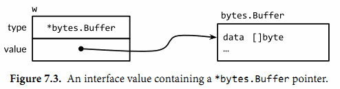

## 6. 方法

从90年代早期开始，面向对象编程（OOP）就成为了称霸工程界和教育界的编程范式，所以之后几乎所有大规模被应用的语言都包含了对OOP的支持，go语言也不例外。

尽管没有被大众所接受的明确的OOP的定义，从我们的理解来讲，一个对象其实也就是一个简单的值或者一个变量，在这个对象中会包含一些方法，而一个方法则是一个和特殊类型关联的函数。一个面向对象的程序会用方法来表达其属性和对应的操作，这样使用这个对象的用户就不需要直接去操作对象，而是借助方法来做这些事情。

在早些的章节中，我们已经使用了标准库提供的一些方法，比如time.Duration这个类型的Seconds方法：

```Go
const day = 24 * time.Hour
fmt.Println(day.Seconds()) // "86400"
```

并且在2.5节中，我们定义了一个自己的方法，Celsius类型的String方法:

```Go
func (c Celsius) String() string { return fmt.Sprintf("%g°C", c) }
```

在本章中，OOP编程的第一方面，我们会向你展示如何有效地定义和使用方法。我们会覆盖到OOP编程的两个关键点，封装和组合。

### 6.1. 方法声明

定义、使用方式如下

```go
package geometry

import "math"

type Point struct{X, Y float64}

// traditional function
func Distance(p, q Point) float64 {
  return math.Hypot(q.X-p.X, q.Y-p.Y)
}

// sone thing, but as a method of the Point type
// 函数前面的参数p会把这个函数Distance附加到Point这种类型上，相当于这种类型定义了他自己的方法
func (p Point) Distance(q Point) float64 {
  return math.Hypot(p.X-q.X, p.Y-q.Y)
}
```

代码中附加的参数p，叫做方法的接收器（receiver）。接收器名字不固定，一般使用对应类型的第一个字母小写化。

使用方式如下

```go
p := Point{1, 2}
q := Point{4, 6}
fmt.Println(Distance(p, q)) // "5", function call
fmt.Println(p.Distance(q)) // "5", method call
```

其中第一个Distance的调用使用的是包级别的函数：geometry.Distance，第二个则是使用Point类下声明的Point.Distance方法。

p.Distance（）这个表达式叫做选择器，他会选择合适的对应p这个对象的Distance方法来执行。选择器也可以用来选择struct类型的字段，比如p.X。

由于方法和字段都是在同一命名空间，所以如果我们在这里声明一个X方法的话，编译器会报错，因为在调用p.X时会有歧义。

> 也就是说不要让字段和方法重名 = 不要让成员和方法重名

不同的类型有自己的命名空间，不要担心不同的Distance混乱。比如这个例子：

``` go
// A Path is a journey connecting the points with straight lines.
type Path []Point
// Distance returns the distance traveled along the path.
func (path Path) Distance() float64 {
    sum := 0.0
    for i := range path {
        if i > 0 {
            sum += path[i-1].Distance(path[i])
        }
    }
    return sum
}
```

Go语言中可以为一些简单的数值、字符串、slice、map来定义一些附加行为（func）。我们可以给同一个包内的任意命名类型定义方法，只要这个命名类型的底层类型（译注：这个例子里，底层类型是指[]Point这个slice，Path就是命名类型）不是指针或者interface。

上面的这两个Distance没有任何关系，尽管Path的Distance方法会在内部调用Point.Distance方法来计算每个连接邻接点的线段的长度。

上面这个Distance可以用来计算三角形的周长

```go
perim := Path {
  {1, 1},
  {5, 1},
  {5, 4},
  {1, 1},
}
fmt.Println(perim.Distance()) // "12"
```

在上面两个对Distance名字的方法的调用中，编译器会根据方法的名字以及接收器来决定具体调用的是哪一个函数。第一个例子中path[i-1]数组中的类型是Point，因此Point.Distance这个方法被调用；在第二个例子中perim的类型是Path，因此Distance调用的是Path.Distance。

对于一个给定的类型，其内部的方法都必须有唯一的方法名，但是不同的类型却可以有同样的方法名，比如我们这里Point和Path就都有Distance这个名字的方法；所以我们没有必要非在方法名之前加类型名来消除歧义，比如PathDistance。这里我们已经看到了方法比之函数的一些好处：方法名可以简短。当我们在包外调用的时候这种好处就会被放大，因为我们可以使用这个短名字，而可以省略掉包的名字.

> 这段话的意思是在命名方面，方法要比函数更加优秀，使用更短的名字就可以说明作用。

下面是例子：

```
import "gopl.io/ch6/geometry"

perim := geometry.Path{{1, 1}, {5, 1}, {5, 4}, {1, 1}}
fmt.Println(geometry.PathDistance(perim)) // "12", standalone function
fmt.Println(perim.Distance())             // "12", method of geometry.Path
```

很明绑定到struct的方法比包内的函数更好（打字少hh）

###  6.2. 基于指针对象的方法

在CPP中指针和引用存在的很大的一个原因，就是在函数传值的时候可以避免不必要的默认拷贝。Go使用指针来避免拷贝，同样的我们使用指针接收器，当这个接受者本身比较大的时候，就可以使用指针而不是对象来声明方法。

```go
func (p *Point) ScaleBy(factor float64) {
    p.X *= factor
    p.Y *= factor
}
```

这个方法的名字全称为：`(*Point).ScaleBy` 。这里的括号是必须的，没有这个括号，表达式会被编译器理解为`*(Point).ScaleBy`。

> 这里主要是再说优先级这个事

一般情况下，大家会统一接收器为指针接收器，还是对象接收器。比如如果Point这个类有一个指针作为接收器的方法，那么Point的所有方法都必须有一个指针接收器，即使有些不需要指针作为接收器的函数。

只有类型（Point）和指向他们的指针（*Point）才可能是出现在接收器声明里面的两种接收器。为了避免歧义，在声明方法的时候，如果一个类型本身是一个指针的话，是不允许其出现在接收器中的，比如：

```go
type P *int
func (P) f() { /* ... */ } // compile error: invalid receiver type
```

想要调用指针类型方法`(*Point).ScaleBy`，只要提供一个Point类型的指针即可，像下面这样。

```go
r := &Point{1, 2}
r.ScaleBy(2)
fmt.Println(*r) // "{2, 4}"
```

或者这样：

```go
p := Point{1, 2}
pptr := &p
pptr.ScaleBy(2)
fmt.Println(p) // "{2, 4}"
```

或者这样:

```go
p := Point{1, 2}
(&p).ScaleBy(2)
fmt.Println(p) // "{2, 4}"
```

熟悉CPP的同学对于这种使用方式习以为常，不过Go会简化接收器的取地址或解引用操作。如果接收器p是一个Point类型的变量，并且其方法需要一个Point指针作为接收器，我们可以用下面这种简短的写法：

```go
p.ScaleBy(2)
```

这里p是一个变量，编译器会隐式地帮我们用&p去调用ScaleBy这个方法。这种简写方法只适用于“变量”，包括struct里的字段比如p.X，以及array和slice内的元素比如perim[0]。我们不能通过一个无法取到地址的接收器来调用指针方法，比如临时变量的内存地址就无法获取得到：

```go
Point{1, 2}.ScaleBy(2) // compile error: can't take address of Point literal
```

同样的我们可以用一个`*Point`这样的接收器来调用Point的方法，因为我们可以通过地址来找到这个变量，只要用解引用符号`*`来取到该变量即可。编译器在这里也会给我们隐式地插入`*`这个操作符，所以下面这两种写法等价的：

这里pptr是一个指针。

```Go
pptr.Distance(q)
(*pptr).Distance(q)
```

这里的几个例子可能让你有些困惑，所以我们总结复习一下：在每一个合法的方法调用表达式中，主要分为两种情况。

* 类型相同

要么接收器的实际参数（实际传入的参数）和其形式参数（声明的参数）是相同的类型，比如两者都是类型T或者都是类型`*T`：

```go
Point{1, 2}.Distance(q) //  Point
pptr.ScaleBy(2)         // *Point

```

* 类型不同

或者接收器实参是类型T，但接收器形参是类型`*T`，这种情况下编译器会隐式地为我们取变量的地址：

```go
p.ScaleBy(2) // implicit (&p)
```

或者接收器实参是类型`*T`，形参是类型T。编译器会隐式地为我们解引用，取到指针指向的实际变量：

```go
pptr.Distance(q) // implicit (*pptr)
```

如果是命名类型T（译注：用type xxx定义的类型）的所有方法都是用T类型自己来做接收器（而不是`*T`），那么拷贝这种类型的实例就是安全的；调用他的任何一个方法也就会产生一个值的拷贝。比如time.Duration的这个类型，在调用其方法时就会被全部拷贝一份，包括在作为参数传入函数的时候。

但是如果一个方法使用指针作为接收器，你需要避免对其进行拷贝，因为这样可能会破坏掉该类型内部的不变性。比如你对bytes.Buffer对象进行了拷贝，那么可能会引起原始对象和拷贝对象只是别名而已，实际上它们指向的对象是一样的。紧接着对拷贝后的变量进行修改可能会有让你有意外的结果。

> 命名类型T 如： type T int
>
> 如果一个方法是使用指针作为接收器，那么你就需要立刻警惕起来，因为不仅仅是对象过大使用指针进行传递，也有可能是因为浅拷贝，结合CPP可能更容易理解。

再再再总结：

1. 不管你的method的receiver是指针类型还是非指针类型，都是可以通过指针/非指针类型进行调用的，编译器会帮你做类型转换。
2. 在声明一个method的receiver该是指针还是非指针类型时，你需要考虑两方面的因素，第一方面是这个对象本身是不是特别大，如果声明为非指针变量时，调用会产生一次拷贝；第二方面是如果你用指针类型作为receiver，那么你一定要注意，这种指针类型指向的始终是一块内存地址，就算你对其进行了拷贝。熟悉C或者C++的人这里应该很快能明白。

#### 6.2.1. Nil也是一个合法的接收器类型

就像一些函数允许nil指针作为参数一样，方法理论上也可以用nil指针作为其接收器，尤其当nil对于对象来说是合法的零值时，比如map或者slice。在下面的简单int链表的例子里，nil代表的是空链表：

```go
// An IntList is a linked list of integers.
// A nil *IntList represents the empty list.
type IntList struct {
    Value int
    Tail  *IntList
}
// Sum returns the sum of the list elements.
func (list *IntList) Sum() int {
    if list == nil {
        return 0
    }
    return list.Value + list.Tail.Sum()
}
```

当你定义一个允许nil作为接收器值的方法的类型时，在类型前面的注释中指出nil变量代表的意义是很有必要的，就像我们上面例子里做的这样。

下面是net/url包里Values类型定义的一部分。

*net/url*

```go
package url

// Values maps a string key to a list of values.
type Values map[string][]string
// Get returns the first value associated with the given key,
// or "" if there are none.
func (v Values) Get(key string) string {
    if vs := v[key]; len(vs) > 0 {
        return vs[0]
    }
    return ""
}
// Add adds the value to key.
// It appends to any existing values associated with key.
func (v Values) Add(key, value string) {
    v[key] = append(v[key], value)
}
```

这个定义向外部暴露了一个map的命名类型，并且提供了一些能够简单操作这个map的方法。这个map的value字段是一个string的slice，所以这个Values是一个多维map。客户端使用这个变量的时候可以使用map固有的一些操作（make，切片，m[key]等等），也可以使用这里提供的操作方法，或者两者并用，都是可以的：

*gopl.io/ch6/urlvalues*

```go
m := url.Values{"lang": {"en"}} // direct construction
m.Add("item", "1")
m.Add("item", "2")

fmt.Println(m.Get("lang")) // "en"
fmt.Println(m.Get("q"))    // ""
fmt.Println(m.Get("item")) // "1"      (first value)
fmt.Println(m["item"])     // "[1 2]"  (direct map access)

m = nil
fmt.Println(m.Get("item")) // ""
m.Add("item", "3")         // panic: assignment to entry in nil map
```

对Get的最后一次调用中，nil接收器的行为即是一个空map的行为。我们可以等价地将这个操作写成Value(nil).Get("item")，但是如果你直接写nil.Get("item")的话是无法通过编译的，因为nil的字面量编译器无法判断其准确类型。所以相比之下，最后的那行m.Add的调用就会产生一个panic，因为他尝试更新一个空map。

由于url.Values是一个map类型，并且间接引用了其key/value对，因此url.Values.Add对这个map里的元素做任何的更新、删除操作对调用方都是可见的。实际上，就像在普通函数中一样，虽然可以通过引用来操作内部值，但在方法想要修改引用`本身`时是不会影响原始值的，比如把他置换为nil，或者让这个引用指向了其它的对象，调用方都不会受影响。（注：因为传入的是存储了内存地址的变量，m传递过来的时候是值拷贝，前文能做修改是因为涉及到了map的扩容，而现在m没有空间，就算创建了一个新的空map给m，因为m是值拷贝，你给他没用啊）

### 6.3. 通过嵌入结构体来扩展类型

给一段代码：

```go
import "image/color"

type Point struct{ X, Y float64 }

type ColoredPoint struct {
    Point
    Color color.RGBA
}
```

对于ColoredPoint的定义，我们完全可以将其定义为有三个字段的struct（X，Y，Color），但是现在却将Point这个类型嵌入到ColoredPoint来提供X和Y这两个字段。内嵌可以使我们在定义ColoredPoint时得到一种句法上的简写形式，并使其包含Point类型所具有的一切字段，然后再定义一些自己的。如果我们想要的话，我们可以直接认为通过嵌入的字段就是ColoredPoint自身的字段，而完全不需要在调用时指出Point，比如下面这样。

```go
var cp ColoredPoint
cp.X = 1
fmt.Println(cp.Point.X) // "1"
cp.Point.Y = 2
fmt.Println(cp.Y) // "2"
```

对于Point中的方法我们也有类似的用法，我们可以把ColoredPoint类型当作接收器来调用Point里的方法，即使ColoredPoint里没有声明这些方法：

```go
red := color.RGBA{255, 0, 0, 255}
blue := color.RGBA{0, 0, 255, 255}
var p = ColoredPoint{Point{1, 1}, red}
var q = ColoredPoint{Point{5, 4}, blue}
fmt.Println(p.Distance(q.Point)) // "5"
p.ScaleBy(2)
q.ScaleBy(2)
fmt.Println(p.Distance(q.Point)) // "10"
```

Point类的方法也被引入了ColoredPoint。用这种方式，内嵌可以使我们定义字段特别多的复杂类型，我们可以将字段先按小类型分组，然后定义小类型的方法，之后再把它们组合起来。

读者如果对基于类来实现面向对象的语言比较熟悉的话，可能会倾向于将Point看作一个基类，而ColoredPoint看作其子类或者继承类，或者将ColoredPoint看作"is a" Point类型。但这是错误的理解。请注意上面例子中对Distance方法的调用。Distance有一个参数是Point类型，但q并不是一个Point类，所以尽管q有着Point这个内嵌类型，我们也必须要显式地选择它。尝试直接传q的话你会看到下面这样的错误：

```go
p.Distance(q) // compile error: cannot use q (ColoredPoint) as Point
```

一个ColoredPoint并不是一个Point，但他"has a"Point，并且它有从Point类里引入的Distance和ScaleBy方法。如果你喜欢从实现的角度来考虑问题，内嵌字段会指导编译器去生成额外的包装方法来委托已经声明好的方法，和下面的形式是等价的：

```go
func (p ColoredPoint) Distance(q Point) float64 {
    return p.Point.Distance(q)
}

func (p *ColoredPoint) ScaleBy(factor float64) {
    p.Point.ScaleBy(factor)
}
```

当Point.Distance被第一个包装方法调用时（直接return p.Point.Distance(q)，简简单单包装一下），它的接收器值是p.Point，而不是p，当然了，在Point类的方法里，你是访问不到ColoredPoint的任何字段的。

在类型中内嵌的匿名字段也可能是一个命名类型的指针，这种情况下字段和方法会被间接地引入到当前的类型中（译注：访问需要通过该指针指向的对象去取）。添加这一层间接关系让我们可以共享通用的结构并动态地改变对象之间的关系。下面这个ColoredPoint的声明内嵌了一个*Point的指针。

```go
type ColoredPoint struct {
    *Point
    Color color.RGBA
}

p := ColoredPoint{&Point{1, 1}, red}
q := ColoredPoint{&Point{5, 4}, blue}
fmt.Println(p.Distance(*q.Point)) // "5"
q.Point = p.Point                 // p and q now share the same Point
p.ScaleBy(2)
fmt.Println(*p.Point, *q.Point) // "{2 2} {2 2}"
```

一个struct类型也可能会有多个匿名字段。我们将ColoredPoint定义为下面这样：

```go
type ColoredPoint struct {
    Point
    color.RGBA
}
```

然后这种类型的值便会拥有Point和RGBA类型的所有方法，以及直接定义在ColoredPoint中的方法。当编译器解析一个选择器到方法时，比如p.ScaleBy，它会首先去找直接定义在这个类型里的ScaleBy方法，然后找被ColoredPoint的内嵌字段们引入的方法，然后去找Point和RGBA的内嵌字段引入的方法，然后一直递归向下找。如果选择器有二义性的话编译器会报错，比如你在同一级里有两个同名的方法。

方法只能在命名类型（像Point）或者指向类型的指针上定义，但是多亏了内嵌，有些时候我们给匿名struct类型来定义方法也有了手段。

下面是一个小trick。这个例子展示了简单的cache，其使用两个包级别的变量来实现，一个mutex互斥锁（§9.2）和它所操作的cache：

```go
var (
    mu sync.Mutex // guards mapping
    mapping = make(map[string]string)
)

func Lookup(key string) string {
    mu.Lock()
    v := mapping[key]
    mu.Unlock()
    return v
}
```

下面这个版本在功能上是一致的，但将两个包级别的变量放在了cache这个struct一组内：

```go
var cache = struct {
    sync.Mutex
    mapping map[string]string
}{
    mapping: make(map[string]string),
}


func Lookup(key string) string {
    cache.Lock()
    v := cache.mapping[key]
    cache.Unlock()
    return v
}
```

我们给新的变量起了一个更具表达性的名字：cache。因为sync.Mutex字段也被嵌入到了这个struct里，其Lock和Unlock方法也就都被引入到了这个匿名结构中了，这让我们能够以一个简单明了的语法来对其进行加锁解锁操作。

### 6.4. 方法值和方法表达式

我们经常选择一个方法，并且在同一个表达式里执行，比如常见的p.Distance()形式，实际上将其分成两步来执行也是可能的。

1. p.Distance叫作“选择器”，选择器会返回一个方法“值”->一个将方法（Point.Distance）绑定到特定接收器变量的函数。
2. 这个函数可以不通过指定其接收器即可被调用；即调用时不需要指定接收器（译注：因为已经在前文中指定过了），只要传入函数的参数即可：

```go
p := Point{1, 2}
q := Point{4, 6}

distanceFromP := p.Distance        // method value
fmt.Println(distanceFromP(q))      // "5"
var origin Point                   // {0, 0}
fmt.Println(distanceFromP(origin)) // "2.23606797749979", sqrt(5)

scaleP := p.ScaleBy // method value
scaleP(2)           // p becomes (2, 4)
scaleP(3)           //      then (6, 12)
scaleP(10)          //      then (60, 120)
```

在一个包的API需要一个函数值、且调用方希望操作的是某一个绑定了对象的方法的话，方法“值”会非常实用（``=_=`真是绕）。举例来说，下面例子中的time.AfterFunc这个函数的功能是在指定的延迟时间之后来执行一个（译注：另外的）函数。且这个函数操作的是一个Rocket对象r

```go
type Rocket struct { /* ... */ }
func (r *Rocket) Launch() { /* ... */ }
r := new(Rocket)
time.AfterFunc(10 * time.Second, func() { r.Launch() })
```

直接用方法“值”传入AfterFunc的话可以更为简短：

```go
time.AfterFunc(10 * time.Second, r.Launch)
```

译注：省掉了上面那个例子里的匿名函数。

和方法“值”相关的还有方法表达式。当调用一个方法时，与调用一个普通的函数相比，我们必须要用选择器（p.Distance）语法来指定方法的接收器。

当T是一个类型时，方法表达式可能会写作`T.f`或者`(*T).f`，会返回一个函数“值”，这种函数会将其第一个参数用作接收器，所以可以用通常（译注：不写选择器）的方式来对其进行调用：

```go
p := Point{1, 2}
q := Point{4, 6}

distance := Point.Distance   // method expression
fmt.Println(distance(p, q))  // "5"
fmt.Printf("%T\n", distance) // "func(Point, Point) float64"

scale := (*Point).ScaleBy
scale(&p, 2)
fmt.Println(p)            // "{2 4}"
fmt.Printf("%T\n", scale) // "func(*Point, float64)"

// 译注：这个Distance实际上是指定了Point对象为接收器的一个方法func (p Point) Distance()，
// 但通过Point.Distance得到的函数需要比实际的Distance方法多一个参数，
// 即其需要用第一个额外参数指定接收器，后面排列Distance方法的参数。
// 看起来本书中函数和方法的区别是指有没有接收器。
```

当你根据一个变量来决定调用同一个类型的哪个函数时，方法表达式就显得很有用了。你可以根据选择来调用接收器各不相同的方法。下面的例子，变量op代表Point类型的addition或者subtraction方法，Path.TranslateBy方法会为其Path数组中的每一个Point来调用对应的方法：

```go
type Point struct{ X, Y float64 }

func (p Point) Add(q Point) Point { return Point{p.X + q.X, p.Y + q.Y} }
func (p Point) Sub(q Point) Point { return Point{p.X - q.X, p.Y - q.Y} }

type Path []Point

func (path Path) TranslateBy(offset Point, add bool) {
    var op func(p, q Point) Point
    if add {
        op = Point.Add
    } else {
        op = Point.Sub
    }
    for i := range path {
        // Call either path[i].Add(offset) or path[i].Sub(offset).
        path[i] = op(path[i], offset)
    }
}
```

### 6.5. 示例：Bit数组

Go语言里的集合一般会用map[T]bool这种形式来表示，T代表元素类型。集合用map类型来表示虽然非常灵活，但我们可以以一种更好的形式来表示它。例如在数据流分析领域，集合元素通常是一个非负整数，集合会包含很多元素，并且集合会经常进行并集、交集操作，这种情况下，bit数组会比map表现更加理想。（译注：这里再补充一个例子，比如我们执行一个http下载任务，把文件按照16kb一块划分为很多块，需要有一个全局变量来标识哪些块下载完成了，这种时候也需要用到bit数组。）

一个bit数组通常会用一个无符号数或者称之为“字”的slice来表示，每一个元素的每一位都表示集合里的一个值。当集合的第i位被设置时，我们才说这个集合包含元素i。下面的这个程序展示了一个简单的bit数组类型，并且实现了三个函数来对这个bit数组来进行操作：

*gopl.io/ch6/intset*

```go
// An IntSet is a set of small non-negative integers.
// Its zero value represents the empty set.
type IntSet struct {
    words []uint64
}

// Has reports whether the set contains the non-negative value x.
func (s *IntSet) Has(x int) bool {
    word, bit := x/64, uint(x%64)
    return word < len(s.words) && s.words[word]&(1<<bit) != 0
}

// Add adds the non-negative value x to the set.
func (s *IntSet) Add(x int) {
    word, bit := x/64, uint(x%64)
    for word >= len(s.words) {
        s.words = append(s.words, 0)
    }
    s.words[word] |= 1 << bit
}

// UnionWith sets s to the union of s and t.
func (s *IntSet) UnionWith(t *IntSet) {
    for i, tword := range t.words {
        if i < len(s.words) {
            s.words[i] |= tword
        } else {
            s.words = append(s.words, tword)
        }
    }
}
```

因为每一个字都有64个二进制位，所以为了定位x的bit位，我们用了x/64的商作为字的下标，并且用x%64得到的值作为这个字内的bit的所在位置。UnionWith这个方法里用到了bit位的“或”逻辑操作符号|来一次完成64个元素的或计算。（在练习6.5中我们还会有程序用到这个64位字的例子。）

当前这个实现还缺少了很多必要的特性，我们把其中一些作为练习题列在本小节之后。但是有一个方法如果缺失的话我们的bit数组可能会比较难混：将IntSet作为一个字符串来打印。这里我们来实现它，让我们来给上面的例子添加一个String方法，类似2.5节中做的那样：

```go
// String returns the set as a string of the form "{1 2 3}".
func (s *IntSet) String() string {
    var buf bytes.Buffer
    buf.WriteByte('{')
    for i, word := range s.words {
        if word == 0 {
            continue
        }
        for j := 0; j < 64; j++ {
            if word&(1<<uint(j)) != 0 {
                if buf.Len() > len("{") {
                    buf.WriteByte(' ')
                }
                fmt.Fprintf(&buf, "%d", 64*i+j)
            }
        }
    }
    buf.WriteByte('}')
    return buf.String()
}
```

这里留意一下String方法，是不是和3.5.4节中的intsToString方法很相似；bytes.Buffer在String方法里经常这么用。当你为一个复杂的类型定义了一个String方法时，fmt包就会特殊对待这种类型的值，这样可以让这些类型在打印的时候看起来更加友好，而不是直接打印其原始的值。fmt会直接调用用户定义的String方法。这种机制依赖于接口和类型断言，在第7章中我们会详细介绍。

现在我们就可以在实战中直接用上面定义好的IntSet了：

```go
var x, y IntSet
x.Add(1)
x.Add(144)
x.Add(9)
fmt.Println(x.String()) // "{1 9 144}"

y.Add(9)
y.Add(42)
fmt.Println(y.String()) // "{9 42}"

x.UnionWith(&y)
fmt.Println(x.String()) // "{1 9 42 144}"
fmt.Println(x.Has(9), x.Has(123)) // "true false"
```

这里要注意：我们声明的String和Has两个方法都是以指针类型`*IntSet`来作为接收器的，但实际上对于这两个类型来说，把接收器声明为指针类型也没什么必要。不过另外两个函数就不是这样了，因为另外两个函数操作的是s.words对象，如果你不把接收器声明为指针对象，那么实际操作的是拷贝对象，而不是原来的那个对象。因此，因为我们的String方法定义在IntSet指针上，所以当我们的变量是IntSet类型而不是IntSet指针时，可能会有下面这样让人意外的情况：

```go
fmt.Println(&x)         // "{1 9 42 144}"
fmt.Println(x.String()) // "{1 9 42 144}"
fmt.Println(x)          // "{[4398046511618 0 65536]}"
```

在第一个Println中，我们打印一个`*IntSet`的指针，这个类型的指针确实有自定义的String方法。第二Println，我们直接调用了x变量的String()方法；这种情况下编译器会隐式地在x前插入&操作符，这样相当于我们还是调用的IntSet指针的String方法。在第三个Println中，因为IntSet类型没有String方法，所以Println方法会直接以原始的方式理解并打印。所以在这种情况下&符号是不能忘的。在我们这种场景下，你把String方法绑定到IntSet对象上，而不是IntSet指针上可能会更合适一些，不过这也需要具体问题具体分析。

### 6.6. 封装

一个对象的变量或者方法如果对调用方是不可见的话，一般就被定义为“封装”。封装有时候也被叫做信息隐藏，同时也是面向对象编程最关键的一个方面。

Go语言只有一种控制可见性的手段：大写首字母的标识符会从定义它们的包中被导出，小写字母的则不会。这种限制包内成员的方式同样适用于struct或者一个类型的方法。因而如果我们想要封装一个对象，我们必须将其定义为一个struct。

这也就是前面的小节中IntSet被定义为struct类型的原因，尽管它只有一个字段：

```go
type IntSet struct {
    words []uint64
}
```

当然，我们也可以把IntSet定义为一个slice类型，但这样我们就需要把代码中所有方法里用到的s.words用`*s`替换掉了：

```go
type IntSet []uint64
```

尽管这个版本的IntSet在本质上是一样的，但它也允许其它包中可以直接读取并编辑这个slice。换句话说，相对于`*s`这个表达式会出现在所有的包中，s.words只能在定义IntSet的包中出现（译注：private和public的意思）。

这种基于名字的手段使得在语言中最小的封装单元是package（一个package可能有很多个.go文件），而不是像其它语言一样的类型。一个struct类型的字段对同一个包的所有代码都有可见性，无论你的代码是写在一个函数还是一个方法里。

封装提供了三方面的优点。首先，因为调用方不能直接修改对象的变量值，其只需要关注少量的语句并且只要弄懂少量变量的可能的值即可。

第二，隐藏实现的细节，可以防止调用方依赖那些可能变化的具体实现，这样使设计包的程序员在不破坏对外的api情况下能得到更大的自由。

把bytes.Buffer这个类型作为例子来考虑。这个类型在做短字符串叠加的时候很常用，所以在设计的时候可以做一些预先的优化，比如提前预留一部分空间，来避免反复的内存分配。又因为Buffer是一个struct类型，这些额外的空间可以用附加的字节数组来保存，且放在一个小写字母开头的字段中。这样在外部的调用方只能看到性能的提升，但并不会得到这个附加变量。Buffer和其增长算法我们列在这里，为了简洁性稍微做了一些精简：

```go
type Buffer struct {
    buf     []byte
    initial [64]byte
    /* ... */
}

// Grow expands the buffer's capacity, if necessary,
// to guarantee space for another n bytes. [...]
func (b *Buffer) Grow(n int) {
    if b.buf == nil {
        b.buf = b.initial[:0] // use preallocated space initially
    }
    if len(b.buf)+n > cap(b.buf) {
        buf := make([]byte, b.Len(), 2*cap(b.buf) + n)
        copy(buf, b.buf)
        b.buf = buf
    }
}
```

封装的第三个优点也是最重要的优点，是阻止了外部调用方对对象内部的值任意地进行修改。因为对象内部变量只可以被同一个包内的函数修改，所以包的作者可以让这些函数确保对象内部的一些值的不变性。比如下面的Counter类型允许调用方来增加counter变量的值，并且允许将这个值reset为0，但是不允许随便设置这个值（译注：小写，无法访问）：

```go
type Counter struct { n int }
func (c *Counter) N() int     { return c.n }
func (c *Counter) Increment() { c.n++ }
func (c *Counter) Reset()     { c.n = 0 }
```

只用来访问或修改内部变量的函数被称为setter或者getter，例子如下，比如log包里的Logger类型对应的一些函数。在命名一个getter方法时，我们通常会省略掉前面的Get前缀。这种简洁上的偏好也可以推广到各种类型的前缀比如Fetch，Find或者Lookup。

```go
package log
type Logger struct {
    flags  int
    prefix string
    // ...
}
func (l *Logger) Flags() int
func (l *Logger) SetFlags(flag int)
func (l *Logger) Prefix() string
func (l *Logger) SetPrefix(prefix string)
```

Go的编码风格不禁止直接导出字段。当然，一旦进行了导出，就没有办法在保证API兼容的情况下去除对其的导出，所以在一开始的选择一定要经过深思熟虑并且要考虑到包内部的一些不变量的保证，未来可能的变化，以及调用方的代码质量是否会因为包的一点修改而变差。

封装并不总是理想的。 虽然封装在有些情况是必要的，但有时候我们也需要暴露一些内部内容，比如：time.Duration将其表现暴露为一个int64数字的纳秒，使得我们可以用一般的数值操作来对时间进行对比，甚至可以定义这种类型的常量：

```go
const day = 24 * time.Hour
fmt.Println(day.Seconds()) // "86400"
```

另一个例子，将IntSet和本章开头的geometry.Path进行对比。Path被定义为一个slice类型，这允许其调用slice的字面方法来对其内部的points用range进行迭代遍历；在这一点上，IntSet是没有办法让你这么做的。

这两种类型决定性的不同：geometry.Path的本质是一个坐标点的序列，不多也不少，我们可以预见到之后也并不会给他增加额外的字段，所以在geometry包中将Path暴露为一个slice。相比之下，IntSet仅仅是在这里用了一个[]uint64的slice。这个类型还可以用[]uint类型来表示，或者我们甚至可以用其它完全不同的占用更小内存空间的东西来表示这个集合，所以我们可能还会需要额外的字段来在这个类型中记录元素的个数。也正是因为这些原因，我们让IntSet对调用方不透明。

> 啊，机翻如此难过，这段话的意思就是如果你想暴露某个字段，那么最好是弄一个更加短小的成员变量或是同类型的，然后赋值给这个新弄出来的成员，把这个新成员暴露出去，这样新旧隔离，新创建出来的字段专门给大家读的。大概这个么个意思。

在这章中，我们学到了如何将方法与命名类型进行组合，并且知道了如何调用这些方法。尽管方法对于OOP编程来说至关重要，但他们只是OOP编程里的半边天。为了完成OOP，我们还需要接口。Go里的接口会在下一章中介绍。

>  屁话

## 7. 接口

接口类型是对其它类型行为的抽象和概括；因为接口类型不会和特定的实现细节绑定在一起，通过这种抽象的方式我们可以让我们的函数更加灵活和更具有适应能力。

很多面向对象的语言都有相似的接口概念，但Go语言中接口类型的独特之处在于它是满足隐式实现的。也就是说，我们没有必要对于给定的具体类型定义所有满足的接口类型；简单地拥有一些必需的方法就足够了。这种设计可以让你创建一个新的接口类型满足已经存在的具体类型却不会去改变这些类型的定义；当我们使用的类型来自于不受我们控制的包时这种设计尤其有用。

在本章，我们会开始看到接口类型和值的一些基本技巧。顺着这种方式我们将学习几个来自标准库的重要接口。很多Go程序中都尽可能多的去使用标准库中的接口。最后，我们会在（§7.10）看到类型断言的知识，在（§7.13）看到类型开关的使用并且学到他们是怎样让不同的类型的概括成为可能。

### 7.1. 接口约定

目前为止，我们看到的类型都是具体的类型。一个具体的类型可以准确的描述它所代表的值，并且展示出对类型本身的一些操作方式：就像数字类型的算术操作，切片类型的取下标、添加元素和范围获取操作。具体的类型还可以通过它的内置方法提供额外的行为操作。总的来说，当你拿到一个具体的类型时你就知道它的本身是什么和你可以用它来做什么。

在Go语言中还存在着另外一种类型：接口类型。接口类型是一种抽象的类型。它不会暴露出它所代表的对象的内部值的结构和这个对象支持的基础操作的集合；它们只会表现出它们自己的方法。也就是说当你有看到一个接口类型的值时，你不知道它是什么，唯一知道的就是可以通过它的方法来做什么。

在本书中，我们一直使用两个相似的函数来进行字符串的格式化：fmt.Printf，它会把结果写到标准输出，和fmt.Sprintf，它会把结果以字符串的形式返回。得益于使用接口，我们不必可悲的因为返回结果在使用方式上的一些浅显不同就必需把格式化这个最困难的过程复制一份。实际上，这两个函数都使用了另一个函数fmt.Fprintf来进行封装。fmt.Fprintf这个函数对它的计算结果会被怎么使用是完全不知道的。

```go
package fmt

func Fprintf(w io.Writer, format string, args ...interface{}) (int, error)
func Printf(format string, args ...interface{}) (int, error) {
    return Fprintf(os.Stdout, format, args...)
}
func Sprintf(format string, args ...interface{}) string {
    var buf bytes.Buffer
    Fprintf(&buf, format, args...)
    return buf.String()
}
```

Fprintf的前缀F表示文件（File）也表明格式化输出结果应该被写入第一个参数提供的文件中。在Printf函数中的第一个参数os.Stdout是`*os.File`类型；在Sprintf函数中的第一个参数&buf是一个指向可以写入字节的内存缓冲区，然而它 并不是一个文件类型尽管它在某种意义上和文件类型相似。

即使Fprintf函数中的第一个参数也不是一个文件类型。它是io.Writer类型，这是一个接口类型定义如下：

```go
package io

// Writer is the interface that wraps the basic Write method.
type Writer interface {
    // Write writes len(p) bytes from p to the underlying data stream.
    // It returns the number of bytes written from p (0 <= n <= len(p))
    // and any error encountered that caused the write to stop early.
    // Write must return a non-nil error if it returns n < len(p).
    // Write must not modify the slice data, even temporarily.
    //
    // Implementations must not retain p.
    Write(p []byte) (n int, err error)
}
```

io.Writer类型定义了函数Fprintf和这个函数调用者之间的约定。一方面这个约定需要调用者提供具体类型的值就像`*os.File`和`*bytes.Buffer`，这些类型都有一个特定签名和行为的Write的函数。另一方面这个约定保证了Fprintf接受任何满足io.Writer接口的值都可以工作。Fprintf函数可能没有假定写入的是一个文件或是一段内存，而是写入一个可以调用Write函数的值。

因为fmt.Fprintf函数没有对具体操作的值做任何假设，而是仅仅通过io.Writer接口的约定来保证行为，所以第一个参数可以安全地传入一个只需要满足io.Writer接口的任意具体类型的值。一个类型可以自由地被另一个满足相同接口的类型替换，被称作可替换性（LSP里氏替换）。这是一个面向对象的特征。

让我们通过一个新的类型来进行校验，下面`*ByteCounter`类型里的Write方法，仅仅在丢弃写向它的字节前统计它们的长度。（在这个+=赋值语句中，让len(p)的类型和`*c`的类型匹配的转换是必须的。）

*gopl.io/ch7/bytecounter*

```go
type ByteCounter int

func (c *ByteCounter) Write(p []byte) (int, error) {
    *c += ByteCounter(len(p)) // convert int to ByteCounter
    return len(p), nil
}
```

因为*ByteCounter满足io.Writer的约定，我们可以把它传入Fprintf函数中；Fprintf函数执行字符串格式化的过程不会去关注ByteCounter正确的累加结果的长度。

```go
var c ByteCounter
c.Write([]byte("hello"))
fmt.Println(c) // "5", = len("hello")
c = 0          // reset the counter
var name = "Dolly"
fmt.Fprintf(&c, "hello, %s", name)
fmt.Println(c) // "12", = len("hello, Dolly")
```

除了io.Writer这个接口类型，还有另一个对fmt包很重要的接口类型。Fprintf和Fprintln函数向类型提供了一种控制它们值输出的途径。在2.5节中，我们为Celsius类型提供了一个String方法以便于可以打印成这样"100°C" ，在6.5节中我们给*IntSet添加一个String方法，这样集合可以用传统的符号来进行表示就像"{1 2 3}"。给一个类型定义String方法，可以让它满足最广泛使用之一的接口类型fmt.Stringer：

```go
package fmt

// The String method is used to print values passed
// as an operand to any format that accepts a string
// or to an unformatted printer such as Print.
type Stringer interface {
    String() string
}
```

我们会在7.10节解释fmt包怎么发现哪些值是满足这个接口类型的。

### 7.2. 接口类型

接口类型具体描述了一些方法的集合，是一个定义，一个实现了这些方法的具体类型是这个接口类型的实例。

io.Writer类型是用得最广泛的接口之一，因为它提供了所有类型的写入bytes的抽象，包括文件类型，内存缓冲区，网络链接，HTTP客户端，压缩工具，哈希等等。io包中定义了很多其它有用的接口类型。Reader可以代表任意可以读取bytes的类型，Closer可以是任意可以关闭的值，例如一个文件或是网络链接。（到现在你可能注意到了很多Go语言中单方法接口的命名习惯interface Reader -> Read）

```go
package io
type Reader interface {
    Read(p []byte) (n int, err error)
}
type Closer interface {
    Close() error
}
```

再往下看，我们发现有些新的接口类型通过组合已有的接口来定义。下面是两个例子：

```go
type ReadWriter interface {
    Reader
    Writer
}
type ReadWriteCloser interface {
    Reader
    Writer
    Closer
}
```

上面用到的语法和结构内嵌相似，我们可以用这种方式以一个简写命名一个接口，而不用声明它所有的方法。这种方式称为接口内嵌。我们也可以像下面这样，尽管略失简洁，，不使用内嵌来声明io.ReadWriter接口。

```go
type ReadWriter interface {
    Read(p []byte) (n int, err error)
    Write(p []byte) (n int, err error)
}
```

或者甚至使用一种混合的风格：

```go
type ReadWriter interface {
    Read(p []byte) (n int, err error)
    Writer
}
```

上面3种定义方式都是一样的效果。方法顺序的变化也没有影响，唯一重要的就是这个集合里面的方法。

### 7.3. 实现接口的条件

一个类型如果拥有一个接口需要的所有方法，那么这个类型就实现了这个接口。例如，`*os.File`类型实现了io.Reader，Writer，Closer，和ReadWriter接口。`*bytes.Buffer`实现了Reader，Writer，和ReadWriter这些接口，但是它没有实现Closer接口因为它不具有Close方法。Go的程序员经常会简要的把一个具体的类型描述成一个特定的接口类型。举个例子，`*bytes.Buffer`是io.Writer；`*os.Files`是io.ReadWriter。

接口指定的规则非常简单：表达一个类型属于某个接口只要这个类型实现这个接口。所以：

```go
var w io.Writer
w = os.Stdout           // OK: *os.File has Write method
w = new(bytes.Buffer)   // OK: *bytes.Buffer has Write method
w = time.Second         // compile error: time.Duration lacks Write method

var rwc io.ReadWriteCloser
rwc = os.Stdout         // OK: *os.File has Read, Write, Close methods
rwc = new(bytes.Buffer) // compile error: *bytes.Buffer lacks Close method
```

这个规则甚至适用于等式右边本身也是一个接口类型

```go
w = rwc                 // OK: io.ReadWriteCloser has Write method
rwc = w                 // compile error: io.Writer lacks Close method
```

因为ReadWriter和ReadWriteCloser包含有Writer的方法，所以任何实现了ReadWriter和ReadWriteCloser的类型必定也实现了Writer接口

在进一步学习前，必须先解释一个类型持有一个方法的表示当中的细节。回想在6.2章中，对于每一个命名过的具体类型T；它的一些方法的接收者是类型T本身然而另一些则是一个`*T`的指针。还记得在T类型的参数上调用一个`*T`的方法是合法的，只要这个参数是一个变量；编译器隐式的获取了它的地址。但这仅仅是一个语法糖：T类型的值不拥有所有`*T`指针的方法，这样它就可能只实现了更少的接口。

> 前文的具体命名类型的方法，到底接收器是T还是\*T，都可以直接调用方法，但是能调用不代表，这个类型有这个方法，接收器是T的类型，不会拥有接收器是\*T的方法（假设类型T同时拥有接收器为T和\*T的方法）。

举个例子可能会更清晰一点。在第6.5章中，IntSet类型的String方法的接收者是一个指针类型，所以我们不能在一个不能寻址的IntSet值上调用这个方法：

```go
type IntSet struct { /* ... */ }
func (*IntSet) String() string
var _ = IntSet{}.String() // compile error: String requires *IntSet receiver
```

> 注：下面这个方法才可以调用

```go
type IntSet struct { /* ... */
}

func (*IntSet) String() string {
	return "这是一个返回值"
}
func main() {
	var a = (&IntSet{}).String()
	fmt.Println(a)
}
```

但是我们可以在一个IntSet变量上调用这个方法：

```go
var s IntSet
var _ = s.String() // OK: s is a variable and &s has a String method
```

然而，由于只有`*IntSet`类型有String方法，所以也只有`*IntSet`类型实现了fmt.Stringer接口：

```go
var _ fmt.Stringer = &s // OK
var _ fmt.Stringer = s  // compile error: IntSet lacks String method
```

> 同样看看下面这个例子

```go
	var _ fmt.Stringer = &IntSet{2, 3} // OK
	var _ fmt.Stringer = IntSet{2, 3}  // not ok
```

12.8章包含了一个打印出任意值的所有方法的程序，然后可以使用godoc -analysis=type tool(§10.7.4)展示每个类型的方法和具体类型和接口之间的关系

就像信封封装和隐藏起信件来一样，接口类型封装和隐藏具体类型和它的值。即使具体类型有其它的方法，也只有接口类型暴露出来的方法会被调用到：

```go
os.Stdout.Write([]byte("hello")) // OK: *os.File has Write method
os.Stdout.Close()                // OK: *os.File has Close method

var w io.Writer
w = os.Stdout
w.Write([]byte("hello")) // OK: io.Writer has Write method
w.Close()                // compile error: io.Writer lacks Close method
```

一个有更多方法的接口类型，比如io.ReadWriter，和少一些方法的接口类型例如io.Reader，进行对比；更多方法的接口类型会告诉我们更多关于它的值持有的信息，并且对实现它的类型要求更加严格。那么关于interface{}类型，它没有任何方法，请讲出哪些具体的类型实现了它？

看上去interface{}空接口没有用，但实际上interface{}被称为空接口类型是不可或缺的。因为空接口类型对实现它的类型没有要求，所以我们可以将任意一个值赋给空接口类型。

```go
var any interface{}
any = true
any = 12.34
any = "hello"
any = map[string]int{"one": 1}
any = new(bytes.Buffer)
```

尽管不是很明显，从本书最早的例子中我们就已经在使用空接口类型。它允许像fmt.Println或者5.7章中的errorf函数接受任何类型的参数。

对于创建的一个interface{}值持有一个boolean，float，string，map，pointer，或者任意其它的类型；我们当然不能直接对它持有的值做操作，因为interface{}没有任何方法。我们会在7.10章中学到一种用类型断言来获取interface{}中值的方法。

> 7.3从这里后面的部分说的就是一种断言方式，如果接口写的有问题直接编译报错，觉得乱可以选择不看。

因为接口与实现只依赖于判断两个类型（这两个类型指接口类型和具体的实例类型）拥有的方法，所以没有必要定义一个具体类型和它实现的接口之间的关系。也就是说，有意地在文档里说明或者程序上断言这种关系偶尔是有用的，但程序上不强制这么做。下面的定义在编译期断言一个`*bytes.Buffer`的值实现了io.Writer接口类型:

```go
// *bytes.Buffer must satisfy io.Writer
var w io.Writer = new(bytes.Buffer)
```

因为任意`*bytes.Buffer`的值，甚至包括nil通过`(*bytes.Buffer)(nil)`进行显示的转换都实现了这个接口，所以我们不必分配一个新的变量。并且因为我们绝不会引用变量w，我们可以使用空标识符来进行代替。总的看，这些变化可以让我们得到一个更朴素的版本：

```go
// *bytes.Buffer must satisfy io.Writer
var _ io.Writer = (*bytes.Buffer)(nil)
```

非空的接口类型比如io.Writer经常被指针类型实现，尤其当一个或多个接口方法像Write方法那样隐式的给接收者带来变化的时候。一个结构体的指针是非常常见的承载方法的类型。

但是并不意味着只有指针类型满足接口类型，甚至连一些有设置方法的接口类型也可能会被Go语言中其它的引用类型实现。我们已经看过slice类型的方法（geometry.Path，§6.1）和map类型的方法（url.Values，§6.2.1），后面还会看到函数类型的方法的例子（http.HandlerFunc，§7.7）。甚至基本的类型也可能会实现一些接口；就如我们在7.4章中看到的time.Duration类型实现了fmt.Stringer接口。

一个具体的类型可能实现了很多不相关的接口。考虑在一个组织出售数字文化产品比如音乐，电影和书籍的程序中可能定义了下列的具体类型：

```
Album
Book
Movie
Magazine
Podcast
TVEpisode
Track
```

我们可以把每个抽象的特点用接口来表示。一些特性对于所有的这些文化产品都是共通的，例如标题，创作日期和作者列表。

```go
type Artifact interface {
    Title() string
    Creators() []string
    Created() time.Time
}
```

其它的一些特性只对特定类型的文化产品才有。和文字排版特性相关的只有books和magazines，还有只有movies和TV剧集和屏幕分辨率相关。

```go
type Text interface {
    Pages() int
    Words() int
    PageSize() int
}
type Audio interface {
    Stream() (io.ReadCloser, error)
    RunningTime() time.Duration
    Format() string // e.g., "MP3", "WAV"
}
type Video interface {
    Stream() (io.ReadCloser, error)
    RunningTime() time.Duration
    Format() string // e.g., "MP4", "WMV"
    Resolution() (x, y int)
}
```

这些接口不止是一种有用的方式来分组相关的具体类型和表示他们之间的共同特点。我们后面可能会发现其它的分组。举例，如果我们发现我们需要以同样的方式处理Audio和Video，我们可以定义一个Streamer接口来代表它们之间相同的部分而不必对已经存在的类型做改变。

```go
type Streamer interface {
    Stream() (io.ReadCloser, error)
    RunningTime() time.Duration
    Format() string
}
```

每一个具体类型的组基于它们相同的行为可以表示成一个接口类型。不像基于类的语言，他们一个类实现的接口集合需要进行显式的定义，在Go语言中我们可以在需要的时候定义一个新的抽象或者特定特点的组，而不需要修改具体类型的定义。当具体的类型来自不同的作者时这种方式会特别有用。当然也确实没有必要在具体的类型中指出这些共性。

### 7.4. flag.Value接口

在本章，我们会学到另一个标准的接口类型flag.Value是怎么帮助命令行标记定义新的符号的。思考下面这个会休眠特定时间的程序：

*gopl.io/ch7/sleep*

```go
var period = flag.Duration("period", 1*time.Second, "sleep period")

func main() {
    flag.Parse()
    fmt.Printf("Sleeping for %v...", *period)
    time.Sleep(*period)
    fmt.Println()
}
```

在它休眠前它会打印出休眠的时间周期。fmt包调用time.Duration的String方法打印这个时间周期是以用户友好的注解方式，而不是一个纳秒数字：

```
$ go build gopl.io/ch7/sleep
$ ./sleep
Sleeping for 1s...
```

默认情况下，休眠周期是一秒，但是可以通过 -period 这个命令行标记来控制。flag.Duration函数创建一个time.Duration类型的标记变量并且允许用户通过多种用户友好的方式来设置这个变量的大小，这种方式还包括和String方法相同的符号排版形式。这种对称设计使得用户交互良好。

```
$ ./sleep -period 50ms
Sleeping for 50ms...
$ ./sleep -period 2m30s
Sleeping for 2m30s...
$ ./sleep -period 1.5h
Sleeping for 1h30m0s...
$ ./sleep -period "1 day"
invalid value "1 day" for flag -period: time: invalid duration 1 day
```

因为时间周期标记值非常的有用，所以这个特性被构建到了flag包中；我们为我们自己的数据类型定义新的标记符号是简单容易的。我们只需要定义一个实现flag.Value接口的类型，如下：

```go
package flag

// Value is the interface to the value stored in a flag.
type Value interface {
    String() string
    Set(string) error
}
```

String方法格式化标记的值用在命令行帮助消息中；这样每一个flag.Value也是一个fmt.Stringer（因为fmt.Stringer也有String方法）。Set方法解析它的字符串参数并且更新标记变量的值。实际上，Set方法和String是两个相反的操作，所以最好的办法就是对他们使用相同的注解方式。

让我们定义一个允许通过摄氏度或者华氏温度变换的形式指定温度的celsiusFlag类型。注意celsiusFlag内嵌了一个Celsius类型（§2.5），因此不用实现本身就已经有String方法了。为了实现flag.Value接口，我们只需要定义Set方法：

*gopl.io/ch7/tempconv*

```go
// *celsiusFlag satisfies the flag.Value interface.
type celsiusFlag struct{ Celsius }

func (f *celsiusFlag) Set(s string) error {
    var unit string
    var value float64
    fmt.Sscanf(s, "%f%s", &value, &unit) // no error check needed
    switch unit {
    case "C", "°C":
        f.Celsius = Celsius(value)
        return nil
    case "F", "°F":
        f.Celsius = FToC(Fahrenheit(value))
        return nil
    }
    return fmt.Errorf("invalid temperature %q", s)
}
```

调用fmt.Sscanf函数从输入s中解析一个浮点数（value）和一个字符串（unit）。虽然通常必须检查Sscanf的错误返回，但是在这个例子中我们不需要。因为如果有错误发生，就没有switch case会匹配到。

下面的CelsiusFlag函数将所有逻辑都封装在一起。它返回一个内嵌在celsiusFlag变量f中的Celsius指针给调用者。Celsius字段是一个会通过Set方法在标记处理的过程中更新的变量。调用Var方法将标记加入应用的命令行标记集合中，有异常复杂命令行接口的全局变量flag.CommandLine.Programs可能有几个这个类型的变量。调用Var方法将一个`*celsiusFlag`参数赋值给一个flag.Value参数，导致编译器去检查`*celsiusFlag`是否有必须的方法。

```go
// CelsiusFlag defines a Celsius flag with the specified name,
// default value, and usage, and returns the address of the flag variable.
// The flag argument must have a quantity and a unit, e.g., "100C".
func CelsiusFlag(name string, value Celsius, usage string) *Celsius {
    f := celsiusFlag{value}
    flag.CommandLine.Var(&f, name, usage)
    return &f.Celsius
}
```

现在我们可以开始在我们的程序中使用新的标记：

*gopl.io/ch7/tempflag*

```go
var temp = tempconv.CelsiusFlag("temp", 20.0, "the temperature")

func main() {
    flag.Parse()
    fmt.Println(*temp)
}
```

下面是典型的场景：

```
$ go build gopl.io/ch7/tempflag
$ ./tempflag
20°C
$ ./tempflag -temp -18C
-18°C
$ ./tempflag -temp 212°F
100°C
$ ./tempflag -temp 273.15K
invalid value "273.15K" for flag -temp: invalid temperature "273.15K"
Usage of ./tempflag:
  -temp value
        the temperature (default 20°C)
$ ./tempflag -help
Usage of ./tempflag:
  -temp value
        the temperature (default 20°C)
```

```go
// 练习 7.6： 对tempFlag加入支持开尔文温度。
// 练习 7.7： 解释为什么帮助信息在它的默认值是20.0没有包含°C的情况下输出了°C。
type Celsius float64
type Fahrenheit float64
type Kelvin float64

func CToF(c Celsius) Fahrenheit { return Fahrenheit(c*9.0/5.0 + 32.0) }
func FToC(f Fahrenheit) Celsius { return Celsius((f - 32.0) * 5.0 / 9.0) }
func KToC(k Kelvin) Celsius     { return Celsius(k - 273.15) }

// 练习7.7 为啥默认值是带有°C的字符串
// 因为Celsius类型实现了String()方法，
// 在flag.CommandLine.Var(&f, name, usage)时，
// 会调用f.String()方法，给Flag结构体的DefValue属性就是带有°C这个符号的
// 而default的这句话是在flag.Parse()调用其他函数中执行输出的
// 见Flag.FlagSet.defaultUsage() 和 PrintDefaults()方法

func (c Celsius) String() string { return fmt.Sprintf("%gC", c) }

// *celsiusFlag satisfies the flag.Value interface.
type celsiusFlag struct{ Celsius }

func (f *celsiusFlag) Set(s string) error {
	var unit string
	var value float64
	fmt.Sscanf(s, "%f%s", &value, &unit) // no error check needed
	switch unit {
	case "C", "°C":
		f.Celsius = Celsius(value)
		return nil
	case "F", "°F":
		f.Celsius = FToC(Fahrenheit(value))
		return nil
	case "K", "°K":
		f.Celsius = KToC(Kelvin(value))
		return nil
	}
	return fmt.Errorf("invalid temperature %q", s)
}

// CelsiusFlag defines a Celsius flag with the specified name,
// default value, and usage, and returns the address of the flag variable.
// The flag argument must have a quantity and a unit, e.g., "100C".
func CelsiusFlag(name string, value Celsius, usage string) *Celsius {
	f := celsiusFlag{value}
	flag.CommandLine.Var(&f, name, usage)
	return &f.Celsius
}

var temp = CelsiusFlag("temp", 20.0, "the temperature")

func main() {
	flag.Parse()
	fmt.Println(*temp)
}
```

### 7.5. 接口值

概念上讲一个接口的值，接口值，由两个部分组成，一个具体的类型和那个类型的值。它们被称为接口的动态类型和动态值。对于像Go语言这种静态类型的语言，类型是编译期的概念；因此一个类型不是一个值。在我们的概念模型中，一些提供每个类型信息的值被称为类型描述符，比如类型的名称和方法。在一个接口值中，类型部分代表与之相关类型的描述符。

下面4个语句中，变量w得到了3个不同的值。（开始和最后的值是相同的）

```go
var w io.Writer
w = os.Stdout
w = new(bytes.Buffer)
w = nil
```

让我们进一步观察在每一个语句后的w变量的值和动态行为。第一个语句定义了变量w:

```go
var w io.Writer
```

在Go语言中，变量总是被一个定义明确的值初始化，即使接口类型也不例外。对于一个接口的零值就是它的类型和值的部分都是nil（图7.1）。


一个接口值基于它的动态类型被描述为空或非空，所以这是一个空的接口值。你可以通过使用w==nil或者w!=nil来判断接口值是否为空。调用一个空接口值上的任意方法都会产生panic:

```go
w.Write([]byte("hello")) // panic: nil pointer dereference
```

第二个语句将一个`*os.File`类型的值赋给变量w:

```go
w = os.Stdout
```

这个赋值过程调用了一个具体类型到接口类型的隐式转换，这和显式的使用io.Writer(os.Stdout)是等价的。这类转换不管是显式的还是隐式的，都会刻画出操作到的类型和值。这个接口值的动态类型被设为`*os.File`指针的类型描述符，它的动态值持有os.Stdout的拷贝；这是一个代表处理标准输出的os.File类型变量的指针（图7.2）。


调用一个包含`*os.File`类型指针的接口值的Write方法，使得`(*os.File).Write`方法被调用。这个调用输出“hello”。

```go
w.Write([]byte("hello")) // "hello"
```

通常在编译期，我们不知道接口值的动态类型是什么，所以一个接口上的调用必须使用动态分配。因为不是直接进行调用，所以编译器必须把代码生成在类型描述符的方法Write上，然后间接调用那个地址。这个调用的接收者是一个接口动态值的拷贝，os.Stdout。效果和下面这个直接调用一样：

```go
os.Stdout.Write([]byte("hello")) // "hello"
```

第三个语句给接口值赋了一个*bytes.Buffer类型的值

```go
w = new(bytes.Buffer)
```

现在动态类型是*bytes.Buffer并且动态值是一个指向新分配的缓冲区的指针（图7.3）。



Write方法的调用也使用了和之前一样的机制：

```go
w.Write([]byte("hello")) // writes "hello" to the bytes.Buffers
```

这次类型描述符是*bytes.Buffer，所以调用了(*bytes.Buffer).Write方法，并且接收者是该缓冲区的地址。这个调用把字符串“hello”添加到缓冲区中。

最后，第四个语句将nil赋给了接口值：

```go
w = nil
```

这个重置将它所有的部分都设为nil值，把变量w恢复到和它之前定义时相同的状态，在图7.1中可以看到。

一个接口值可以持有任意大的动态值。例如，表示时间实例的time.Time类型，这个类型有几个对外不公开的字段。我们从它上面创建一个接口值：

```go
var x interface{} = time.Now()
```

结果可能和图7.4相似。从概念上讲，不论接口值多大，动态值总是可以容下它。（这只是一个概念上的模型；具体的实现可能会非常不同）


接口值可以使用==和!＝来进行比较。两个接口值相等仅当它们都是nil值，或者它们的动态类型相同并且动态值也根据这个动态类型的==操作相等。因为接口值是可比较的，所以它们可以用在map的键或者作为switch语句的操作数。

然而，如果两个接口值的动态类型相同，但是这个动态类型是不可比较的（比如切片），将它们进行比较就会失败并且panic:

```go
var x interface{} = []int{1, 2, 3}
fmt.Println(x == x) // panic: comparing uncomparable type []int
```

考虑到这点，接口类型是非常与众不同的。其它类型要么是安全的可比较类型（如基本类型和指针）要么是完全不可比较的类型（如切片，映射类型，和函数），但是在比较接口值或者包含了接口值的聚合类型时，我们必须要意识到潜在的panic。同样的风险也存在于使用接口作为map的键或者switch的操作数。只能比较你非常确定它们的动态值是可比较类型的接口值。

当我们处理错误或者调试的过程中，得知接口值的动态类型是非常有帮助的。所以我们使用fmt包的%T动作:

```go
var w io.Writer
fmt.Printf("%T\n", w) // "<nil>"
w = os.Stdout
fmt.Printf("%T\n", w) // "*os.File"
w = new(bytes.Buffer)
fmt.Printf("%T\n", w) // "*bytes.Buffer"
```

在fmt包内部，使用反射来获取接口动态类型的名称。我们会在第12章中学到反射相关的知识。

#### [7.5.1. 警告：一个包含nil指针的接口不是nil接口](https://gopl-zh.github.io/ch7/ch7-05.html#751--警告一个包含nil指针的接口不是nil接口)

一个不包含任何值的nil接口值和一个刚好包含nil指针的接口值是不同的。这个细微区别产生了一个容易绊倒每个Go程序员的陷阱。

思考下面的程序。当debug变量设置为true时，main函数会将f函数的输出收集到一个bytes.Buffer类型中。

```go
const debug = true

func main() {
    var buf *bytes.Buffer
    if debug {
        buf = new(bytes.Buffer) // enable collection of output
    }
    f(buf) // NOTE: subtly incorrect!
    if debug {
        // ...use buf...
    }
}

// If out is non-nil, output will be written to it.
func f(out io.Writer) {
    // ...do something...
    if out != nil {
        out.Write([]byte("done!\n"))
    }
}
```

我们可能会预计当把变量debug设置为false时可以禁止对输出的收集，但是实际上在out.Write方法调用时程序发生了panic：

```go
if out != nil {
    out.Write([]byte("done!\n")) // panic: nil pointer dereference
}
```

当main函数调用函数f时，它给f函数的out参数赋了一个\*bytes.Buffer的空指针，所以out的动态值是nil。然而，它的动态类型是*bytes.Buffer，意思就是out变量是一个包含空指针值的非空接口（如图7.5），所以防御性检查out!=nil的结果依然是true。


动态分配机制依然决定(\*bytes.Buffer).Write的方法会被调用，但是这次的接收者的值是nil。对于一些如\*os.File的类型，nil是一个有效的接收者（§6.2.1），但是*bytes.Buffer类型不在这些种类中。这个方法会被调用，但是当它尝试去获取缓冲区时会发生panic。

> 注：\*bytes.Buffer这个类型的Write的接收器必须是非空，如果是\*os.File的Write方法的接收器是可以为nil的

问题在于尽管一个nil的\*bytes.Buffer指针有实现这个接口的方法，它也不满足**这个接口**具体的行为上的要求。特别是这个调用违反了(*bytes.Buffer).Write方法的接收者非空的隐含先觉条件，所以将nil指针赋给这个接口是错误的。解决方案就是将main函数中的变量buf的类型改为io.Writer，因此可以避免一开始就将一个不完整的值赋值给这个接口：

```go
var buf io.Writer
if debug {
    buf = new(bytes.Buffer) // enable collection of output
}
f(buf) // OK
```

现在我们已经把接口值的技巧都讲完了，让我们来看更多的一些在Go标准库中的重要接口类型。在下面的三章中，我们会看到接口类型是怎样用在排序，web服务，错误处理中的。