# Hash

## 1、什么是Hash

Hash也称散列、哈希，对应的英文都是Hash。基本原理就是把任意长度的输入，通过Hash算法变成固定长度的输出。这个映射的规则就是对应的Hash算法，而原始数据映射后的二进制串就是哈希值。活动开发中经常使用的MD5和SHA都是历史悠久的Hash算法。

```shell
echo md5("这是一个测试文案")
// 输出结果：2124968af757ed51e71e6abeac04f98d
```

在这个例子里，`这是一个测试文案`是原始值，`2124968af757ed51e71e6abeac04f98d` 就是经过hash算法得到的Hash值。整个Hash算法的过程就是把原始任意长度的值空间，映射成固定长度的值空间的过程。

## 2、Hash的特点

一个优秀的hash算法，需要什么样的要求呢？

- a)、从hash值不可以反向推导出原始的数据
  这个从上面MD5的例子里可以明确看到，经过映射后的数据和原始数据没有对应关系

- b)、输入数据的微小变化会得到完全不同的hash值，相同的数据会得到相同的值
  ```shell
  echo md5("这是一个测试文案");
  // 输出结果：2124968af757ed51e71e6abeac04f98d
  echo md5("这是二个测试文案");
  // 输出结果：bcc2a4bb4373076d494b2223aef9f702可以看到我们只改了一个文字，但是整个得到的hash值产生了非常大的变化。
  ```

- c)、哈希算法的执行效率要高效，长的文本也能快速地计算出哈希值

- d)、hash算法的冲突概率要小
  由于hash的原理是将输入空间的值映射成hash空间内，而hash值的空间远小于输入的空间（输入x的定义域大于输出y值域）。根据抽屉原理，一定会存在不同的输入被映射成相同输出的情况。那么作为一个好的hash算法，就需要这种冲突的概率尽可能小。

> 桌上有十个苹果，要把这十个苹果放到九个抽屉里，无论怎样放，我们会发现至少会有一个抽屉里面放不少于两个苹果。这一现象就是我们所说的“抽屉原理”。抽屉原理的一般含义为：“如果每个抽屉代表一个集合，每一个苹果就可以代表一个元素，假如有n+1个元素放到n个集合中去，其中必定有一个集合里至少有两个元素。” 抽屉原理有时也被称为鸽巢原理。它是组合数学中一个重要的原理

## 3、Hash碰撞的解决方案

前面提到了hash算法是一定会有冲突的，那么如果我们如果遇到了hash冲突需要解决的时候应该怎么处理呢？比较常用的算法是`链地址法`和`开放地址法`。

### 3.1 链地址法

[链表地址法](https://www.zhihu.com/search?q=链表地址法&search_source=Entity&hybrid_search_source=Entity&hybrid_search_extra={"sourceType"%3A"answer"%2C"sourceId"%3A890181997})是使用一个链表数组，来存储相应数据，当hash遇到冲突的时候依次添加到链表的后面进行处理。

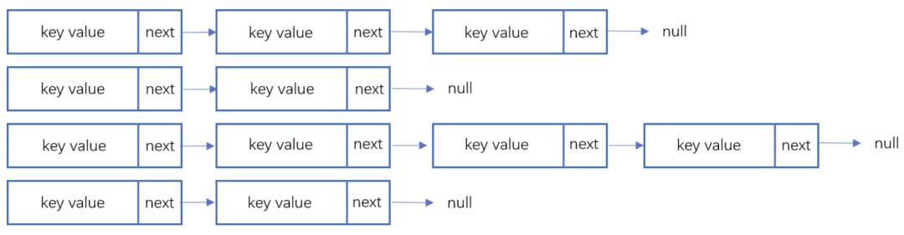

链地址在处理的流程如下：
添加一个元素的时候，首先计算元素key的hash值，确定插入数组中的位置。如果当前位置下没有重复数据，则直接添加到当前位置。当遇到冲突的时候，添加到同一个hash值的元素后面，行成一个链表。这个链表的特点是同一个链表上的Hash值相同。java的数据结构HashMap使用的就是这种方法来处理冲突，JDK1.8中，针对链表上的数据超过8条的时候，使用了红黑树进行优化。由于篇幅原因，这里不深入讨论相关数据结构，有兴趣的同学可以参考这篇文章：

[《Java集合之一—HashMap》](https://link.zhihu.com/?target=https%3A//blog.csdn.net/woshimaxiao1/article/details/83661464)

### 3.2 开放地址法

开放地址法是指大小为 M 的数组保存 N 个键值对，其中 M > N。我们需要依靠数组中的空位解决碰撞冲突。基于这种策略的所有方法被统称为“开放地址”哈希表。[线性探测法](https://www.zhihu.com/search?q=线性探测法&search_source=Entity&hybrid_search_source=Entity&hybrid_search_extra={"sourceType"%3A"answer"%2C"sourceId"%3A890181997})，就是比较常用的一种“开放地址”哈希表的一种实现方式。线性探测法的核心思想是当冲突发生时，顺序查看表中下一单元，直到找出一个空单元或查遍全表。简单来说就是：**一旦发生冲突，就去寻找下 一个空的散列表地址，只要散列表足够大，空的散列地址总能找到。**

线性探测法的数学描述是：h(k, i) = (h(k, 0) + i) mod m，i表示当前进行的是第几轮探查。i=1时，即是探查h(k, 0)的下一个；i=2，即是再下一个。这个方法是简单地向下探查。[mod m](https://www.zhihu.com/search?q=mod m&search_source=Entity&hybrid_search_source=Entity&hybrid_search_extra={"sourceType"%3A"answer"%2C"sourceId"%3A890181997})表示：到达了表的底下之后，回到顶端从头开始。

对于开放寻址冲突解决方法，除了线性探测方法之外，还有另外两种比较经典的探测方法，二次探测（Quadratic probing）和双重散列（Double hashing）。但是不管采用哪种探测方法，当散列表中空闲位置不多的时候，散列冲突的概率就会大大提高。为了尽可能保证散列表的操作效率，一般情况下，我们会尽可能保证散列表中有一定比例的空闲槽位。我们用`装载因子`（load factor）来表示空位的多少。

散列表的装载因子=填入表中的元素个数/散列表的长度。装载因子越大，说明冲突越多，性能越差。

### 3.3 两种方案的demo示例

假设散列长为8，散列函数H(K)=K mod 7，给定的关键字序列为{32,14,23,2, 20}
当使用链表法时，相应的数据结构如下图所示：

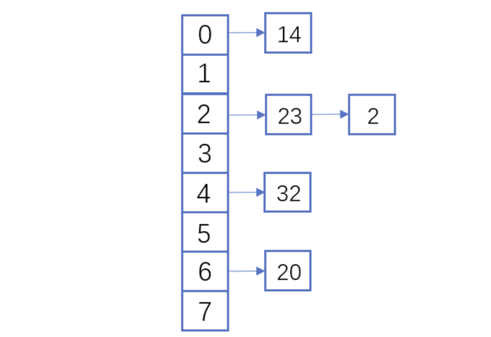

当使用线性探测法时，相应的数据结果如下图所示：


这里的两种算法的区别是2这个元素，在链表法中还是在节点2的位置上，但是在线性探测法遇到冲突时会将冲突数据放到下一个空的位置下面。

## **4、hash算法在日常活动中的应用**

在日常运营活动中，我们活动开发经常遇到的应用场景是信息加密、数据校验、负载均衡。下面分别对这三种应用场景进行讲解。

### **4.1 信息加密**

首先我们看一下信息加密的应用。2011年CSDN脱库事件，导致超过600W的用户的密码泄露，让人失望的是，CSDN是明文存储用户的注册邮箱和密码的。作为用户的非常隐私的信息，最简单的保护措施就是对密码进行hash加密。在客户端对用户输入的密码进行hash运算，然后在服务端的数据库中保存用户密码的hash值。由于服务器端也没有存储密码的明文，所以目前很多网站也就不再有找回密码的功能了。

- 这里也友情提示一下大家：如果在使用中发现某网站还有提供找回密码的功能，就要好好担心下这个网站的安全性了。

看到这里有些同学会觉得那么我们是不是对用户输入的密码进行一次MD5加密就可以了呢，这样就算恶意用户知道了hash值，也没有办法拿到用户的真实密码。假设用户的密码是`123456789`，经过一次md5以后得到的值是:

```
25f9e794323b453885f5181f1b624d0b
```

那么是不是使用了这个加密后的字符串来存密码就万无一失了呢，理想总是很丰满，而现实总是很骨感的。

大家可以看一下这个网站：

[https://www.cmd5.com/](https://link.zhihu.com/?target=https%3A//www.cmd5.com/)

这里是该网站的相关介绍：

> 本站针对md5、sha1等全球通用公开的加密算法进行反向查询，通过穷举字符组合的方式，创建了明文密文对应查询数据库，创建的记录约90万亿条，占用硬盘超过500TB，查询成功率95%以上，很多复杂密文只有本站才可查询。已稳定运行十余年，国内外享有盛誉

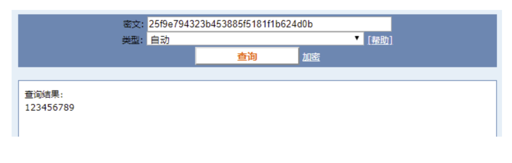

那么一般针对这种问题，我们的解决之道就是引入[salt](https://www.zhihu.com/search?q=salt&search_source=Entity&hybrid_search_source=Entity&hybrid_search_extra={"sourceType"%3A"answer"%2C"sourceId"%3A890181997})(加盐)，即利用特殊字符（盐）和用户的输入合在一起组成新的字符串进行加密。通过这样的方式，增加了反向查询的复杂度。但是这样的方式也不是万无一失，如果发生了盐被泄露的问题，就需要所有用到的地方来重置密码。

针对salt泄露的问题，其实还有一种解决办法，即使用HMAC进行加密（Hash-based Message Authentication Code）。这种算法的核心思路是加密使用的key是从服务器端获取的，每一个用户的是不一样的。如果发生了泄露，那么也就是这一个用户的会被泄露，不会影响到全局。

这里也留给大家一个思考点，如果恶意用户直接抓取了你的活动参与链接，也就是拿到了你计算后的hash值，那从技术的角度上说，我们还有没有其他可以提升恶意用户的违法成本呢？

### 4.2 数据校验

\- **git commit id**
使用过git的同学都应该清楚，每次git提交后都有一个commit id，比如`:`

```
19d02d2cc358e59b3d04f82677dbf3808ae4fc40
```

就是一次git commit的结果，那么这个id是如何生成出来的呢？查阅了相关资料，使用如下代码可以进行查看：

```text
printf "commit %s\0" $(git cat-file commit HEAD | wc -c); git cat-file commit HEAD
```

git的commit id主要包括了以下几部分内容：Tree 哈希，parent哈希、作者信息和本次提交的备注。

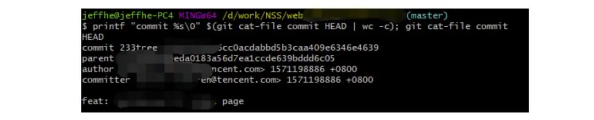

针对这些信息进行SHA-1 算法后得到值就是本次提交的commit id。简单来讲，就是对于单次提交的头信息的一个校验和。

> Linux kernel开创者和Git的开发者——Linus说，Git使用了sha1并非是为了安全性，而是为了数据的完整性；它可以保证，在很多年后，你重新checkout某个commit时，一定是它多年前的当时的状态，完全一摸一样，完全值得信任。

但最新研究表明，理论上对其进行哈希碰撞（hash collision，不同的两块数据有相同的hash值）的攻击可以在2^51（2的51次方）左右的次数内实现。不过由于[commit id](https://www.zhihu.com/search?q=commit id&search_source=Entity&hybrid_search_source=Entity&hybrid_search_extra={"sourceType"%3A"answer"%2C"sourceId"%3A890181997}) 是针对单个仓库里的，所以实际应用中我们可以认为如果两个文件的SHA-1值是相同的，那么它们确是完全相同的内容。

*注：对于git里tree、parent等结构感兴趣的同学，可以参考下这篇文章[《Git 内部原理 - Git 对象》](https://link.zhihu.com/?target=https%3A//git-scm.com/book/zh/v2/Git-%E5%86%85%E9%83%A8%E5%8E%9F%E7%90%86-Git-%E5%AF%B9%E8%B1%A1)，这里由于篇幅原因就不进行深入分析了。*

**版权校验**
在数据校验方面的另一个应用场景就是版权的保护或者违禁信息的打击，比如某个小视频，第一个用户上传的时候，我们认为是版权所有者，计算一个hash值存下来。当第二个用户上传的时候，同样计算hash值，如果hash值一样的话，就算同一个文件。这种方案其实也给用户传播违禁文件提高了一些门槛，不是简单的换一个名字或者改一下后缀名就可以躲避掉打击了。（当然这种方式也是可以绕过的，图片的你随便改一下颜色，视频去掉一帧就又是完全不同的hash值了。注意：我没有教你变坏，我只是和你在讨论这个技术。。。）另外我们在社区里，也会遇到玩家重复上传同一张图片或者视频的情况，使用这种校验的方式，可以有效减少cos服务的存储空间。

**大文件分块校验**
使用过bt的同学都有经验，在p2p网络中会把一个大文件拆分成很多小的数据各自传输。这样的好处是如果某个小的数据块在传输过程中损坏了，只要重新下载这个块就好。为了确保每一个小的数据块都是发布者自己传输的，我们可以对每一个小的数据块都进行一个hash的计算，维护一个hash List，在收到所有数据以后，我们对于这个hash List里的每一块进行遍历比对。这里有一个优化点是如果文件分块特别多的时候，如果遍历对比就会效率比较低。可以把所有分块的hash值组合成一个大的字符串，对于这个字符串再做一次Hash运算，得到最终的hash（Root hash）。在实际的校验中，我们只需要拿到了正确的Root hash，即可校验Hash List，也就可以校验每一个数据块了。

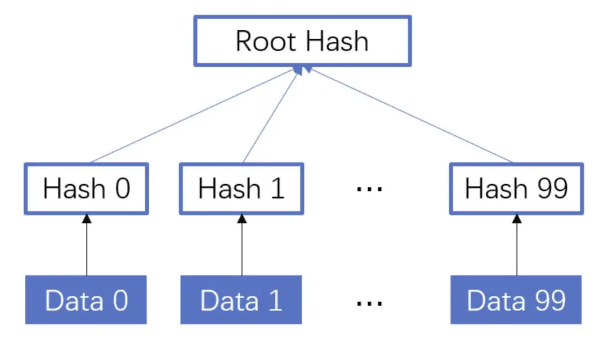

### 4.3 负载均衡

活动开发同学在应对高星级业务大用户量参与时，都会使用分库分表，针对用户的[openid](https://www.zhihu.com/search?q=openid&search_source=Entity&hybrid_search_source=Entity&hybrid_search_extra={"sourceType"%3A"answer"%2C"sourceId"%3A890181997})进行hashtime33取模，就可以得到对应的用户分库分表的节点了。

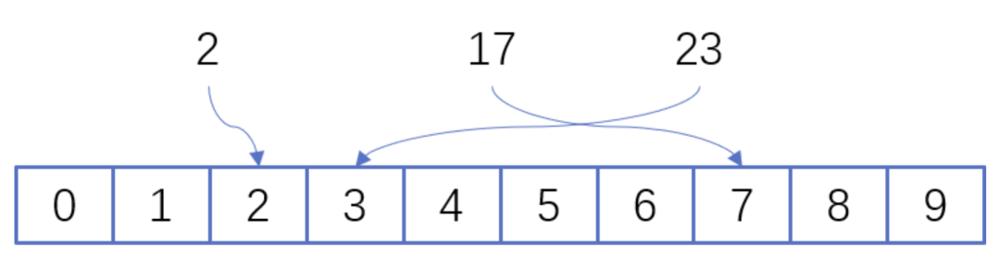

如上图所示，这里其实是分了10张表，openid计算后的hash值取模10，得到对应的分表，在进行后续处理就好。对于一般的活动或者系统，我们一般设置10张表或者100张表就好。

下面我们来看一点复杂的问题，假设我们活动初始分表了10张，运营一段时间以后发现需要10张不够，需要改到100张。这个时候我们如果直接扩容的话，那么所有的数据都需要重新计算Hash值，大量的数据都需要进行迁移。如果更新的是缓存的逻辑，则会导致大量缓存失效，发生`雪崩效应`，导致数据库异常。造成这种问题的原因是hash算法本身的缘故，只要是取模算法进行处理，则无法避免这种情况。针对这种问题，我们就需要利用`一致性hash`进行相应的处理了。

`一致性hash`的基本原理是将输入的值hash后，对结果的hash值进行2^32取模，这里和普通的hash取模算法不一样的点是在一致性hash算法里将取模的结果映射到一个环上。将缓存服务器与被缓存对象都映射到hash环上以后，从被缓存对象的位置出发，沿顺时针方向遇到的第一个服务器，就是当前对象将要缓存于的服务器，由于被缓存对象与服务器hash后的值是固定的，所以，在服务器不变的情况下，一个openid必定会被缓存到固定的服务器上，那么，当下次想要访问这个用户的数据时，只要再次使用相同的算法进行计算，即可算出这个用户的数据被缓存在哪个服务器上，直接去对应的服务器查找对应的数据即可。这里的逻辑其实和直接取模的是一样的。如下图所示：

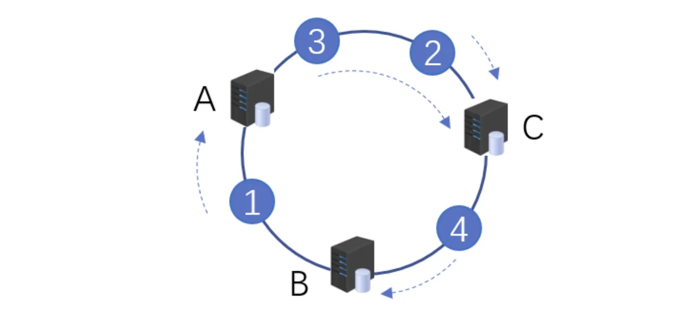

初始情况如下：用户1的数据在服务器A里，用户2、3的数据存在服务器C里，用户4的数据存储在服务器B里

下面我们来看一下当服务器数量发生变化的时候，相应影响的数据情况：

- **服务器缩容**

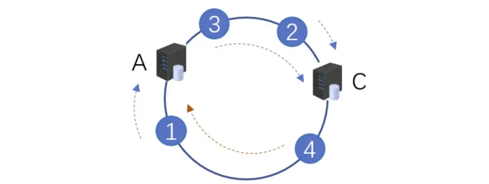

服务器B发生了故障，进行剔除后，只有用户4的数据发生了异常。这个时候我们需要继续按照顺时针的方案，把缓存的数据放在用户A上面。

- **服务器扩容**
  同样的，我们进行了服务器扩容以后，新增了一台服务器D，位置落在用户2和3之间。按照顺时针原则，用户2依然访问的是服务器C的数据，而用户3顺时针查询后，发现最近的服务器是D，后续数据就会存储到d上面。

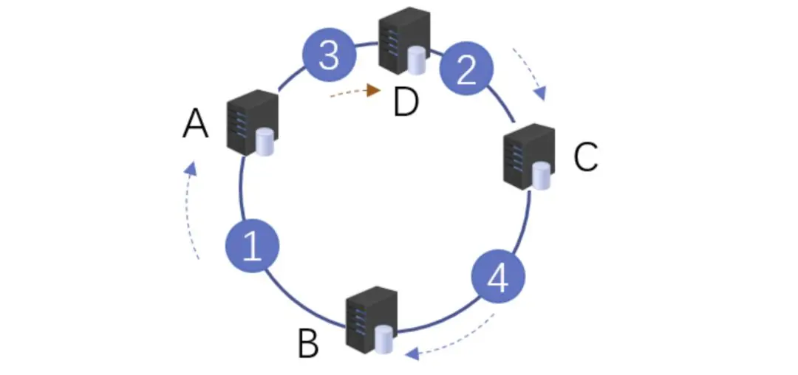

- **虚拟节点**
  当然这只是一种理想情况，实际使用中，由于服务器节点数量有限，有可能出现分布不均匀的情况。这个时候会出现大量数据都被映射到某一台服务器的情况，如下图左侧所示。为了解决这个问题，我们采用了`虚拟节点`的方案。`虚拟节点`是`实际节点`（实际的物理服务器）在hash环上的`复制品`，一个实际节点可以对应多个虚拟节点。虚拟节点越多，hash环上的节点就越多，数据被均匀分布的概率就越大。

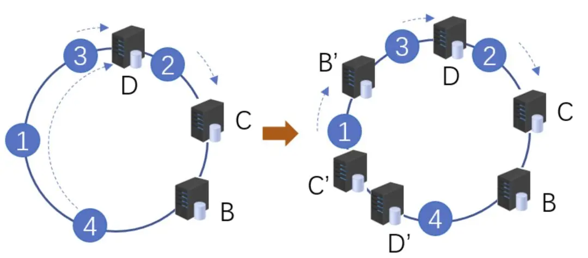

如右图所示，B、C、D 是原始节点复制出来的虚拟节点，原本都要访问机器D的用户1、4，分别被映射到了B,D。通过这样的方式，起到了一个服务器均匀分布的作用。

## **5、几种hash算法的扩展应用**

下面介绍几种大家可能不经常遇到的应用，由于篇幅原因，不做深入介绍，只抛砖引玉。

### **5.1 SimHash**

simHash是google用于海量文本去重的一种方法，它是一种局部敏感hash。那什么叫局部敏感呢，假定两个字符串具有一定的相似性，在hash之后，仍然能保持这种相似性，就称之为局部敏感hash。普通的hash是不具有这种属性的。simhash被Google用来在海量文本中去重。

simHash算法的思路大致如下：

- 将Doc进行关键词抽取(其中包括分词和计算权重)，抽取出n个(关键词，权重)对， 即图中的多个(feature, weight)。记为 feature_weight_pairs = [fw1, fw2 … fwn]，其中 fwn = (feature_n,weight_n)。
- 对每个feature_weight_pairs中的feature进行hash。然后对hash_weight_pairs进行位的纵向累加，如果该位是1，则+weight,如果是0，则-weight，最后生成bits_count个数字，大于0标记1，小于0标记0
- 最后转换成一个64位的字节，判断重复只需要判断他们的特征字的距离是不是<n (n根据经验一般取3)，就可以判断两个文档是否相似。


如下图所示，当两个文本只有一个字变化时，如果使用普通Hash则会导致两次的结果发生较大改变，而SimHash的局部敏感特性，会导致只有部分数据发生变化。


### **5.2 GeoHash**

GeoHash将地球作为为一个二维平面进行递归分解。每个分解后的子块在一定经纬度范围内拥有相同的编码。以下图为例，这个矩形区域内所有的点（经纬度坐标）都共享相同的GeoHash字符串，这样既可以保护隐私（只表示大概区域位置而不是具体的点），又比较容易做缓存。


下面以一个例子来理解下这个算法，我们对纬度39.3817进行逼近编码 ：

- 地球纬度区间是[-90,90]，对于这个区间进行二分划分左区间[-90,0), 右区间[0,90]。39.3817属于右区间，标记为1
- 将右区间[0,90]继续进行划分，左区间[0,45) ,右区间[45,90]。39.3817属于左区间，标记为0
- 递归上面的过程，随着每次迭代，区间[a，b]会不断接近39.3817。递归的次数决定了生成的序列长度。
- 对于经度做同样的处理。得到的字符串，偶数位放经度，奇数位放纬度，把2串编码组合生成新串。对于新串转成对应10进制查出实际的base32编码就是类似WX4ER的hash值。

整体递归过程如下表所示：

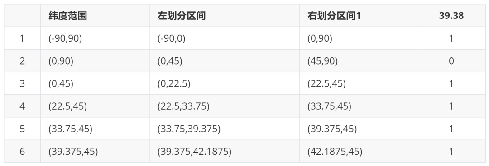

这里有一篇文章详细介绍了GeoHash，有兴趣的同学可以移步这里：

[腾讯技术工程：app 是如何快速定位我们位置的？深入了解 geohash 算法及其实现](https://zhuanlan.zhihu.com/p/90889887)

### **5.3 [布隆过滤器](https://www.zhihu.com/search?q=布隆过滤器&search_source=Entity&hybrid_search_source=Entity&hybrid_search_extra={"sourceType"%3A"answer"%2C"sourceId"%3A890181997})**

布隆过滤器被广泛用于黑名单过滤、垃圾邮件过滤、爬虫判重系统以及缓存穿透问题。对于数量小，内存足够大的情况，我们可以直接用hashMap或者hashSet就可以满足这个活动需求了。但是如果数据量非常大，比如5TB的硬盘上放满了用户的参与数据，需要一个算法对这些数据进行去重，取得活动的去重参与用户数。这种时候，布隆过滤器就是一种比较好的解决方案了。

布隆过滤器其实是基于bitmap的一种应用，在1970年由布隆提出的。它实际上是一个很长的二进制向量和一系列随机映射函数，用于检索一个元素是否在一个集合中。它的优点是空间效率和查询时间都远远超过一般的算法，缺点是有一定的误识别率和删除困难，主要用于大数据去重、垃圾邮件过滤和爬虫url记录中。核心思路是使用一个bit来存储多个元素，通过这样的方式来减少内存的消耗。通过多个hash函数，将每个数据都算出多个值，存放在bitmap中对应的位置上。

布隆过滤器的原理见下图所示：

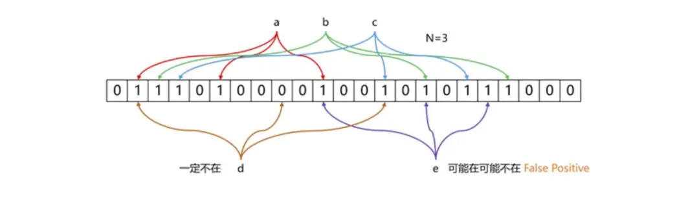

上图所示的例子中，数据a、b、c经过三次hash映射后，对应的bit位都是1，表示这三个数据已经存在了。而d这份数据经过映射后有一个结果是0，则表明d这个数据一定没有出现过。布隆过滤器存在`假阳率`（判定结果为存在的元素，实际可能不存在）的问题，但是没有`假阴率`（判断结果不存在的元素，可能存在）的问题。即对于数据e，三次映射的结果都是1，但是这份数据也可能没有出现过。

误判率的数据公式如下所示：


其中，p是误判率，n是容纳的元素，m是需要的存储空间。由公示可以看出，布隆过滤器的长度会直接影响误报率，布隆过滤器越长其误报率越小。哈希函数的个数也需要权衡，个数越多则布隆过滤器 bit 位置位 1 的速度越快，且布隆过滤器的效率越低；但是如果太少的话，则会导致误报率升高。

## **6、总结**

Hash算法作为一种活动开发经常遇到的算法，我们在使用中不仅仅要知道这种算法背后真正的原理，才可以在使用上做到有的放矢。Hash的相关知识还有很多，有兴趣的同学可以继续深入研究。

更多内容欢迎关注我们：[腾讯技术工程](https://zhuanlan.zhihu.com/tencent-TEG)


转自：https://www.zhihu.com/question/26762707/answer/890181997